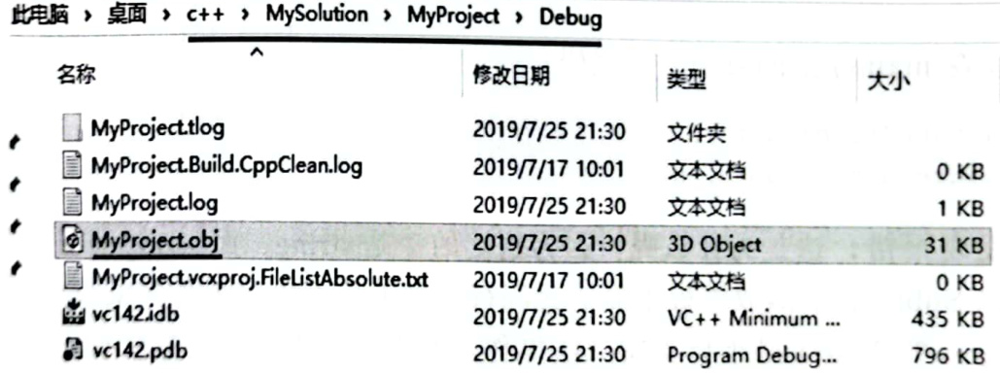

# 2.1函数模板  

## 2模板基础知识  

$\mathsf{C}^{\mathrel{\dagger}+\dagger}$ 语言中的模板有很多种，本章会涉及函数模板、类模板、变量模板、别名模板、可变参模板等诸多基础概念和知识点，这些基础概念和知识点形形色色，没准在某种场合下就会遇到，因此优先学习。接着，会讲解奇异的递归模板模式与混人模式这两种常用的编程手法。此外，本章还会详细介绍模板代码的组织结构与模板的显式实例化和声明。  

---

## 2.1.1基本范例  

创建一个函数，能将两个int类型的形参相减，将结果值返回，代码如下。  

``` cpp
int Sub(int tv1, int tv2)  
{  
    return tv1 - tv2;  
}
```

如果是两个float类型的形参相减呢？那么还要再写一个函数版本，代码如下。  

``` cpp
float Sub(float tv1, float tv2)  
{  
    return tv1 - tv2;  
}
```

可以看到，上面是两个同名函数，属于函数重载。  

这两个函数的区别是什么呢？除了参数类型，函数体的代码是一样的，重复写这种代码完全没有必要，如果将来参数类型再发生改变，还得再写一个类似的函数。那么，这种场合就是使用函数模板的最好场合。  

这里，不想为每种类型都定义一个不同的函数，所以采取定义一个通用的函数模板的策略。下面看一看怎样利用模板写出一个适合多种参数类型求差值的函数，将刚才的两个重载函数全部注释，增加以下代码，定义一个函数模板。  

``` cpp
template <typename T>  
T Sub(T tv1, T tv2)  
{  
    return tv1 + tv2;  
}
```

在main（）主函数中添加代码：  

``` cpp
int subv = _nmsp1::Sub(3, 5);  
cout << "subv = " << subv << endl;  
double subv2 = _nmsp1::Sub(4.7, 2.1);  
cout << "subv2 = " << subv2 << endl;
```

运行程序，查看结果：  

``` cpp
subv=-2
subv2 = 2. 6
```

上述就是一个函数模板的典型范例，因为函数参数的类型没有确定，所以用T表示，这个T可以称为模板参数，更确切地，是一个类型模板参数，因为它代表的是一个类型。  

这里有一些模板的基础知识：①模板的定义是以template关键字开头；②类型模板参数T前面用typename修饰（语法就这样规定），所以，遇到typename就应该知道其后跟的是一个类型；同时，这里的typename可以用class取代（但推荐使用typename），但这里的class并没有“类”的意思（有些人习惯于使用typename表明对应的模板实参可以是任意类型，而使用class表明对应的模板实参必须是一个类类型）；③类型模板参数T（代表一个类型）以及前面的修饰符typename都是用尖括号<>括起来的；④T可以换成任何其他标识符，对程序没有影响，用T是一种使用习惯而已。

如果读者对这些最基础的模板知识仍感到陌生，从现在开始逐步去掌握，它们其实都很简单。  

如果继续在main()主函数中添加代码：  

``` cpp
string a("abc"), b("def");  
string addresult = _nmsp1::Sub(a, b);
```

编译一下，发现报错，这是为什么呢？因为这里的T是string，而 string类型是不支持减法操作的，所以Sub(这个函数模板里面的代码行就是不合法的。这说明Sub()函数模板要想成功编译，传人的类型T必须要支持减法操作。所以，同样一个函数模板，可能以某种方式进行调用是合法的，而换一种方式调用就不合法了。尤其值得注意的是，这种合法性，在编译阶段就可以由编译器判断出来，因为这些对Sub（）函数模板的调用代码就在这里摆着，编译器有能力在编译时就从这些调用代码中去推断Sub（)函数模板中的模板参数T的类型。根据模板参数T的类型，编译器就能够判断出这个类型是否支持减法运算。  

## 2.1.2实例化  

2.1.1节的代码分别用int和double类型的参数调用了Sub(）函数模板，因为有这种调用代码的存在，所以在编译的时候，编译器就会对这个函数模板进行实例化。这里可以给实例化一个定义：用具体的“类型”代替“类型模板参数”的过程就叫作实例化（也称为代码生成器）。  

针对int和 double 两种类型，每种类型都会被实例化一次，所以，Sub()函数模板一共会被实例化两次，相当于产生了两个Sub()函数。可以用dumpbin工具查看这两个函数，具体步骤如下。  

（1）在VisualStudio2019中，通过菜单命令“生成” $\rightarrow$ “生成解决方案”编译当前的项目。等待大概几秒到几十秒的时间，当界面下方的“输出”窗口提示“成功1个”字样的时候，就代表一个.obj文件（MyProject.obj）生成了。  

（2）下面就是找到这个.obj文件的位置。在Visual Studio 2019中右击MyProject.cpp文件名标签并在弹出的菜单中选择“打开所在的文件夹”命令，如图2.1所示。  

  
图 2.1打开MyProject.cpp文件所在的文件夹  

（3）此时，弹出“文件资源管理器”窗口，并定位到 MyProject.cpp 所在的文件夹，进入其中的 Debug子文件夹，就可以找到 MyProject.obj 文件，如图 2.2 所示。  

  
图2.2MyProject.obj文件所在的文件夹  

（4）MyProject.obj（在Linux平台下扩展名也许是，o)。在Linux下使用 $\mathbf{g}^{++}$ 编译器的读者可以使用-c参数生成.o文件。  

然后需要打开开发人员命令行工具（DeveloperCommand Prompt fo..)，安装了 Visual Studio 2019（或其他版本的Visual Studio）一般都会带有该命令行工具，可能需要在“开始”菜单中寻找，如图2.3所示。  

  
图2.3VisualStudio 2019开发人员命令行工具  

（5）在这个命令行提示符下可以直接使用dumpbin 命令行工具，否则就需要自己查找dump bin工具的位置。

在命令行提示符下，My Project.obj文件所在的路径，输人dumpbin/all MyProjectobj $>$ MyProject.txt，如图2.4所示。  

  
图2.4用dumpbin工具将.obj文件的可视化信息导出到文本文件中  

这样，在与MyProject.obj相同的文件夹下，就会产生一个MyProject.txt文件，也就把MyProject.obj二进制文件中的可视化信息导人MyProject.txt文本文件。这个文本文件可以Visual Studio。  

.obj文件的格式一般会被认为是一种通用对象文件格式（Common Object FileFormat，COFF）。这里不详细研究.obj文件的格式。  

通过查看MyProject.txt文件中的内容，能看到.obj文件中保存的诸多信息。在MyProject.txt文件中，按Ctrl+F快捷键并查找“Sub”字样，可以看到以下结果。  

```cpp
int __cdecl Sub<int>(int, int)
double __cdecl Sub<double>(double, double)
```

可以观察到，实例化之后的函数名分别为Sub`<int>`和Sub`<double>`，这与普通的函数名不太一样。实例化后的函数名由3部分组成：①模板名；②后面跟一对尖括号<>；③尖括号中间是一个具体类型。不管怎么说，可以清晰地看到，在编译的时候，编译器为Sub（）函数模板实例化出了两个具体的Sub（）函数，这两个Sub（）函数的区别是它们的参数和返回值不同。

而且编译器很智能，根据程序员调用该函数模板的参数类型，自动决定如何对函数模板进行实例化。  

下面探讨函数模板的函数体相关问题。再把刚才报错的两行代码演示一下。  

```cpp
string a("abc"), b("def");
string addresult = Sub(a, b);
```

通过菜单命令“生成” $\rightarrow$ “生成解决方案”编译当前的项目，会看到提示：

``` cpp
errorc2676：二进制“_”“T”不定义该运算符或到预定义运算符可接收的类型的转换  
```


为什么报错，上面也解释了，是因为SubO函数模板中的代码行“return tv1-tv2；”对string，如果修改为“returntvl $^+$ tv2；”，就能够顺利编译。这说明在编译阶段，在对模板进行具体针对某类型的实例化之前，编译器需要查看函数模板的函数体，确定能否针对该类型进行实例化。若无法实例化，在编译阶段就会报错。换句话说，在编译阶段，编译器需要能够找到函数模板的函数体部分。所以，函数模板的定义通常都是在头文件中（虽然笔者演示的时候是将函数模板定义放在一个.cpp源文件中，但书写具体项目时都应该放在.h头文件中）。  

还有一点值得注意的就是，模板参数的类型问题，现在这个Sub()函数模板要求两个参数类型相同，编译器才能推断出具体的类型。例如下面的代码，编译就会报错。  

``` cpp
Sub (3, 4. 0) :
```

上述代码报错的原因是第1个参数看起来是int类型，第2个参数看起来是double类型，有的读者会说，int类型可以自动转换成double类型。不行！在推断函数模板类型这件事情上，是不能进行自动类型转换的，要求的是类型精确匹配。按以下两种方式之一修改代码即可。  
```cpp
Sub<double>(3, 4.0);//在构成函数名的尖括号中直接指定类型，不需要编译器进行推断
Sub(double(3), 4.0);//用强制类型转换，让两个参数类型保持一致
```

## 2.1.3模板参数的推断  

### 1.常规的参数推断  

定义另外一个函数模板AddO，代码如下。  

``` cpp
template <typename T, typename U, typename V>  
V Add(T tv1, U tv2)  
{  
    return tv1 + tv2;  
}
```

在这个函数模板中，定义了3个类型模板参数，分别是T，U，V。形参tv1和tv2的类型分别是T和U，而返回类型是 $\mathbf{v}$ .

怎么调用这个函数模板呢？在main（主函数中添加代码：  

``` cpp
cout << Add(15, 17.8) << endl;
```

编译一下，发现报错：  

``` cpp
errorc2672:“Add””：找到匹配的重载函数
errorC2783:“VAdd（T，U）”：未能为“v”推导模板参数  
```


通过错误提示不难看出，根据调用语句Add（15，17.8)所给的具体数字，系统能推断出T的类型和U的类型，但是没有任何线索能够让编译器推断AddO函数模板的返回结果类型V，这就是编译器报错的原因。所以，必须用尖括号显式地指定V（返回的结果）的类型。如何指定呢？观察一下函数模板定义中的尖括号，尖括号中的第1个位置是类型T，第2个位置是类型U，而类型V在第3个位置，虽然T和U的类型都能推断出来，只需要指定V的类型，但是很无奈， $\mathbf{C++}$ 语言中没有合适的语法让程序员只指定V的类型而跳过T和U，例如：  

```cpp
cout << Add<..., ..., double> (15, 17.8) << endl;
```

所以，只能手工指定T的类型和U的类型。  

```cpp
cout << Add<int, double, double>(15, 17.8) << endl;
```

这时，有些读者马上就会想到：在定义Add（）函数模板时，把类型V放到第1个位置，是不是情况会有所改观，如下所示。

``` cpp
template <typename V, typename T, typename U >  
V Add(T tv1, U tv2)  
{  
    return tv1 + tv2;  
}
```

确实，在调用Add（0函数模板时，可以指定第1个类型模板参数V，而第2个类型模板参数T和第3个类型模板参数U不需要指定（省略），编译器可以通过调用Add(时传人的实参自动推断出来。可以这样调用：  
```cpp
cout << Add<double>(15, 17.8) << endl;
```
所以，可以清楚地看到，通过尖括号指定一部分模板参数，另外一部分模板参数可以让编译器去推断。但是，一旦从某个模板参数开始推断，后续的所有模板参数都需要让编译器推断，不可以自己指定第1个类型 $\mathbf{v}$ 和第3个类型U，然后推断中间第2个类型T，编译器不支持这种语法。  

说到这里，也许读者会想起 $\mathbf{C}^{\mathrel{++}}$ 11标准中的auto关键字，它能进行变量类型的自动推断，如果把AddO函数模板的返回类型指定成auto，是否可行呢？如果可行，就能把类型模板参数V忽略，从而实现AddO）函数模板返回类型自动推断的目的。试一试：  

``` cpp
template <typename T, typename U >  
auto Add(T tv1, U tv2)  
{  
    return tv1 + tv2;  
}
```

这个时候，下面这行代码就可以成功编译并运行了。  

```cpp
cout << Add<double>(15, 17.8) << endl;
```

在笔者的《 $\mathbf{C}^{++}$ 新经典》一书中，讲到“decltype主要用途”的时候，介绍过“auto结合 decltype 构成返回类型后置语法”，这种后置语法其实也就是使用 auto 结合 decltype完成返回值类型推断，在这里也写一写，代码如下。  

``` cpp
template <typename T, typename U >  
auto Add(T tv1, U tv2) -> decltype(tv1 + tv2)  
{  
    return tv1 + tv2;  
}
```

上面这种写法值得注意的就是auto，这种返回值类型后置语法中的auto没有类型推导的含义，它只是“返回类型后置语法”的组成部分。  

### 2.各种推断的比较与空模板参数列表的推断  

再看一个范例，定义一个名为mydouble的函数模板如下。  

``` cpp
template<typename T>  
T mydouble(T tmpvalue)  
{  
    return tmpvalue * 2;  
}
```

对上述mydouble（）函数模板的调用，可以有很多种方式。  

1）自动推断 

指定实参，编译器会自动推断出模板参数的类型，调用代码如下。  

``` cpp
int result mydouble(15);
```

上述代码中，编译器可以根据传人的实参15，推断出函数模板mydouble（）中类型模板参数T为int类型。  

2）指定类型模板参数  

同时指定实参和类型模板参数，调用代码如下。  

``` cpp
int result2 mydouble<int>(16.9)
```

上述代码中，同时指定了类型模板参数为int类型，也指定了实参为16.9。因为显式指定了mydouble()函数模板的模板参数为int类型，所以就不存在编译器根据给定的实参（16.9）类型推断模板参数类型的情况。但是，因为模板类型为int类型，而16.9是double类型，所以，编译器会隐式地将16.9转换为int类型（16），这样转换肯定会损失一些数据精度，所以编译的时候编译器会给出警告：  

``` cpp
warningC4244：“参数”：从“double”转换到“T”，可能丢失数据  
```

3）指定空模板参数列表调用代码如下。  


``` cpp
auto result3 = mydouble<>(16.9);
//33.8
```

上述代码中，模板参数列表为空（ $(<>)$ ，实参传人16.9。那么，模板参数列表为空是什么意思呢？  

（1）mydouble 模板参数的类型依旧是通过实参16.9类型推断，所以，推断出来的是double类型。  

（2）在当前情况下， $<>$ 没什么用处，但是当有一个也叫作mydouble(）的普通函数存在时， $<>$ 也许就会发挥作用，增加一个普通的mydouble(）函数，代码如下。  

``` cpp
double mydouble(double tmpvalue)  
{  
    return tmpvalue * 2;  
}
```

如果进行下面的调用，调用的就是普通的mydouble()函数。  

``` cpp
auto result4 = mydouble(16.9);
```

而下面的语句调用的是mydouble(）函数模板。  
``` cpp
auto result3 = mydouble<>(16.9);
```
所以， $<>$ 这个空模板参数列表的用处是可以明确地指出：请调用mydouble(）函数模板，而不是调用普通的mydouble（）函数。  

## 2.1.4 重载  

函数模板的重载与函数的重载比较类似，函数（函数模板）重载的概念是：函数（函数模板）名字相同，但参数数量或参数类型不同。编译器会根据调用时给出的具体实参，选择一个编译器认为最合适的函数模板实例化和调用。看一个简单的范例，写一个函数模板myfunc(，注意其形参的形式。  

``` cpp
template<typename T>  
void myfunc(T tmpvalue)  
{  
    cout << "myfunc(T tmpvalue)执行了" << endl;  
}
```
在main()主函数中添加代码：  

``` cpp
myfunc(12);  
char* p = nullptr;  
myfunc(p);
```
运行程序，结果如下。  

``` cpp
myfunc（T tmpvalue）执行了
myfunc（T tmpvalue）执行了  
```


这个范例很简单，当调用 myfunc(12);代码行时，编译器推断出来的类型模板参数 T显然是int类型，而调用 myfunc(p);代码行时，编译器推断出来的类型模板参数 T显然是char\*类型。  

现在，重载一下 myfunc()函数模板，换一换它的形参类型，代码如下，注意其形参的形式。  

``` cpp
template<typename T>  
void myfunc(T* tmpvalue)  
{  
    cout << "myfunc(T *tmpvalue)执行了" << endl;  
}
```
再次运行程序，结果如下。  

``` cpp
myfunc（T tmpvalue）执行了
myfunc（T *tmpvalue）执行了  
```


可以看到，这次当调用 myfunc(p);代码行时，编译器执行的是形参为 T\*类型的函数模板。  

另外，函数模板和函数可以同时存在，此时该函数也是一种重载，增加下面的myfunc(）函数定义，注意其形参的形式。  

``` cpp
void myfunc(int tmpvalue)  
{  
    cout << " myfunc(int tmpvalue)执行了" << endl;  
}
```
在main（主函数中添加代码：  

``` cpp
myfunc（12.1);  
```


再次运行程序，结果如下。  

``` cpp
myfunc（int tmpvalue）执行了
myfunc（T *tmpvalue）执行了
myfunc（T tmpvalue）执行了
```


从这次的结果中可以看到，myfunc（12)；代码行调用的是普通的myfunc（）函数，而不是实例化后的mvfunc（）函数模板。当普通函数和函数模板都比较合适的时候，编译器会优先选择普通函数执行。  

至于如何选择最合适（最特殊）的函数模板或函数，编译器内部有一套比较复杂的排序规则、而且这些规则也在不断调整和变化，开发者不用深究，而且一般开发者用自己的直觉就能判断出哪个函数模板更合适。例如上面这个范例，执行myfunc（p)；代码行时显然实例化和调用形参为T\*的函数模板比形参为T的函数模板看起来更合适。  

## 2.1.5特化  

泛化的意思就是“大众化的，常规的”，一般来讲，常规状态下所写的函数模板都是泛化的函数模板，这里直接书写一个泛化版本的函数模板范例。  

``` cpp
template <typename T, typename U>  
void tfunc(T& tmprv, U& tmprv2)  
{  
    cout << "tfunc泛化版本" << endl;  
    cout << tmprv << endl;  
    cout << tmprv2 << endl;  
}
```

在mainO主函数中添加代码：  
```cpp
const char* p = "I Love China!";
int i = 12;
tfunc(p, i);
```

运行程序，结果如下。  

``` cpp
tfunc泛化版本
I Love China!  
12
```

不难看出，执行tfunc(p,i);代码行时，会实例化函数模板tfunc<constchar\*，int>。所以，在该实例化中，T代表constchar\*，形参tmprv就应该是constchar\*&类型；U代表int，形参tmprv2就应该是int&类型。  

而特化版本往往代表从泛化版本中抽出来的一组子集。  

### 1.全特化  

现在，写一个全特化版本—两个类型模板参数，一个为 int类型，一个为 double 类型；位置接在刚才的泛化版本的函数模板tfunc()后面。  

所谓全特化，就是把tfunc（O这个泛化版本中的所有模板参数都用具体的类型代替，构成一个特殊的版本（全特化版本），既然所有模板参数都用具体的类型代替了，那么tfunc()泛化版本中template后面尖括号中的内容就变成空了。  

``` cpp
template<> //全特化<>里就是空的  
void tfunc(int& tmprv, double& tmprv2) //替换原来的T,U，这格式要与泛化版本一一对应不然编译就报错，比如第二个参数写成double tmprv2就会报错  
{  
    cout << "-------------begin-------------" << endl;  
    cout << "tfunc<int,double>特化版本" << endl;  
    cout << tmprv << endl;  
    cout << tmprv2 << endl;  
    cout << "-------------end---------------" << endl;  
}
```

在main（）主函数中添加代码：  

``` cpp
int k = 12;  
double db = 15.8f;  
tfunc(k, db);  //这里调用的就是特化版本
```

运行程序，结果如下。  

``` cpp
begin
tfunc<int,double>特化版本 
12
15. 8
end
```

全特化实际上等价于实例化一个函数模板，并不等价于一个函数重载，注意比较下面两行代码：  
```cpp
void tfunc<int, double>(int& tmprv, double& tmprv2){...};
// 全特化，等价于实例化一个函数模板

void tfunc<int, double, double>(int& tmprv, double& tmprv2){...};
// 重载的函数
```

上面已经存在了int 和 double 类型的函数模板tfunc()全特化，如果再存在一个 int 和double类型形参的重载函数：  

``` cpp
void tfunc(int& tmprv, double& tmprv2)  
{  
    cout << "-------------begin-------------" << endl;  
    cout << "tfunc普通函数" << endl;  
    cout << "-------------end---------------" << endl;  
}
```

那么此时前面 main() 主函数中的代码行 tfunc(k, db);就不会调用 tfunc() 函数模板的特化版本，而是调用tfunc()重载函数。再次运行程序，结果如下。  

``` cpp
begin
tfunc普通函数
end
```

这说明一个问题，如果将来读者遇到一个函数调用，选择普通函数、函数模板(泛化)或函数模板特化版本都合适的时候，编译器考虑顺序是优先选择普通函数；没有普通函数，才会考虑函数模板的特化版本；如果没有特化版本或特化版本都不合适，才会考虑函数模板的泛化版本。  

针对函数模板的特化版本的选择问题，如果恰好碰到两个模板特化版本都合适的情况，那么编译器会选择最合适的特化版本。例如，如果传递一个字符串给函数模板，函数模板特化版本中有数组类型模板参数和指针类型模板参数，都可以接受字符串类型，但在编译器看来，很可能数组类型的模板参数比指针类型的模板参数更合适，所以编译器会选择数组类型的模板参数的特化版本。拿不准的时候，就要多写代码测试。  

### 2.偏特化（局部特化）  

全特化是把所有类型模板参数都用具体类型代表。而偏特化（局部特化）可以分为两个方面，一个是模板参数数量上的偏特化，一个是模板参数范围上的偏特化。  

1）模板参数数量上的偏特化  

例如，特化第1个模板参数类型为 double 类型，但第2个模板参数不特化。实际上,从模板参数数量上来讲，函数模板不能偏特化。比如下面的代码，编译会出现错误，所以只有类模板才能偏特化。  

``` cpp
template<typename U>  
void tfunc<double, U>(double& tmprv, U& tmprv2)//注意特化版本tfunc后面要有尖括号  
{  
    cout << "-------------begin-------------" << endl;  
    cout << "tfunc<double,U>偏特化版本" << endl;  
    cout << tmprv << endl;  
    cout << tmprv2 << endl;  
    cout << "-------------end---------------" << endl;  
}
```

2）模板参数范围上的偏特化  

所谓“参数范围”，比如原来是int类型，如果变成const int类型，那么与int类型相比，const int类型的范围就变小了；再比如，如果原来是任意类型T，现在变成T\*（从任意类型缩小为任意指针类型)，那这个类型的范围也是变小了；还有T＆(左值引用）、T&&(右值引用)，对于T，从类型范围上都属于变小了。  

但是实际上，对于函数模板，也不存在模板参数范围上的偏特化。因为这种所谓模板参数范围上的偏特化，实际上是函数模板的重载。例如，下面的代码实际上是对上面泛化版本的tfunc(的重载。  

``` cpp
template <typename T, typename U>  
void tfunc(const T& tmprv, U& tmprv2)  
{  
    cout <<"tfunc(const T& tmprv,U6 tmprv2)重载版本"<<endl;
}  
```

在main（主函数中继续添加代码：  
```cpp
const int k2 = 12;
tfunc(k2, db);
```

运行程序，新增代码行的结果如下。  

``` cpp
tfunc（constT&tmprv，U&tmprv2）重载版本  
```


3）通过重载实现模板参数数量上的偏特化  

再看一看刚刚谈到的“模板参数数量上的偏特化”，可以通过重载的手段实现这种偏特化。如果要支持第1个模板参数是double类型的tfunc(）函数模板的重载，可以直接把第1个模板参数T去掉，只保留第2个模板参数U，同时，代码中用到T的位置都用double替代，完整的代码如下。  

``` cpp
template <typename U>  
void tfunc(double& tmprv, U& tmprv2)  
{  
    cout << "-------------begin-------------" << endl;  
    cout << "类似于tfunc<double,U>偏特化的tfunc重载版本" << endl;  
    cout << tmprv << endl;  
    cout << tmprv2 << endl;  
    cout << "-------------end---------------" << endl;  
}
```
在main(0主函数中，注释以往的代码，重新添加测试代码：  

``` cpp
const char* p = "I Love China!";  
int i = 12;  
tfunc(p, i);  
  
double j = 18.5;  
tfunc(j, i);
```

运行程序，结果如下。  

``` cpp
tfunc泛化版本
I Love China！
12 
begin 
类似于tfunc<double, $\mho$ 偏特化的tfunc重载版本
18.5 
12  
end
```

值得注意的是，对于类模板，还是存在模板参数范围上的偏特化的，后面将详细讲解。  

## 2.1.6默认参数  

函数模板可以提供默认的模板参数，下面举一个简单的例子。  

``` cpp
//普通函数  
int mf(int tmp1, int tmp2)  
{  
    return 1;  
}  
typedef int(*FunType)(int, int); //函数指针类型定义  
template <typename T, typename F = FunType>  
void testfunc(T i, T j, F funcpoint )  
{  
    cout << funcpoint(i, j) << endl;  
}
```

在main（主函数中添加代码：  

``` cpp
testfunc（15,16);  
```


可以看到，调用testfunc()函数的时候，不用指定第3个实参，因为第3个参数有默认值。要注意默认参数的写法：针对当前的范例，类型模板参数F给了默认值，函数的形参也给了默认值。默认模板参数F是一个函数指针类型（FuncType），函数参数funcpoint $=\,\mathbf{m}\mathbf{f}$ 中的mf是函数名，代表函数首地址。  

当然，函数模板的形参可以不给默认值，那么调用时候就需要指定第3个实参，如：  

``` cpp
testfunc（15,16，mf);  
```


另外，函数模板的默认模板参数可以放在前面（这一点与后续讲解的类模板默认模板参数不一样，类模板的模板参数一旦有一个是默认参数，则其后续的参数都需要是默认参数，讲到类模板时再详细讲解）。  

``` cpp
template <typename T = int, typename U>  
void testfunc2(U m)  
{  
  
    T tmpvalue = m;  
    cout << tmpvalue << endl;  
}
```

在mainO主函数中添加代码：

``` cpp
testfunc2(12);  
```


## 2.1.7非类型模板参数  

上面演示的函数中涉及的模板参数都是类型模板参数。实际上，模板参数不但可以是一个类型，也可以是一个普通的参数（非类型模板参数)，当然，这种普通参数也可以有一个默认值。改造一下Add()函数模板，为其增加第3个模板参数。  

``` cpp
template <typename T, typename U, int val = 100>  
auto Add(T tv1, U tv2)  
{  
    return tv1 + tv2 + val;  
}
```

上面的代码中，在template 后的尖括号中，增加了一个普通的 int类型的参数，并且给了一个默认值100。  

在main()主函数中添加代码：  

``` cpp
cout << Add<float, float>(22.3f, 11.8f) << endl;  
cout << Add<float, float, 800>(22.3f, 11.8f) << endl;
```

运行程序，结果如下。  

``` cpp
134.1 
834.1  
```


从结果中可以看到，新添加的第1行代码中，Add0函数模板的第3个模板参数使用的是默认值100，而第2行代码指定了一个新的模板参数值800（注意是在尖括号中指定的）。  

另外，从 $\mathbf{C}\!+\!+\,17$ 标准开始，已经支持将非类型模板参数设置为auto这种自动类型。这样，从某种程度上能给代码的书写提供更大的灵活性。  

``` cpp
template <typename T, typename U, auto val = 100>  
auto Add(T tv1, U tv2)  
{  
    return tv1 + tv2 + val;  
}
```

还要注意的是，指定非类型模板参数的值时，一般给的都是常量，变量是不行的，因为编译器要求在编译的时候就能确定非类型模板参数的值。例如，下面的代码编译会报错。  
```cpp
int k = 1000;
cout << Add<float, float, k>(22.3f, 11.8f) << endl;
```

此外，关于非类型模板参数的类型向题，井不是任何类型的参数都可以作为非类型模板参数。例如，int类型可以，但float、double类型或类类型（如string）就不可以，不过double\*这种指针类型也是可以的，例如下面的代码：  

``` cpp
template <double* p>  
void mft()  
{  
    cout << "mft()执行了" << endl;  
  
}  
double g_d = 1.3; //全局量
```

在mainO主函数中添加代码：  

``` cpp
mft<&g_d>():
//mft（）执行了
```

至于具体哪些类型可以，哪些类型不可以，可以去尝试，一般允许的类型有以下几种（可能随着 $\mathbf{C++}$ 标准的扩充，所充许的类型也会不断增加）。  

（1）整型或枚举类型。
（2）指针类型。
（3）左值引用类型。  
（4）auto dec l type（auto)。对于decltype（auto）这个用法，auto的类型，而decltype理解成推导过程采用decltype推导，在笔者的《 $\mathbf{c}_{++}$ 新经典》一书中有相关的讲解和范例。  
（5）可能还有其他类型，请读者自行在学习或阅读他人代码的过程中收集和总结。  

非类型模板参数主要还是用于传递一些数组大小之类的信息，目的是在提高程序运行效率等方面与C语言的数组进行竞争。另外，如果能换成普通的函数参数解决问题，还是优先考虑使用普通的函数参数，而不是非类型模板参数。  

还有一些比较奇怪的语法，下面介绍给读者，以免将来遇到这样的程序写法时感到困惑。  

（1）不管是类型模板参数还是非类型模板参数，如果在代码中没有用到这个参数，则参数名可以省略，如下面的类模板Add2()。  

``` cpp
template <typename T, int value>  
auto Add2()  
{  
    return 100;  
}
```

因为类型模板参数T和非类型模板参数value都没用到，所以可以省略不写，从语法上讲，这是允许的。  

``` cpp
template <typename, int>  
auto Add2()  
{  
    return 100;  
}
```

可能有的读者会问：没用，把它们传过来干什么？答案可以在后面的学习中慢慢体会，这里不做过多解释。但不管怎样，日后看到这种写法要能够认识。  

（2）类型前面可以增加一个typename修饰以明确标识一个类型。  

typename 的使用场合很多，如上面范例中的 typename，后面跟的是类型模板参数。而有的时候为了表明其后面是一个类型，也需要用typename 修饰，这个是属于 $\mathbf{c}^{\mathrel{+{+}}}$ 基础知识的范畴。所以，如果将来读者碰到了在类型名前面使用 typename 进行修饰时，不用感觉异。例如，改造一下上面的Add2()函数模板，画蛇添足一下，在语法上是没有问题的。  

``` cpp
template <typename, typename int>  
auto Add2()  
{  
    return 100;  
}
```

上述Add2()函数模板中，第1个 typename后面修饰的是一个类型模板参数，这个typename是可以用class取代的，前面已经讲过。  

第2个typename，仅仅表示其后面修饰的 int是一个类型。当然，在这里，int是一个类型，这是一个非常明显的事实，所以笔者才说这个typename 是属于画蛇添足。但在某些场合，当系统无法正确区分某种写法是不是一个类型的时候（此时编译器会报错)，就需要在它前面用 typename 修饰，标识它确实是一个类型，至于在什么场合需要用typename 表示其后面修饰的是一个类型，没有必要刻意去整理和总结（指 typename 的出场时机)，发现编译器报错的时候可以尝试去观察编译器给出的错误提示信息（编译器在这种场合真是不够智能，有待改进)，久而久之，读者自然就能够感受到哪些类型需要在前面增加 typename修饰（一般必须要增加 typename 的场合总是与模板有些关系）。同时，不难发现，第2个typename class。  

所以，如果读者将来发现在非类型模板参数前面真的出现了一个 typename，也不必感到惊讶。