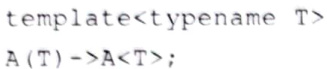

# 2.2类模板、变量模板与别名模板  

## 2.2.1类模板的基本范例和模板参数的推断  

类模板，也是产生类的模具，通过给定的模板参数，生成具体的类，也就是实例化一个特定的类，这个概念听起来跟函数模板差不多。  

例如，读者已经非常熟悉的vector`<int>`，这里的vector是类模板，尖括号中的int就理解成模板参数，通过这个模板参数指出容器vector中所保存的元素类型。  

考虑一个问题， $\mathbf{C}^{++}$ 语言中为什么会出现类模板这个概念呢？当然这也与函数模板是一个道理，一个容器，如vector容器，可以向其中存放整型元素、实型元素、字符串，甚至还可以存储其他类对象，但若每装一个不同类型的元素，就写一个新类来处理，这样就很烦琐(因为如果真要写成不同的类，那么这些不同的类肯定会有很多重复的代码)。  

所以，为了避免出现很多重复的代码（减少代码冗余)，引人了类模板，然后通过模板参数向这个类模板中传递不同的类型或非类型参数，从而实现同一套代码可以应付不同的数据类型，这样，代码就显得精简和通用多了。  

### 1．基本范例  

类模板的声明和实现一般都放在一个头文件中，因为实例化具体类的时候必须有类模板的全部信息。这里为了演示，可以把类模板的声明放在一个.cpp 源文件中。本范例展示一个自己实现的容器类模板，代码如下。  

``` cpp
template<typename T> //名字为T的模板参数，表示myvector这个容器所保存的元素类型  
class myvector  
{  
public:  
    typedef  T* myiterator;    //迭代器  
  
public:  
    myvector();               //构造函数  
    myvector& operator=(const myvector&);   //赋值运算符重载,在类模板内部使用模板名myvector并不需要提供模板参数,当然提供也行,可以写成myvector<T>  
  
public:  
    void myfunc()  
    {  
       cout << "myfunc()被调用" << endl;  
    }  
public:  
    //迭代器接口  
    myiterator mybegin();     //迭代器起始位置  
    myiterator myend();       //迭代器结束位置  
  
public:  
    static void mystaticfunc()  
    {  
       cout << "mystaticfunc()被调用" << endl;  
    }  
  
public:  
    myvector(T tmpt)  
    {  
    }  
};  
template<typename T>  
myvector<T>::myvector() //类外构造函数的实现  
{  
}
```

在main（）主函数中添加代码：  

``` cpp
myvector<int>  tmpvec;     //T被替换成了int  
tmpvec.myfunc();                  //调用类模板中一个普通的成员函数
```

可以看到，类模板的一些基础知识和函数模板完全一样，如以 template 开头、类型前面用typename或class修饰等，这里就不再重复。  

对于类模板myvector,myvector可以称为类名或类模板，而myvector`<T>`可以称为类 型名（myvector后面带了尖括号，所以表示的是一个具体类型），其中的T称为模板参数，T本身代表的也是一个类型（容器中的元素类型）。所以，上述在类模板myvector定义之外写构造函数的实现体时，myvector`<T>`：myvector（）中：左侧的就是类型名，右侧的就是类名。当然，如果在类模板内部，则类型名可以简写成类名，如myvector& operator=（constmyvector&);,如果写完整，应该是 myvector`<T>&` operator=(const myvector`<T>&`);。

在 main()主函数中也看到了，创建tmpvec 这个类模板对象的时候，使用的是类型名(类名后面跟一对尖括号，尖括号中是模板参数)，类型名中的模板参数不能省略，这一点不像函数模板（函数模板的某些模板参数可以省略，依靠推断解决)，但是，这个问题在 $\mathsf{C}\!+\!+17$ 标准中得到了改善，后面会说明。  

因为在mainO主函数中出现了myvector`<int>`tmpvec;代码，这行代码代表要创建一个myvector`<int>`类型的对象，创建对象必须要调用 myvector`<int>`的构造函数，所以，如果用前面演示过的 dumpbin 工具查看，会注意到编译器实例化了一个构造函数:  

```cpp
public: __thiscall myvector<int>::myvector<int>(void)
```

另外，调用类模板的普通成员函数也很简单，直接调用即可，与调用一个类的成员函数没什么区别。例如，上面的代码 tmpvec.myfunc();，编译器非常智能，因为调用了 myfunc(成员函数，所以用 dumpbin 工具查看，也会注意到编译器实例化了一个 myfunc() 函数:  

```cpp
public: void _thiscall myvector<int>::myfunc(void)
```

所以，有一点要明确，类模板中，只有被调用的成员函数，编译器才会产生出这些函数的实例化代码。  

另外，如果类模板中有静态成员函数，那么当这个静态成员函数被调用的时候，也会被实例化。向myvector类模板添加一个静态成员函数：  

``` cpp
public:  
    static void mystaticfunc()  
    {  
       cout << "mystaticfunc()被调用" << endl;  
    }
```

在 main()主函数中添加对静态成员函数的调用代码，这次用一个 string类型的模板参my vector：  

``` cpp
myvector<string>::my static fun c();  
```


用dumpbin查看一下，不难看到：  

```cpp
public: static void __cdecl myvector<class std::basic_string<char>,struct std::
char_traits<char>,class std::allocator<char>> ::mystaticfunc(void)
```

### 2.模板参数的推断  

在 $\mathsf{C}\!+\!+\,17$ 标准中，一个类模板的类型模板参数也变得可以推断了，读者可以简单了解一下，为上述myvector类模板增加一个构造函数，注意该构造函数的形参。  

``` cpp
public:  
    myvector(T tmpt)  
    {  
    }
```

这段代码中，注意该构造函数的形参，如果构造myvector对象的时候传人一个对应的实参，那么编译器是能够推断出T的类型的，在mainO主函数中继续添加以下代码，注意此时不用指定myvector的模板参数了。  

``` cpp
myvector  tmpvec2(12);     //无需指定模板参数  
tmpvec2.myfunc();               //调用类模板中一个普通的成员函数
```

### 3.推断指南概要了解  

推断指南，deduction guide，这是 $\mathsf{C}\!+\!+\,17$ 标准提出的概念。推断指南主要用来在推断类模板参数时提供推断指引。在这里可以简单了解一下，以免将来遇到这种写法时不认识。  

1）隐式的推断指南

看一个最简单的范例，定义一个类模板A：

``` cpp
template<typename T>
struct A  
{  
    A(T val1, T val2)  
    {  
       cout << "A::A(T val1, T val2)执行了!" << endl;  
    };  
};
```

可以注意到，类模板A有一个构造函数，这个构造函数有两个参数，分别是vall1 和val2。  

在main（)主函数中添加代码：

``` cpp
A aobj1 (15, 16) :
```

编译一下，可以看到，虽然这里没有指定类模板A的类型模板参数，但是可以顺利编译。显然，在创建aobj1对象的时候，编译器根据程序中提供的两个类模板A构造函数（带两个参数的构造函数）的实参15和16，自动推断出了类模板A的类型模板参数T为int类型，因此产生了一个实例化后的类A`<int>`。  

如果再给类模板A新增一个构造函数：  

``` cpp
A(T val)  
{  
    cout << "A::A(T val)执行了!" << endl;  
}
```

在main（主函数中继续添加代码：  

``` cpp
A aobj2(12.8);  
```


编译一下，没有问题。显然，在创建aobj2对象的时候，编译器根据程序中提供的类模板A构造函数（带一个参数的构造函数）的实参12.8，自动推断出了类模板A的类型模板参数T为double类型，因此产生了一个实例化后的类A`<double>`。  

上面的这些类型推断是怎样完成的呢？为什么创建类模板A的对象时尽管没有指定类型模板参数，但依然不会产生编译错误呢？  

其实，针对类模板A的每个构造函数，都有一个隐式的模板参数推断机制存在，这个机制就称为隐式的推断指南（程序员看不到，却是真实存在的），这个隐式推断指南应该是如下的形式（看一看带两个参数的构造函数对应的隐式推断指南）。  

``` cpp
template<typename T>  //把类模板A的模板参数列表复制过来
A(T)->A<T>;
```

首先，第1行把类模板的参数复制过来。  

第2行用 $\scriptscriptstyle->$ 分成两部分并以分号结尾，表示出现 $_{->}$ 左侧部分内容或形式时，请推断成 $\scriptscriptstyle->$ 右侧的类型的含义，右侧的类型也称为“指南类型”。  

左侧部分为该推断指南所对应的构造函数的函数声明（可以不要函数声明中的参数名，只保留参数的类型），多个参数之间用逗号分隔。  

右侧部分为类模板名，后跟一个尖括号，尖括号中是模板参数名。  

整个推断指南的含义：当用调用带两个参数的构造函数通过类模板A创建相关对象时，请用所提供的构造函数的实参推断类模板A的模板参数类型。所以，对于代码行Aaobj1(15，16);，因为为构造函数提供的实参是15和16（int类型），因此，实例化的类A为A`<int>`。于是，代码行：  

``` cpp
A a0bj1（15,16);  
```


进行类型推断后，就相当于代码行：  

``` cpp
A<int> aobj1(15,16); //aobj1的类型是A<int>  
```


总之，推断指南的存在意义就是让编译器能推断出模板参数的类型。所以，下面这行代码显然是非法的（无法根据给出的代码推断出类模板A的模板参数类型）。  

``` cpp
A *aobj3=NULL;  
```


上面的推断指南非常简单，因此，根本不需要程序员书写出来（隐式存在）。但是试想一下，如果推断指南写成（这种情况下的指南需要由程序员主动写出来）：  
```cpp
template<typename T>
A(T, T)->A<double>;
```

那么代码行：  

``` cpp
A a0bj1（15,16）;  
```


进行类型推断后就相当于：  

```cpp
A<double> aobj1(15, 16);
//15,16可以转换成double类型，所以编译没有问题，
//aobj1的类型是A<double>
```

### 2）自定义的推断指南  

所谓自定义的推断指南，就是程序员自已写的推断指南，而不采用隐式推断指南（自定 义的推断指南可以和类定义写在一起，放到.h头文件中类定义之后）。  

例如，针对上面的类模板A的带一个参数的构造函数，写一个自定义的推断指南，代码如下。  

  


``` cpp
template<typename T>  
A(T)->A<T>;
```

有了上述的推断指南之后，代码行：  

``` cpp
A aobj2 (12.8);
```
进行类型推断后，就相当于：  

``` cpp
A<double>aobj2(12.8);  
```


再看一个范例，定义一个类模板B，代码如下。  

``` cpp
template<typename T>  
struct B  
{  
    T m_b;  
};
```

这个类模板并没有构造函数，因为即便是隐式的推断指南，也必须依托于构造函数存在，所以类模板B也不存在隐式的推断指南。那么如何创建类模板B相关的对象呢？在main0主函数中继续添加代码：  

``` cpp
B<int> bobj1; //需要明确指定模板参数的类型  
B<int> bobj2{ 15 }; //可以用初始化列表的方式来定义对象bobj2，其成员变量m_b=15，但依旧必须明确指定模板参数的类型  
::B bobj3{ 15 };  //语法错，无法推断出类模板B的模板参数类型
```

上面的代码中，最后一行代码编译会报错，原因是无法推断出类模板B的模板参数类型。现在，增加一个自定义的推断指南，内容如下。  

``` cpp
template<typename T> 
B(T)->B<T>;
```

再次编译，发现原代码行已经不再报错。为什么增加了上述自定义的推断指南，该行代码就不再报错了呢？这个自定义的推断指南明明是针对带一个参数的构造函数而言的。其实是很多条件促成这行代码的编译不再报错，违背了以下任何一条，编译都会再次报错。  

（1）类B只有普通数据成员（更严格地说，类B是一个聚合类，关于聚合类的含义，读者可以通过搜索引擎了解。聚合类的初始化工作可以通过（）进行）。  

（2）Bbobj3{15)；这种形式正好相当于调用了类模板B的带一个参数（15）的构造函数，尽管类模板B并不存在构造函数。  

（3）因为自定义推断指南的存在，当调用了类模板B的带一个参数的构造函数时，推断出来的类型为 $\tt B<T>$ 。所以，根据参数15，最终推断出采的类型为B`<int>`类型。  

思考一下，如果希望下面的代码行也能顺利编译，需要对类模板B的代码做出哪些调整呢？  

``` cpp
B bobj4(15,20);  
```


调整应该如下。  

（1）大括号中有两个int类型数字，所以，类模板B中还应该存在另一个T类型的成员变量，增加：  

``` cpp
Tm_b2;  
```


（2）参考刚刚的自定义推断指南，写一个新的自定义推断指南，假设Bbobj4{15，20}; 这种形式调用了类模板B的带两个参数（15，20）的构造函数，尽管类模板B并不存在构造函数。  

```cpp
template<typename T>
B<T,T>->B<T>
```

编译项目，代码行Bbobj4{15,20);已经能够被成功编译。当然，如果把{}换成（，是不可以的，读者可以尝试一下。  

## 2.2.2类模板的特化  

先从一个范例开始，逐步引人“特化”这个概念，看下面TC类模板的定义。  

``` cpp
template <typename T, typename U>  
struct TC  
{  
    TC()  
    {  
       cout << "TC泛化版本构造函数" << endl;  
    }  
    void functest1()  
    {  
       cout << "functest1泛化版本" << endl;  
    }   
};
``` 

这里定义了一个TC类模板，它是一个泛化的类模板。前面说过，所谓泛化，就是“大众化的，常规的”，一般来讲，所写的类模板都是泛化的类模板。  

在main()主函数中添加代码：  

```cpp
TC<int,float> mytc;
mytc.functest1();
```

运行程序，结果如下。  

``` cpp
TC泛化版本构造函数  
functest1泛化版本
```

特化的类模板是通过泛化的类模板生成的。所以，先有泛化版本，才能有特化版本。上述代码在生成mytc对象时，给到TC的类型模板参数是int和float类型。调用functest1O 成员函数的时候，调用的是类模板TC泛化版本的构造函数。  

考虑到程序员可能有这样一个需求，如果两个类型模板参数都是int类型，那么希望在调用functestl(）成员函数时可以执行一些不同的操作，这时就要创建TC的特化版本，所谓特化版本，就是特殊对待的版本。  

### 1.类模板的全特化  

所谓全特化，就是把TC这个泛化版本中的所有模板参数都用具体的类型代替，构成一个特殊的版本（全特化版本）。既然所有模板参数都用具体的类型代替了，那么在书写TC全特化版本时，TC泛化版本中template后面尖括号中的内容就变成空了，来看下面TC全特化版本的代码。  

``` cpp
template<>  //全特化所有类型模板参数都用具体类型代表，所以<>里就空了  
struct TC<int, int> //上面的T绑定到这里的第一个int，上面的U绑定到这里的第二个int  
{  
    TC()  
    {  
       cout << "TC<int,int>特化版本构造函数" << endl;  
    }  
};
```

在mainO主函数中继续添加代码：  

```cpp
TC<int, int> mytc2;
mytc2.functest1();
```

这时编译会报错，因为mytc2是属于TC<int，int>类型，这是TC类模板的一个全特化版本，特化的两个模板参数都是int类型，读者可以把TC<int，int>看作一个新类型。既然是一个新类型，那么如果要去调用这个类型的functestl（)成员函数，那就必须增加在这个类型中的针对functestl()成员函数的定义。在TC<int,int>中增加对functest1的定义：  

``` cpp
void TC<int, int>::functest1()  
{  
    cout << "functest1特化版本" << endl;  
}
```

这样就可以了，运行程序，查看新增代码的结果如下。  

``` cpp
TC<int，int>特化版本构造函数
functest 1  特化版本
```

可以看到，这种特化版本的functestlO成员函数中，可以书写与原来泛化版本的functest10成员函数完全不同的代码内容，非常灵活。  

如果用dumpbin查看，可以看到两个实例化的functestlO函数如下。 

``` cpp
public: void __thiscall TC<int, int>:: functestl(void) public: void __thiscall TC<int, float>:: functestl(void)
```

这里值得说明的就是，如果将这个全特化版本的functestl0)函数拿到类模板定义外面去写（记得类定义中保留对functestl（0函数的声明），该怎样写？  

``` cpp
//template<>   //注意不需要使用这行，否则会报语法错  
void TC<int, int>::functest1()  
{  
    cout << "functest1特化版本" << endl;  
}
```

从上述代码中可以看到，因为类模板已经全特化了，这样的类模板相当于一个普通类，所以要按照一个普通类的成员函数的实现方法来写（开头位置不要增加template $<>$ )。  

此外，还可以为这种全特化版本增加新的成员函数，因为既然将全特化版本看作一个新类型，那么完全可以为新类型增加新的成员函数，在TC<int,int>中增加对functest2（函数的定义：  

``` cpp
void functest2()  
{  
    cout << "functest2特化版本" << endl;  
}
```

在main（）主函数中继续添加代码：

``` cpp
mytc2.functest2（）；
```

当然，如果要把上述functest2()函数的代码实现放在全特化类模板定义之外，应该这样写：  


``` cpp
void  TC<int, int>::functest2()  
{  
    cout << "functest2特化版本" << endl;  
}
```

最后强调一下，在理解上，泛化版本的类模板与全特化版本的类模板，只是名字相同(都叫作TC)，在其他方面，可以把实例化后的它们理解成两个完全不同的类。  

### 2.普通成员函数的全特化  

下面看一看如何根据类模板的泛化版本实现针对某个成员函数的全特化。这里就以泛化版本的functestl()成员函数为例，在TC类模板的泛化版本定义之外添加代码：  

```cpp
template<>// 普通成员函数的全特化从本行开始，实际上去掉本行编译器也不报语法错
void TC<double, int>::functest1()
{
    cout <<  普通成员函数 TC<double, int>::functest1 的全特化  << endl;
}
```

在main（主函数中继续添加代码：  

``` cpp
TC<double, int> mytc3; 
mytc3. functestl();
```

运行程序，这两行新增代码的结果如下。  

``` cpp
TC泛化版本构造函数  
普通成员函数TC<double，int>：：fun c test 1  
```

不难看到，所调用的functestlO成员函数执行的是functestlO成员函数的全特化版本。换句话说，这个特化版本的成员函数取代了泛化版本的该成员函数。  

### 3.静态成员变量的全特化  

为了介绍静态成员变量的全特化，首先需要在TC类模板的泛化版本中增加一个静态成员变量的声明：  

``` cpp
static int m_stc;
//声明一个静态成员变量
```
为了能够使用这个静态成员变量，还必须定义这个静态成员变量（目的是给静态成员变量分配内存）。在TC类模板泛化版本的定义之外添加代码：  

``` cpp
template <typename T, typename U>  
int TC<T, U>::m_stc = 50;
```

在mainO主函数中继续添加代码：  

``` cpp
cout << "mytc3.m_stc = " << mytc3.m_stc;
```

运行程序，这行新增代码的结果如下。  

``` cpp
mytc3.m stc=50  
```


下面为这个静态成员变量进行全特化（同样在TC类模板泛化版本的定义之外）  

``` cpp
template<>  //静态成员变量的全特化需要以本行开始  ，实际上去掉本行编译器也不报语法错
int TC<double, int>::m_stc = 100;
```

再次运行程序，运行新增代码的结果如下。  

``` cpp
mytc3.m stc =100  
```


那么，这个特化版本的静态成员变量就取代了泛化版本的该静态成员变量。  

特别值得一提的是，如果进行了普通成员函数的全特化，或者是静态成员变量的全特化，那么就无法用这些全特化时指定的类型对整个类模板进行全特化了。例如，下面的代码无法编译通过。  

``` cpp
template<>  
struct TC<double, int> //无法针对<double,int>类型对TC类模板进行全特化  
{  
  
};
```

可以编译一下，查看编译器报错提示：  

``` cpp
errorC2908：显式专用化；已实例化"Tc<double，int>"  
```


根据这个错误提示，找一下原因，应该是因为进行了普通成员函数的全特化或静态成员变量的全特化，导致实例化了TC<double，int>类，而上述TC类模板的全特化版本会再次实例化出TC<double，int>类，造成对TC<double，int>类实例化重复，使编译器报错。  

### 4.类模板的偏特化（局部特化）  

全特化是把所有类型模板参数都用具体类型代表。而偏特化（局部特化）可以从两个方面理解，一个是模板参数数量上的偏特化，一个是模板参数范围上的偏特化。  

1）模板参数数量上的偏特化  

接着上面的TC类模板来说，例如特化第1个模板参数类型为float类型，但第2个模板参数不特化，代码如下。  

``` cpp
template<typename U>  
struct TC<float, U>  
{  
    TC()  
    {  
       cout << "TC<float,U>偏特化版本构造函数" << endl;  
    }  
    void functest1();  
};
template<typename U>  
void TC<float, U>::functest1()  
{  
    cout << "TC<float,U>::functest1偏特化版本" << endl;  
}
```

在mainO主函数中添加代码：

``` cpp
TC<float, int> mytc4;  
mytc4.functest1();
```

运行程序，结果如下。  

``` cpp
TC<float，U>偏特化版本构造函数
TC<float，U>::fun c test 1  
```

2）模板参数范围上的偏特化  

所谓“参数范围”，前面曾经提到过，这里再次复习一下。例如，原来是int类型，如果变成const int类型，那么与int类型相比，const int类型的范围就变小了（范围更窄了）。再如，如果原来是任意类型T，现在变成 $\scriptstyle\mathbf{T}^{\star}$ （从任意类型缩小为指针类型），那么这个类型的范围也是变小了。还有T&（左值引用）和T&&（右值引用），对于T来说，类型范围都属于变小了。  

接着上面的TC类模板来说，T参数范围缩小成const T，U参数范围缩小成 $\mathbf{U}^{\star}$ ，代码如下。  

``` cpp
template <typename T, typename U>  
struct TC<const T, U*>  
{  
    TC()  
    {  
       cout << "const T, U*偏特化版本构造函数" << endl;  
    }  
    void functest1();  
};  
template <typename T, typename U>  
void TC<const T, U*>::functest1()  
{  
    cout << "TC<const T, U*>::functest1偏特化版本" << endl;  
}
```

在main（）主函数中添加代码：  
```cpp
TC<const float, int *> mytc5;
mytc5.functest1();
```

运行程序，结果如下。  

``` cpp
constT，U*偏特化版本构造函数
TC<constT，U*>:：fun c test 1  
```


如果把这个偏特化版本的TC类模板定义去掉，显然mytc5对象的构造函数会调用TC类模板的泛化版本，所执行的functestl（）成员函数也会是泛化版本。  

## 2.2.3默认参数  

1.常规默认参数  

类型模板参数可以有默认值。但是指定默认值有一个规矩：如果某个模板参数有默认值，那么从这个有默认值的模板参数开始，后面的所有模板参数都得有默认值。  

改造一下上面泛化版本的TC类模板，为T和U这两个类型模板参数指定默认值。  

``` cpp
template <typename T = char, typename U = int>  
struct TC  
{  
};
```

这样，在main（主函数中，就可以这样定义对象：  

``` cpp
TC<> mytc5;  //都使用缺省参数，则<>中啥也不用提供  
TC<double> mytc6; //<>中第一个类型不使用缺省参数，第二个类型使用缺省参数
```

当然，类模板偏特化版本中的类型模板参数不可以有默认值。例如，下面的写法是非法的，编译时会提示errorC2756：“T”：部分专用化中不允许有默认模板参数。  

``` cpp
template <typename T = char>  
struct TC<T, int>  
{  
};
```

### 2.后面的模板参数依赖前面的模板参数  

另一种情况是后面的模板参数可以依赖前面的模板参数。例如，下面范例中，模板参数U依赖模板参数T。  

``` cpp
template <typename T, typename U = T*>  
struct TC  
{  
    //......  
};
```

### 3.在模板声明中指定默认参数  

代码如下。  

``` cpp
//声明1  
template <typename T, typename U, typename V = int, typename W = char>  
struct TC;  
  
//声明2  
template <typename T, typename U = char, typename V, typename W> //前面的TC声明中的V,W有缺省参数，也就相当于这里的V，W有了缺省参数  
struct TC;  
  
//定义时就不要指定缺省参数了  
template <typename T, typename U, typename V, typename W>  
struct TC  
{  
    //......  
};
```

这样，在main（）主函数中，就可以这样定义对象：
``` cpp
TC<int> mytc;
//第2，3，4个模板参数采用默认值，所以<>中只提供了一个类型模板实参
```

## 2.2.4 类型别名  

对于模板，类型名往往比较长（实际的项目中往往比这里举例的类型名长很多），所以可以用typedef或using给这些类型名起一个额外的别名以简化书写，下面是使用typedef的方法。  

``` cpp
typedef TC<int, float> IF_TC;  
IF_TC mytc10;  //等价于 TC<int, float> mytc10
```

下面是使用using的方法， $\mathtt{c}_{++}$ 11标准中支持using  

``` cpp
using IF_TCU = TC<int, float>;  
IF_TCU mytc11; //等价于 TC<int, float> mytc11
```

唯一值得注意的就是using后面接的是类型别名，然后接一个等号，等号后面才是模极的类型名，顺序正好与typedef相反（typede后面先接模板类型名，再接一个空格，然后是类型别名），感觉using更符合使用习惯。  

## 2.2.5非类型模板参数  

上面演示的类模板中涉及的模板参数都是类型模板参数，实际上模板参数不但可以是一个类型，也可以是一个普通的参数(非类型模板参数)。当然，这种普通参数也可以给一个默认值，改造一下泛化版本的TC类。  

``` cpp
template <typename T, typename U, size_t arrsize = 8>  
struct TC  
{  
    T m_arr[arrsize];  
    void functest2();  
    //......  
};
```

上面的代码中，在template后的尖括号中，增加了一个普通的size_t类型的参数，并且给了一个默认值8，然后在TC的定义中，用这个参数确定m_arr数组的大小。有些读者可能有疑问：数组大小不是不可以动态的吗？这里并不是动态，而是在编译期间，编译器就会根据传递进来的arrsize确定数组m_arr的大小。  

那么这个functest2O函数在类外面如何实现呢？  

``` cpp
template <typename T, typename U, size_t arrsize>  
void TC<T, U, arrsize>::functest2()  
{  
    cout << "functest2泛化版本" << endl;  
}
```

注意TC后面尖括号中的3个内容，分别是T、U和arrsize，这里不要把arrsize写成size_t，那样语法就错了。  

在mainO主函数中添加代码：  

``` cpp
TC<double, double> mytc30;  //缺省第三个参数是8  
for (size_t i = 0; i < 8; ++i)  
{  
    mytc30.m_arr[i] = static_cast<double>(i);  
}  
cout << mytc30.m_arr[7] << endl;  
_nmsp4::TC<double, double, 18> mytc31; //注意第三个模板参数给的是一个值  
mytc31.m_arr[10] = 16.8f;  
cout << mytc31.m_arr[10] << endl;
```

同样，如果将非类型模板参数前面的size_t替换为auto，也是可以的。  

另外，前面函数模板的话题中提到的非类型模板参数的一些限制（如数值是常量，类型一般也限制在整型、指针类型等），在这里同样适用，就不再重复了。  

还有两点值得一提。  

（1）全局指针不能作为模板参数，看下面的范例。  

``` cpp
template <const char* p>  
struct TC2  
{  
    TC2()  
    {  
       printf("TC2::TC2执行了，p = %s\n", p);  
    }  
};  
const char* g_s = "hello"; //全局指针
```

在main()主函数中添加代码：  

``` cpp
TC2<g_s>mytc40;  
```


编译会提示错误：  

``` cpp
errorc2975:“p”：“TC2”的模板参数无效，应为编译时常量表达式  
```

把 ${\bf g}_{-}{\bf s}$ 修改为以下定义，则可以正常编译。  

``` cpp
const char g_s[]  =  "hello";  
```


（2）字符串常量也无法作为模板参数，下面的代码行也是无效的。  

``` cpp
TC2<"he1lo">mytc41;  
```


编译会提示错误：  

``` cpp
errorC2762：“Tc2”：作为“p”的模板参数的表达式无效  
```

为什么字符串常量无法作为模板参数？主要是 $\mathtt{C}^{++}$ 标准委员会有一些特殊考虑在里面。例如，两个TC2<"hello">是同一个类型吗？看起来一样，这两个"hello"字符串虽然内容相同，但是理论上来说应该是保存在不同的地址中的，模板参数是一个constchar $\mathbf{\star_{p}}$ ，这也是一个指针，表示的就是一个地址，所以如果从地址的角度看，两个TC2<"hello" $\mathrm{\textgreater}$ 又不是同一个类型，类似种种问题的一个考虑，导致了字符串常量无法作为模板参数。但是笔者认为这种情况将来也许会有所改变。  

说到这里，读者可以再进一步考虑一下，为什么float、double这样的浮点数也不允许作为非类型模板参数呢？主要是因为浮点数保存的数字都不是一个精确的数字，如何判断两个浮点数相等是个很麻烦的问题，浮点数不相等，就会被认为是两个类型。例如，有一个类模板TC3，带的如果是一个浮点类型的模板参数，那么可能 $\mathbb{T C}3\substack{<2.111111>}$ 和 $\mathsf{T C}3\!<\!2.1111109\!>$ 就会被认为是两个类型，这就比较麻烦，所以不允许用浮点类型作为非类型模板参数。  

## 2.2.6成员函数模板  

### 1．基本含义、构造函数模板  

不管是普通的类，还是类模板，都可以为其定义成员函数模板，这种情况就是类（类模板）和其成员函数模板都有各自独立的模板参数。看一看下面这个类。  

``` cpp
template <typename T1>
class A  
{  
public:  
    template <typename T2>  
    A(T2 v1, T2 v2); //构造函数也引入自己的模板参数T2，和整个类的类型模板参数T没有关系  
  
    template <typename T3>  
    void myft(T3 tmpt) //普通成员函数模板  
    {  
     cout << tmpt << endl;   
    }  
      
    T1 m_ic;  
    static constexpr int m_stcvalue = 200;  
};

  
//在类外实现类模板的构造函数模板  
template <typename T1>   //先跟类模板的模板参数列表，要排在上面（如果排在下面会报错）  
template <typename T2>   //再跟构造函数模板自己的模板参数列表  
A<T1>::A(T2 v1, T2 v2)  
{  
    cout << "A::A(T2,T2)执行了!" << endl;  
}
```

由上面这个范例可以看到，类模板本身有自己的模板参数T1，而成员函数模板A（）（也是构造函数模板）、myft(）也有自己的模板参数T2、T3，这三者之间互不打扰。另外，笔者特意把构造函数模板放到类外实现，注意具体的代码写法，注意那两个template。  

在main（主函数中添加代码：  


``` cpp
A<float> a(1, 2); //实例化了一个A<float>这样一个类，并用int型来实例化构造函数  
a.myft(3); //3  
A<float> a2(1.1, 2.2); //A<float>已经被上面代码行实例化过了，这里用double来实例化构造函数，因为1.1和2.2都是double类型  
A<float> a3(11.1f, 12.2f); //这里用float来实例化构造函数，因为以f结尾的数字是float类型
```
运行程序，结果如下。  

``` cpp
A::A(T2,T2)执行了！ 
3
A::A(T2,T2)执行了！ 
A::A(T2,T2)执行了！
```

此外，再进一步设想一下，如果在类模板A中增加两个构造函数： 

``` cpp
A(double v1, double v2)  
{  
    cout << "A::A(double,double)执行了!" << endl;  
}  
A(T1 v1, T1 v2)  
{  
    cout << "A::A(T1,T1)执行了!" << endl;  
}
```

那么显然，代码行A`<float>`a2（1.1，2.2)；就不会再用double类型（1.1和2.2都是double类型）实例化构造函数模板了，因为类模板A中已经有了以double类型作为形参的构造函数，构造a2对象时，编译器会执行形参为double类型的构造函数函数体而不会执行构造函数模板中的函数体（当函数和函数模板都合适时，编译器会优先选择函数而非函数模板）。而对于代码行A`<float>`a3（11.1f，12.2f)，模板参数指定为float类型，而且传入的构造函数形参11.1f和12.2f都是float类型。所以对于编译器，选择A::A（T1，T1)执行最合适。  

再次运行程序，结果如下。  

  

请记住下面的说法。  

（1）类模板中的成员函数，只有源程序代码中出现调用这些成员函数的代码时，这些成员函数才会出现在一个实例化的类模板中。  

（2）类模板中的成员函数模板，只有源程序代码中出现调用这些成员函数模板的代码时，这些成员函数模板的具体实例才会出现在一个实例化的类模板中。  

（3）目前的编译器并不支持虚成员函数模板，因为虚函数表vtb1的大小是固定的，每个表项里面就是一个虚函数地址。但是成员函数模板只有被调用的时候才能实例化（否则编译器也不知道要用什么模板参数实例化这个成员函数模板）。换句话说，如果是允许虚成员函数模板的存在，则有可能对应的虚函数不会被实例化，从而造成虚函数表vtbl的大小无法固定（无法确定）。按照 $\mathtt{C}^{++}$ 之父的说法：如果允许虚函数模板，则每次有人用新的参数类型调用该虚函数模板时，就必须给对应的虚函数表再增加一项，这意味着只有链接程序才能构造虚函数表并在表中设置有关函数。因此，成员函数模板绝不能是虚的。期待编译器开发商能够解决这个问题，这里就不多谈。  

当然，类模板中是可以有普通虚成员函数的，这并没有什么问题。读者都知道，普通的成员函数如果不被调用，是不会被实例化出来的。但是对于虚成员函数，不管是否被调用，编译器都会把它实例化出来，因为编译器要创建虚函数表vtbl，并且每个表项里面都对应一个虚函数地址，所以编译器必然得把所有虚函数都实例化出来。  

### 2.拷贝构造函数模板与拷贝赋值运算符模板

继续给类模板A增加一个拷贝构造函数模板和一个拷贝赋值运算符模板。  

``` cpp
//拷贝构造函数模板  
template <typename U>  
A(const A<U>& other)  
{  
    cout << "A::A(const A<U>& other)拷贝构造函数模板执行了!" << endl;  
}  
//拷贝赋值运算符模板  
template <typename U>  
A<T1>& operator=(A<U>& other)  
{  
    cout << "operator=(A<U>& other)拷贝赋值运算符模板执行了!" << endl;  
    return *this;  
}
```

请读者注意区分：拷贝构造函数模板不是拷贝构造函数，拷贝赋值运算符模板不是拷贝赋值运算符（其实这句话也同样适合构造函数模板不是构造函数）。因为拷贝构造函数或拷贝赋值运算符要求拷贝的对象类型完全相同，而拷贝构造函数模板或拷贝赋值运算符模板就没有这种要求。  

现在，请注意观察，在main（）主函数中继续添加代码：  

``` cpp
a3.m_ic = 16.2f;  
A<float> a4(a3);//会执行拷贝构造函数模板中的代码吗？
``` 

运行程序，可以发现以下两个问题。  

（1）新增加的代码行没有任何结果输出，这表示拷贝构造函数模板中的代码并没有执行。  

（2）如果跟踪调试，则不难发现，执行完代码行A`<float>`a4(a3);后，a4.m_ic 的值的确变成了16.2f，这说明确实是通过a3拷贝构造生成a4对象的。  

解释一下原因。因为a3的类型是A`<float>`，a4的类型依旧是A`<float>`，所以两者是相同类型的，当执行A`<float>`a4（a3）；代码行时，实际是要执行类模板A中的拷贝构造函数，但是类模板A中并没有拷贝构造函数，所以，编译器内部实际是执行了按值拷贝的一个动作，使a4.m_ic=16.2f。这里可能有些读者认为编译器内部会帮助程序员生成一个拷贝构造函数，其实不是这样的，相信读过笔者的《C++新经典：对象模型》的读者就不会有此疑问。如果此时向类模板A中增加一个拷贝构造函数，立即就会发现，这个新增加的拷贝构造函数会被调用。

此时读者的疑问是，类模板A中虽然没有拷贝构造函数，却有拷贝构造函数模板，请记住：拷贝构造函数模板永远不可能成为拷贝构造函数，需要执行拷贝构造函数的地方，绝不会因为拷贝构造函数模板的存在就用对拷贝构造函数模板的调用代替对拷贝构造函数的调用。  

那么，拷贝构造函数模板什么时候会被调用？类型不同（都是用类模板A实例化出来的类）的两个对象，用一个拷贝构造另外一个时。在main（主函数中继续添加代码：  

``` cpp
A<int> a5(a3); //a3的类型是A<float>,a5的类型是A<int>
```

运行程序，新增代码行的结果如下。  

``` cpp
A::A（constA<U>&other）拷贝构造函数模板执行了！ 
```
 

可以看到，类模板A的拷贝构造函数模板执行了，因为a5是A`<int>`类型，a3是A`<float>`类型，两者类型不同，所以，利用a3 构造a5时，就会导致拷贝构造函数模板的执行。  

当然，细心的读者也许会发现，如果把拷贝构造函数模板形参中的const修饰符去掉，大概是下面的样子：  
```cpp
template <typename U>
A{A<U>& other){...};
```

那么确实可以做到无论是通过a3构造a4，还是通过a3构造a5，都会调用拷贝构造函 数模板。但是，这种针对在形参中去掉const修饰符的拷贝构造函数模板的写法，笔者并不赞同（也不正规，可能会导致误用、混乱等），因为在模板编程中，const修饰符是会影响到编译器对函数模板的匹配的。所以，请读者遵照在拷贝构造函数模板的形参中使用const修饰符的做法并理解好“拷贝构造函数模板永远不可能成为拷贝构造函数”的含义一类型相同的对象拷贝构造调用的是拷贝构造函数（即使拷贝构造函数不存在，也不会调用拷贝构造函数模板），类型不同的对象拷贝构造调用的是拷贝构造函数模板（拷贝构造函数模板若不存在，则编译器直接报错而不管拷贝构造函数是否存在）。  

现在，继续看一下拷贝赋值运算符模板。在mainO主函数中继续添加代码：  

``` cpp
a3=a4; 
a3=a5;  
```


运行程序，新增加的代码行的执行结果如下。

``` cpp
operator $=$ (const $\mathtt{A<U>g}$ other）拷贝赋值运算符模板执行了！  
```


从结果可以看到，拷贝赋值运算符模板的表现和拷贝构造函数模板其实是相同的，因为a3与a4类型相同，则不会执行拷贝赋值运算符模板；而因为a3与a5类型不同，才会执行拷贝赋值运算符模板。当然，如果在拷贝赋值运算符模板的形参中去掉const修饰符，则无论两个对象类型是否相同，都会执行拷贝赋值运算符模板，但笔者同样不赞同去掉const修饰符。  

如果同时存在拷贝赋值运算符和拷贝赋值运算符模板，因为a3和a4的类型相同，代码行 ${\tt a3}={\tt a4};$ ：会执行类模板A的拷贝赋值运算符；而因为a3与a5类型不同，代码行 ${\bf a3}={\bf a5}$ 会执行类A的拷贝赋值运算符模板。如果只存在拷贝赋值运算符，则代码行 $\pmb{a3}=$ a5；编译不会报错，但它的执行会让人大吃一惊，因为这行代码可能会导致诡异的问题（拷贝构造函数模板被执行了，因为可能涉及通过类型转换构造函数产生临时对象的问题）。不要这样做，请确保给类模板A提供一个拷贝赋值运算符模板以应对 ${\tt a3}={\tt a5}$ ；这样的代码行。  

为了明晰起见，笔者在此集中列出类模板A的拷贝赋值运算符以及拷贝赋值运算符模板，请注意区分。  

``` cpp

//拷贝赋值运算符  
A<T1>& operator=(A<T1>& other)  
{  
    cout << "operator=(A<T1>& other)拷贝赋值运算符执行了!" << endl;  
    return *this;  
}

//拷贝赋值运算符模板  
template <typename U>  
A<T1>& operator=(A<U>& other)  
{  
    cout << "operator=(A<U>& other)拷贝赋值运算符模板执行了!" << endl;  
    return *this;  
}     
  
```

### 3.特化  

其实成员函数模板也能被特化，但是具体能特化到什么程度，可能不同编译器的标准不同，这里笔者抛砖引玉，读者有兴趣可以自己测试。  

修改上面的成员函数模板myft()，并为其增加一个全特化和一个偏特化，在类模板A的定义中，修改后的内容如下。  

``` cpp
template <typename T3, typename T4>  
void myft(T3 tmpt, T4 tmpt2) //普通成员函数模板  
{  
    cout << "myft()泛化版本" << endl;  
    cout << tmpt << endl;  
    cout << tmpt2 << endl;  
}  
  
template <typename T4>  //偏特化  
void myft(int tmpt, T4 tmpt2);  
{  
    cout << "myft(int,T4)偏特化版本" << endl;  
    cout << tmpt << endl;    
    cout << tmpt2 << endl;
} 
  
template <>   //全特化  
void myft(int tmpt, float tmpt2)  
{  
    cout << "myft(int,float)全特化版本" << endl;  
    cout << tmpt << endl;  
    cout << tmpt2 << endl;  
}
```

在mainO主函数中添加代码：  

``` cpp
A<float> a2(1, 2);  
a2.myft(3.1, 2);  
a2.myft(3, 2);  
a2.myft(3, 2.5f);
```
运行程序，结果如下。  

``` cpp
myft（）泛化版本
3.1 
2
myft(int,T4)偏特化版本 
3
2
myft(int, float)全特化版本 
3
2.5
```

现在的情形是myft()的偏特化和全特化版本写在了类模板A的定义中，笔者尝试写在类模板A的定义之外，偏特化版本可以这样写： 
``` cpp
//在类外实现类模板的A的myft成员函数模板的偏特化版本  
template <typename T1>  
template <typename T4>  
void A<T1>::myft(int tmpt, T4 tmpt2)  
{  
    cout << "myft(int,T4)偏特化版本" << endl;  
    cout << tmpt << endl;  
    cout << tmpt2 << endl;  
}
```

而下面的全特化版本编译会报错：  

``` cpp
//在类外实现类模板的A的myft成员函数模板的全特化版本，无法编译通过  
template <typename T1>  
template <>  
void A<T1>::myft(int tmpt, float tmpt2)  
{  
    cout << "myft(int,float)全特化版本" << endl;  
    cout << tmpt << endl;  
    cout << tmpt2 << endl;  
}
```

编译后，出现的错误提示如下。  

``` cpp
“A<T1>：：myft”：无法将函数定义与现有的声明匹配
```

笔者感觉目前VisualStudio2019所带的编译器似乎还是不太完善。笔者测试过，如果是类A（不是类模板A），这种写法就没问题。  

有些资料表示目前的 $\mathtt{C}^{++}$ 标准不允许在类模板之外全特化一个未被特化的类模板（指的是类模板A）的成员函数。所以，这里可以尝试一下全特化类模板A，顺便把成员函数模板myftO全特化。  

``` cpp
template <>  
class A<float>  
{  
public:  
    template <typename T3, typename T4>  
    void myft(T3 tmpt, T4 tmpt2) //普通成员函数模板  
    {  
       cout << "类A特化版本的myft()泛化版本" << endl;  
       cout << tmpt << endl;  
       cout << tmpt2 << endl;  
    }  
};  
//A<float>中有泛化版本的myft（），因此不用在A<float>中声明如下全特化版本
template <>  
void A<float>::myft(int tmpt, float tmpt2)  
{  
    cout << "类A特化版本的myft(int,float)全特化版本" << endl;  
    cout << tmpt << endl;  
    cout << tmpt2 << endl;  
}
```

在mainO主函数中注释掉以往代码，添加代码：  

``` cpp
A<float> a3;  
a3.myft(3, 2.5f);  
a3.myft(3.1,2);
```

运行程序，查看新增代码的执行结果如下。  

``` cpp
类A特化版本的myft(int,float)全特化版本 
3
2.5
类A特化版本的myft（）泛化版本
3.1
2
```

可以看到，这次可以成功编译了，有兴趣的读者可以尝试。总之，类模板中的成员函数模板全特化可能还不太完善，读者写代码的时候要注意测试，这里就不做太过深入的研究。  

在实际工作中，建议把这些特化版本写在类模板内部，类模板一般也都要写在头文件中。  

## 2.2.7类/类模板中的类模板（类模板的嵌套）  

类中可以定义类，这个读者都不陌生了，所以类或类模板中可以套类模板这个事也好理解。继续以前面的类模板A的float全特化版本做演示，在其中添加代码（类似于类模板的嵌套）：  

``` cpp
public:  
    template <typename U>  
    class OtherC  //类模板的嵌套用于强调该类模板应与外部的类模板一起使用
    {  
    public:  
       void myfOC();  
       {  
          cout << "myfOC执行了" << endl;  
       }  
    };
```

在main()主函数中添加代码：  

``` cpp
A<float>::OtherC<float> myobjc;  
myobjc.myfOC(); //myfOC执行了
```

如果要把 myfOC()成员函数写在类模板 A的 float 全特化版本定义外面，那就麻烦一些，代码如下。  

``` cpp
//将myfOC实现在类外面  
//template <>  
template <typename U>  
void A<float>::OtherC<U>::myfOC()  
{  
    cout << "myfOC执行了" << endl;  
}
```

试想一下，如果将类模板OtherC实现在类模板A的泛化版本中，那么代码应该与上述实现在类模板A的float全特化版本中没有区别。但是，如果此时要将myfOC()成员函数写在类模板A的泛化版本之外，代码应该发生怎样的变化？  

``` cpp
template <typename T1>
template <typename U>
void A<T1>::OtherC<U>::myfOC()
{
    cout << myfOC 执行了 << endl;
}
```
这里笔者不多讲，展示的主要目的就是让读者将来遇到这种代码时不糊涂。  
## 2.2.8变量模板与成员变量模板  

Variable Templates，是 $_{\mathrm{C++14}}$ 标准引人的。一般这种变量模板需要定义在全局空间或命名空间中（一般也是放在.h头文件中)，代码如下。  

``` cpp
template<typename T=int>  
T g_myvar{}; //写成T g_myvar = 0;也不会出现语法错误，该写法一般只适合T为数值类型
```

在 main（） 主函数中添加代码：


``` cpp
g_myvar<float> = 15.6f;  
g_myvar<int> = 13;  
cout << _nmsp6::g_myvar<float> << endl;      //15.6  
cout << _nmsp6::g_myvar<int> << endl;    //13
```
从上面这几行代码可以看到，要使用g_myvar变量模板，也是老规矩，必须使用尖括号并在其中指定类型。当然，尖括号中指定的类型不同，会被当作两个不同的变量，所以g_myvar`<float>`和g_myvar`<int>`是两个不同的变量。  

从感觉上，变量模板与函数模板有些类似，看起来像一个没有参数但有返回值的函数模板。  

此外，还值得一提的是，g_myvar后面跟了一个大括号{}，其实这是一种对变量的初始化方式，一般叫零初始化。所谓零初始化，就是数值型变量初始化为0；指针型变量初始化为nullptr；布尔型变量初始化为false，诸如此类（如果不对这些变量进行初始化，那么如果这些变量是局部变量的话，它们的值就可能是任意值）。例如下面两个局部变量：  

``` cpp
char* p{};  //NULL  
int q{};    //0
```

但如果不用{}进行零初始化，就会出现变量初始值不确定的情形：  
```cpp
char* p;  // 0xcccccccc, 一个乱地址

int q;  // -85993460, 一个任意值
```

零初始化的方式也不仅可以单独使用{}，中间加“ $=$ ”也是可以的。  
```cpp
char* p={};//NULL
int q={};//0
```

查一查资料就能发现，下面这3种方式都是零初始化方式（T表示一个类型)。  
```cpp
T();
T t = ();
T{};
// 如 int temp1 = int();
// 如 int temp2 = ();
// 如 int temp3 = int();
```

### 1.变量模板的特化  

1）变量模板的全特化  

变量模板可以全特化，先将上述 ${\bf g}_{-}$ myvar泛化版本写在这里，以便与下面的g_myvar特化版本做比较。  

``` cpp
template<typename T>  
T g_myvar{};
```

然后针对变量模板g_myvar，再写一个特化版本如下。  

``` cpp
template<>  
char g_myvar<double>{};
```

观察上述的特化版本的第2行代码，特别有意思，最开始是一个char类型，而后面尖括号中是一个double类型，其实，变量模板的特化时，并不需要正在特化类型（double）与这个变量模板类型（char）保持一致，所以，上面这种特化的代码被认为是没问题的。  

在main（O主函数中添加代码：  

```cpp
g_myvar<double> = '2';
// 这里使用的就是刚刚特化版本的 g_myvar 变量模板
```

可以看到，经过特化之后，就可以把g_myvar`<double>`当作一个char类型的变量使用了，它能够存储的数据范围当然也是与char类型变量一致的。  

2）变量模板的偏特化  

关于变量模板的偏特化，做一下简单了解，以免将来遇到类似的语法让人糊涂。再次将刚刚的g_myvar泛化版本写在这里。  

```cpp
template<typename T> 
T g_myvar();
```

再写一个特化版本：  
```cpp
template<typename T> 
T g_myvar<T>{120}; 
```

针对这个特化版本的代码行 Tg_myvar<T $\scriptstyle\star>\left\{120\right\}$ ，有以下说明：  

（1）初始值赋的是120；  

（2）前面是T类型（变量模板的类型）：  

（3）后面是 $\scriptstyle\mathbf{T}^{\star}$ 类型，代表的是正在特化的类型；  

（4）变量模板的类型和正在特化的类型虽然不同（类似于类模板偏特化时模板参数范围上的偏特化），但是，要求正在特化的类型必须依赖于变量模板的类型。例如，上面特化版2 Tg my var<double\* $\textgreater$ {120)；肯定是无法编译通过的。  

在mainO主函数中添加代码：  
```cpp
cout << g_myvar<int*> << endl;
cout << g_myvar<int> << endl;
```
运行程序，结果如下。  

``` cpp
120  
0
```


### 2.默认模板参数  

给变量模板指定默认模板参数是可以的。  

``` cpp
template<typename T=int>  
T g_myvar;
```

那么在main（）主函数中，就可以把myvar后面尖括号中的类型取消（但尖括号本身不能省略）。也就是说，myvar $<>$ 等价于myvar`<int>`，这两个是同一个变量。可以在main()主函数中增加代码进行验证。  

``` cpp
g_myvar<int> = 13;  
g_myvar<> = 26;  
cout << _nmsp6::g_myvar<int> << endl;    //26  
cout << _nmsp6::g_myvar<> << endl;       //26
```

### 3.非类型模板参数  

给变量模板指定非类型的模板参数也可以。  
```cpp
template<typename T, int value> 
T g_myvar3[value];
```

在mainO主函数中，可以这样用：  

``` cpp
for (int i = 0; i < 15; ++i)  
{  
    _nmsp6::g_myvar3<int, 15>[i] = i; //g_myvar3<int, 15>的写法一出现就表示定义了int g_myvar3<int, 15>[15]这个大小为15个元素的int类型数组  
}
```

### 4.变量模板的另一种形式  

再看一种变量模板的形式，可能以后读者在阅读其他程序的时候也能看到。例如，有一个类模板B：  

``` cpp
template<typename T>  
struct B  
{  
    const static T value = {160}; //const也可以写成constexpr,()可以不加 
};
```

类型模板参数可以这样用：  

``` cpp
template<typename T>  
int g_myvar4 = B<T>::value; //注意g_myvar4是个变量模板
```
在main（）主函数中，可以这样用：  

``` cpp
cout << _nmsp6::g_myvar4<int> << endl; //160  
_nmsp6::g_myvar4<int> = 152;  
cout << _nmsp6::g_myvar4<int> << endl; //152
cout << B<int>: value < endl;
//160,注意B<int>::value值不发生变化
```

这里，g_myvar4`<int>`相当于B`<int>`::value，但写成g_myvar4`<int>`更简洁，看起来更清晰，至少省略了：（有点与用 typedef或using 给类型起别名以达到简化书写的目的类似），读者在阅读标准库或其他库的代码时有可能会遇到这种写法。  

### 5.成员变量模板  

成员变量模板与变量模板很类似，在下面的类模板D中增加成员变量模板。  

``` cpp
template <typename T>  
class D  
{  
public:  
    template <typename W>  
    static W m_tpi;  //静态成员变量模板声明  
};
```

上面是静态成员变量模板的声明，在类模板D的外面，还要定义一下这个静态成员变量模板（不定义是否可行，读者可以在所在的编译器上自行尝试）。语法比较奇怪，读者主要是了解：  

``` cpp
template <typename T>  
template <typename W>  
W D<T>::m_tpi = 5;
```

在mainO主函数中，可以这样用：  

``` cpp
cout << _nmsp6::D<float>::m_tpi<int> << endl;  //5  
D<float>::m_tpi<int> = 150;  
cout << D<float>::m_tpi<int> << endl;  //150
```

## 2.2.9别名模板与成员别名模板  

别名模板的英文叫作Alias Templates，是C+11标准引入的，引入的目的是不但能简化书写，而且可以达到通过其他手段很难实现的效果，一般都是通过using实现别名模板，看一看范例：

```cpp
template<typename T>
using str_map_t = std::map<std::string, T>;
```

在mainO主函数中，可以这样用：  

``` cpp
str_map_t<int> map1;  
map1.insert({ "first",1 });  
map1.insert({ "second",2 });
```

当然，别名模板也可以放在类或类模板中，一般可以放到类或类模板定义的最上面，不需要用public等修饰符。例如，把以下代码行放人前面的类模板E的定义中。  

``` cpp
template <typename T>  
class E  
{  
    template<typename T>  
    using str_map_t = std::map<std::string, T>;   
};
```

然后、在类模板E中就可以使用了，如在类模板E中定义一个成员变量：  

``` cpp
public:  
    str_map_t<int> map1;
```

在main（）主函数中，可以这样用：  

``` cpp
E<float> obja;  
obja.map1.insert({ "first",1 });  
obja.map1.insert({ "second",2 });
```

## 2.2.10模板模板参数  

Template Template Parameters，名字比较绕嘴，就是让模板参数本身成为模板的意思。理解起来稍微绕点弯，但不难理解，为了支持后续的演示，先在MyProject.cpp的最上面，包含两个必需的 $\mathbf{C}^{++}$ 标准库提供的头文件：  
```cpp
#include <vector>
#include <list>
```
为了讲解需要，先强调一下名称：  

（1）int，称为一个类型（简单类型／内部类型)；  

（2）vector list $\mathtt{C}^{++}$ 标准库中的容器，具体称呼应该是类模板(类名)，而诸如vector`<int>`或list`<double>`就属于模板被实例化了的产物，称为类型（类类型）。  

现在，有这样一个需求，笔者希望创建一个叫作myclass的类模板，这个类模板中，有一个成员变量myc，这个成员变量是一个容器（可能是一个vector或list，或者其他容器），希望在实例化myclass类模板时能够通过模板参数指定myc是什么类型的容器，以及指定这个容器中所装的元素类型。于是，将来实例化 myclass 这个类模板的时候，可能下面的代码就能够正确地实例化。  

``` cpp
myclass<int, vector> myvecobj;  //int是容器中的元素类型，vector是容器类型  
myclass<double, list> mylistobj;  //double是容器中的元素类型，list是容器类型
```

看到这个需求，有些读者可能认为比较简单，于是，开始尝试实现myclass类模板，刚开始的实现代码是这样的：  

``` cpp
template<typename T, typename Container = std::vector >  
class myclass  
{  
public:  
    Container<T> myc;  
};
```

正当我们觉得一切很完美，甚至还给了第2个模板参数一个默认参数（std::vector）的时候，编译发现报错：  

``` cpp
errorc2059:语法错误：”<"，  
```

这个错误的原因其实不难想象，对于代码行Container`<T>`myc;，T是一个类型模板参数，代表的是一个类型（容器中元素的类型），但是，Container代表的不是一个类型（不能是一个类型模板参数），如果Container代表的是诸如vector或list这种容器，那么Container代表的是一个类模板（类名）。换句话说，要把类模板（而不是类型）当作一个参数传递到myclass中，这种模板参数就不叫作“类型模板参数”，而是叫作“模板模板参数”，这就是模板模板参数这个名字的由来。换句话说，这表示，这个模板参数本身又是一个模板（而类型模板参数表示的是这个模板参数本身是一个类型）。  

所以，上面代码中，针对template所在行的Container必须修改（现在的写法只适用于类型模板参数的传递，不适用于模板模板参数的传递）。于是，新版本的实现代码如下。  

``` cpp
template<  
    typename T,      //类型模板参数  
    template<class> class Container = std::vector //这就是一个模板模板参数，写法比较固定。这里的名字叫Container，实际上叫U也可以，因为模板模板参数一般是做容器用，所以这里取名Container，std::vector是缺省值  
>  
  
class myclass  
{  
public:  
    Container<T> myc;   
};
```

再次编译，发现问题已经解决。  

上面的范例中，最重要的就是理解这一行：template`<class> `class Container=std: vector。单独看，这一行就是在定义一个叫作Container的类模板。Container作为一个 类模板使用（因为它的后面带着`<T>`，所以它是一个类模板）。所以，看到这个用法，读者就明白了，如果想把Container当成一个类模板使用，就必须把它变成一个“模板模板参数”。

再强调一次，template`<class>`class Container，my class，而Container本身也是一个模板，所以Container就叫“模板模板参数”。  

复习一下，现在已经学习了：①类型模板参数；②非类型模板参数；③模板模板参数。

下面的代码与刚刚所写的代码效果完全相同，读者将来阅读他人所写代码时，一旦遇到这种写法，也要能够认识。

``` cpp
template<  
    typename T,     
    template<class> class Container = std::vector 
    template<typename W> typename Container = std::vector  //也要理解这种写法  
>  
  
class myclass  
{  
public:  
    Container<T> myc;  
};
```

这里特别说明一下，有两个地方的内容可以省略不写，读者以后遇到这样的语法时一定要清楚。  

（1）上面代码中的W看成是Container的类型模板参数，但实际上在这里W没有什么用（用不到），通常都是省略的。其实W也不能在myclass模板定义中使用，否则编译器会报语法错。W一般只能用在自身其他参数的声明中，如下面myclass2类模板定义中的用法。 
``` cpp
template<  
    //...
    template<typename W,W *point> typename Container  
>
class myclass2
{
    // W * m_p; // 错误，不可以在这里使用W（W叫作模板模板参数Container的模板参数）
};
```

（2）另外，如果在类模板中不使用Container，也可以将其省略，于是，可能会出现typename $=$ 的写法（后面会遇到类似的实际案例）。  
```cpp
template<
//...
template<typename> typename = std::vector		/* 第 1 个 typename 后的 W 可以省略，第 2 个 typename 后的 Container 也可以省略，语法上并没有问题 */
>

class myclass3
{
    //...
};
```

再说回myclass 类模板，其Container既然可以理解成一个类模板，以往只能用class修饰，但随着 $\mathtt{c}_{++}$ 标准的逐渐开放，它确实可以用typename修饰了。  

继续，在myclass类模板中增加一个public修饰的普通成员函数和一个构造函数：  

``` cpp
public:  
    void func();  
    myclass() //构造函数  
    {  
       for (int i = 0; i < 10; ++i)  
       {  
          myc.push_back(i); //这行代码是否正确取决于实例化该类模板时所提供的模板参数类型  
       }  
    }  
};
```

编译一下，没有问题。  

如果在类模板外面实现func(0）成员函数，代码应该怎么写？  

``` cpp
template<  
    typename T,  
    template<class> class  Container //本行写成template<typename > typename  Container也可以  >  
void myclass<T, Container>::func()  
{  
    cout << "good!" << endl;  
}
```

在main（主函数中添加代码：  

``` cpp
myclass<double, list> mylistobj;  //double是容器中的元素类型，list是容器类型
mylistobj2.func();
```

再次编译，一切顺利。运行程序，新增代码的执行结果如下。  

``` cpp
good!  
```


要注意的是尖括号中的第2个参数，如vector、list都必须是类模板，而且因为myclass类模板中代码行Container`<T>`myc；的存在，所以这些类模板会用第1个模板参数所代表的类型实例化一类模板myclass第1个模板参数将作为第2个模板参数的实例化类型。  

这样，读者就看到了模板模板参数的具体应用。  

## 2.2.11共用体模板（联合模板）  

读者都熟悉共用体，也叫作联合。与结构很类似，只不过共用体是把几种不同类型的变量存放到同一段内存单元。可以把共用体理解成一种类类型（不要理解成类）。共用体也支持模板化，这些读者简单了解即可，共用体模板的英文为UnionTemplates，看看下面这段代码：  

``` cpp
template<typename T, typename U>  
union myuni  
{  
    T  carnum;  //轿车的编号，4个字节  
    U cartype; //轿车的类型，比如 微型车、小型车、中型车、中大型车，1个字节够了  
    U cname[60]; //轿车名，60字节  
};
```

在main0主函数中添加代码：  
```cpp
myuni<int,char> myu;
	myu.carnum = 156;
	cout << myu.carnum << endl; //156
```