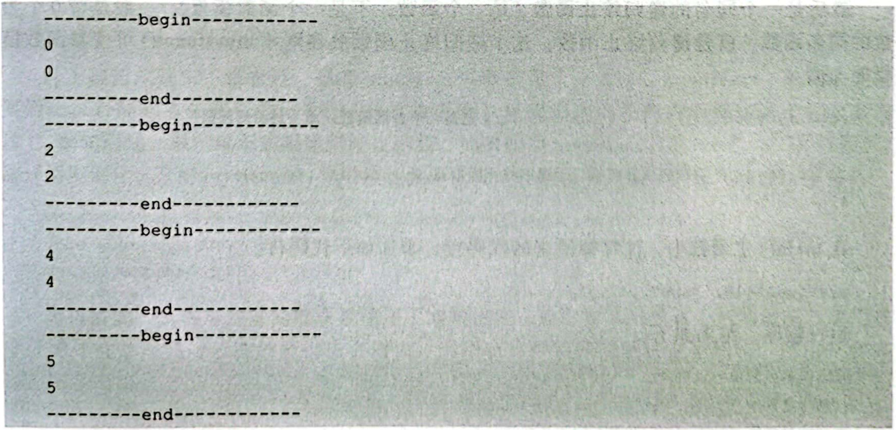
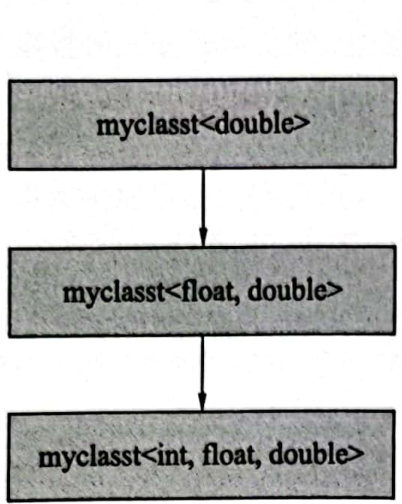
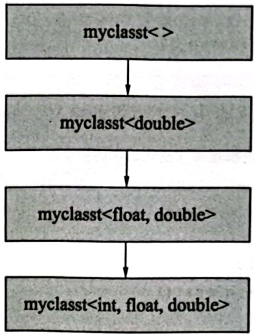
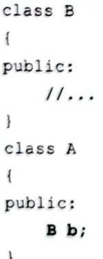

# 2.4可变参模板  

Varia dic Templates，是 C++11 标准引人的。  

可变参模板允许模板定义中含有0到多个（任意个）模板参数，以往实现类似可变参模板的功能是很麻烦的（后面会讲到一个范例一不使用可变参模板的情况下模拟对可变参模板的支持），而真正引人可变参模板后，就可以把以往为了实现类似功能所写的烦琐代码大量简化。可变参模板提供了诸多很神奇的功能，但是要想用好，并不容易。  

到了 $\mathbf{C}\mathrm{++}\ \mathbf{17}$ 标准中，又引入了很多可变参模板的新特性，笔者建议的学习方法是先学习一些可变参模板的基础知识，而一些新标准、新特性，遇到再学，随时遇到随时学。因为有很多的知识点，如果单独讲解，虽然读者能够看懂，但是如何更好地运用，却是一个问题，如果一个知识点学完后不能够很好地运用，那这个知识点就白学了。  

## 2.4.1可变参函数模板  

### 1.基本含义  

先看一个普通的函数，这是一个最简单的没有形参的函数：  

``` cpp
void myptfunct()  
{  
}
```

再看一个可变参函数模板，名字是myvtfunct（与普通函数名字不同）：  

``` cpp
template <typename... T>  
void myvtfunct(T... args) //T：一包类型  ，args：一包形参  
{  
    cout << "---------begin------------" << endl;  
    cout << sizeof...(args) << endl; //收到的参数数量  
    cout << sizeof...(T) << endl;    //收到的类型数量  
    cout << "---------end------------" << endl;  
}
```

在main0主函数中加入以下代码，对可变参函数模板进行调用。  

``` cpp
myvtfunct();  
myvtfunct(10, 20);  
myvtfunct(10, 25.8, "abc", 68);  
myvtfunct<double, double>(10, 25.8, "abc", 68, 73); //指定部分类型，让编译器推导另一部分类型是允许的
```

运行程序，结果如下。  

  

从结果可以看到，每次调用可变参模板myvtfunct()，就打印出了参数的数量。代码中有以下几个注意点。  

（1）注意template行的写法，尖括号中的typename后面带3个点（代表参数包），然后才修饰 T。  

（2）代码行voidmyvtfunct（T..args）中，因为T后面带了….，所以将T称为可变参类型，看起来是一个类型名，实际上其中包含的是0到多个不同的类型（一包类型）。所以理解T这个名字的时候，不能把它理解成一个类型，而是要理解成0到多个不同的类型。args一般称为一包或一堆参数，而且每个参数的类型可以各不相同。这包参数（函数模板的形参）中可以容纳0到多个参数，而且这些参数可以为任意类型。  

（3）代码中的sizeof.属于固定语法，是 $\mathbf{c}_{++}$ 11在标准引人的，用于可变参函数模板或可变参类模板内部，用来表示收到的模板参数个数或类型数量，针对的只能是这种..的可变参，它后面的圆括号中可以是函数模板的形参（args），也可以是类型模板参数（T）。  

myvtfunct()这个可变参函数模板有一个问题，就是在获得了一包参数之后，程序员必须要把这一包参数逐个拿到手进行处理，也就是参数包的展开(一包参数怎样展开)问题。  

对于这种可变参函数模板，展开的套路是比较固定的，一般都是用递归函数的方式展开参数包。为了实现用递归函数的方式展开参数包，就要求在可变参函数模板的代码编写中，有一个参数包展开函数和一个同名的递归终止函数，通过这两个函数把参数包展开。  

所以，在实际的应用中，myvtfunct()不会像上面这样写（这样写无法将参数包展开)，而应该写成“一个参数包展开函数 $^+$ 一个同名的递归终止函数”。现在，开始改造myvtfunctO，my vt fun c tO，首先写参数包展开函数：  

``` cpp
template <typename T, typename...U>  
void myvtfunct(T firstarg, U ...otherargs)  
{  
    cout << "收到的参数值为:" << firstarg << endl;  
    myvtfunct(otherargs...); //递归调用，注意塞进来的是一包形参，这里...不能省略       
}
```

然后是一个同名的递归终止函数（是一个函数，不是一个函数模板)，一般是带0个参数的同名函数，就是递归终止函数，这个递归终止函数放在刚才 myvtfunct()可变参函数模板的上面。  

``` cpp
void myvtfunct()//这是个普通函数，而不是函数模板  
{  
    cout << "参数包展开时执行了递归终止函数myvtfunct()" << endl;  
}
```

在main（主函数中，注释掉原来的代码行，添加如下代码行。

``` cpp
myvtfunct(10, "abc", 12.7);
```

运行程序，结果如下。  

``` cpp
收到的参数值为：10
收到的参数值为：abc
收到的参数值为：12.7
参数包展开时执行了递归终止函数myvtfunct（）  
```

看一下这个结果，不难理解：  

第1次调用myvtfunct()，firstarg 拿到10，剩余两个参数被otherargs 拿到了，输出10；  

第2次调用myvtfunct()，otherags中的两个参数，一个被拆分给了firstarg，另一个被other arg s，输出abc。  

以此类推，每次调用 myvtfunct()，otherargs 中的参数数量就减少一个。最终当这一包参数（otherargs）为空的时候，就会调用void myvtfunct()。此时，递归终止函数myvtfunct（）就被执行了。  

通过这种把第1个和其余的参数分开的手段，把可变参函数模板中的参数逐个拿到手。这个调用过程拆开后其实就是：①myvtfunct(10,"abc",12.7);②myvtfunct("abc",12.7); 3myvtfunct(12.7); 4 myvtfunct();.

在 $\mathsf{C}\!+\!+\,17$ 标准中增加了一个语句，叫作编译期间if语句（constexprif，注意实际写代码时这两个单词是反过来写的，详见下面的代码）。与常规的if语句类似，但在if语句后面又增加了一个constexpr关键字，这个关键字代表“常量”或编译时求值（编译时就能把值确定）这个概念。通过编译期间if语句，就可以把上述的递归终止函数myvtfunct()省下来。如何做到，很简单，只需要修改一下myvtfunct()这个函数模板：  

``` cpp
template <typename T, typename...U>  
void myvtfunct(T firstarg, U ...otherargs)  
{  
    cout << "收到的参数值为:" << firstarg << endl;  
    if constexpr (sizeof...(otherargs) > 0) //constexpr必须有否则无法成功编译，圆括号中是常量表达式  
    {  
       myvtfunct(otherargs...); //递归调用，塞进来的是一包形参，这里...不能省略  
    }  
    else   
{  
  ////不需要做什么，其实整个else可以不要
    }  
}
```

从上面的代码中不难看到，只有otherargs参数数量大于O时，myvtfunctO模板才会被实例化，否则就不会被实例化（else 分支被丢弃，里面出现的任何内容都相当于从未出现过)。换句话说，根本就不需要递归终止函数。如果调用myvtfunct(10，“abc"，12.7);代码行，编译器实例化出来的myvtfunctO）函数应该是下面几个，读者有兴趣可以用dumpbin观察。  

```cpp
void myvtfunct<int, char const*, double>(int, char const*, double)
void myvtfunct<char const*, double>(char const*, double)
void myvtfunct<double>(double)
```

可以看到，这种可变参函数模板使用了递归技术，递归技术当然有一定的理解和使用难度；另外就是递归对系统的开销也会增大，编译项目时编译时间肯定会加长，使用时要谨慎，不要滥用。  

下面为针对ifconstexpr的进一步认识，请读者仔细理解。（1）不满足条件的分支，也同样会被编译器编译（被编译器进行语法检查）。  

如果编译期间ifconstexpr语句的条件不满足，那么不满足条件的代码行依旧会被编译 器编译。例如，在myvtfunctO）函数模板的末尾添加代码：  

``` cpp
if constexpr (sizeof...(otherargs) > 100) 
{  
    testfunc();
}
```

可以明显地看到这个if constexpr语句在编译期间其所包含的条件不会满足，因为main（）主函数中代码行myvtfunct(10，“abc"，12.7);只提供了3个实参。但是不管这个ifconstexpr条件是否满足，编译都会报错，因为testfunc（）函数并没有被定义。这说明，即便ifconstexpr条件不成立，但其中包括的代码行也一样会被编译。这一点与条件编译不同，对于#ifdef条件编译，如果条件不满足，则对应的代码段不会被编译器编译（当然也就不存在进行语法检查的问题)。例如，下面的代码段不会报错，因为并没有定义过_MYDEF_宏，所以testfuncO；这行代码不会被编译。  

```cpp
#ifdf __MYDEF__
	testfunc();
#endif
```

（2）ifconstexpr所指定的条件必须是常量。  

在对ifconstexpr的理解上，可以将其理解为普通的if语句，只是这个if语句的判断条件从执行期间判断挪到了编译期间判断，仅此而已。既然是编译期间判断，那么要求if constexpr中的条件必须是编译期常量（编译期间其值是确定的）。所以，如果写出如下代码是一定会出错的，因为i是变量，其值在运行期间才能确定。  

```cpp
int i = 8;
if constexpr (i > 0)
{
...
}
```
总之，ifconstexpr的存在完善了在模板与泛型编程中的程序执行路径选择问题。  

### 2.重载  

可变参函数模板也可以重载，看一看下面的范例，两个可变参函数模板，一个普通函数。  

``` cpp
template<typename... T>  
void myfunc(T... arg)  
{  
    cout << "myfunc(T... arg)执行了!" << endl;  
}  
  
template<typename... T>  
void myfunc(T*... args)  
{  
    cout << "myfunc(T*... args)执行了!" << endl;  
}  
  
void myfunc(int arg)  
{  
    cout << "myfunc(int arg)执行了!" << endl;  
}
```

在main(）主函数中，注释掉原来的代码行，添加如下代码行。  

``` cpp
myfunc(NULL);  
myfunc(nullptr);  
myfunc((int*)nullptr);
```

运行程序，结果如下。  

``` cpp
myfunc（intarg）执行了！
myfunc（T...arg）执行了！
myfunc（T*...args）执行了！  
```

对于可变参数模板的选择，编译器内部也有一套比较复杂的排序规则，与普通函数模板一样，不用深究，当把握不准的时候，可以多做测试。一般来讲，当调用一个普通函数和调用实例化后的函数模板都合适的时候，编译器会优先选择普通函数。例如，代码行myfunc(NULL);执行的是普通的myfuncO）函数，如果把myfunc(）普通函数注释掉，那么就会执行voidmyfunc（T...arg){...}函数模板。  

## 2.4.2折叠表达式  

折叠表达式（Fold Expressions）是 $\mathsf{C}\!+\!+\,17$ 标准引人的，引人折叠表达式的主要目的是计算某个值（表达式的结果当然是一个值）。这个值的特殊性在于：它与所有可变参有关，而不是与单独某个可变参有关。换句话说，需要所有的可变参都参与计算，才能求出该值(如求所有可变参的和)。但是在可变参函数模板中，因为展开参数比较麻烦，如要把传递进来的这些参数加在一起，可能要写很多代码，而通过折叠表达式，只需要一行代码就可以求出所有可变参的和（而不需要再对这些可变参进行参数展开）。看看下面这个范例是如何解决的。  

``` cpp
template<typename... T>  
auto add_val(T ... args)  
{  
    return (... + args);  //圆括号不能省略，否则会出现编译错误
}
```

在main（主函数中添加代码：  

``` cpp
cout << add_val(10, 20, 30) << endl
```

运行程序，结果如下。  

60  

从结果可以看出，add_val0)这个可变参函数模板中的return返回的是10，20，30这3个可变参（一包参数）的和值。  

在上面的范例中，return语句后面的圆括号中就是一个折叠表达式。折叠表达式一般有4种格式（注意每种格式都是用圆括号括起。另外，所谓左折就是参数从左侧开始计算；所谓右折就是参数从右侧开始计算）。  

#### 1.一元左折（U nary Left Fold）  

格式：（..运算符一包参数）  

计算方式：（（参数1运算符参数2）运算符参数3）运算符参数 $N$  

运算符指的就是 $\mathbf{c}_{++}$ 语言中的运算符，绝大部分运算符都可以用在这里，如上面范例中的加号。  

这种形式的3个点在最开头，中间是运算符，最后是这一包参数的形式，正好是上述add_val)可变参函数模板范例中用到的形式，这种形式的表达式进行的计算是从第1个参数开始的：参数1与参数2作运算，得到的结果再与参数3作运算，以此类推。所以，求参数和这种运算用这种形式就很容易实现。  

#### 2.一元右折（U nary Right Fold）  

格式：（一包参数运算符.）  

计算方式：（参数1运算符（·（参数N-1运算符参数 $N$ 》  

这种形式的3个点在最后，一包参数在开头，运算符还是在中间，位置没变，这种形式的表达式进行的计算是从最后的参数开始的：最后两个参数先作运算，得到的结果再与倒数第3个参数作运算，以此类推。对于加法这种满足交换律的运算，范例中 add_val()的return语句行修改如下，结果也是一样的。  

``` cpp
return (args +...)
```

看一个范例，代码如下。  

``` cpp
template<typename... T>  
auto sub_val_left(T... args)  
{  
    return (... - args); //形式1  
}  
template<typename... T>  
auto sub_val_right(T... args)  
{  
    return (args - ...);  //形式2  
}
```

在mainO主函数中添加代码：  

``` cpp
cout << sub_val_left(10, 20, 30, 40) << endl; //-80  
cout << sub_val_right(10, 20, 30, 40) << endl; //-20
```

运行程序，新增代码行的执行结果如下。  
``` cpp
-80
-20
```

这个结果是如何得到的呢？sub_val_left()的计算顺序是从第1个参数开始，整个计算顺序应该是：  

$$
\left(\,\left(10\!-\!20\,\right)\,-\!30\,\right)\,-\,40\;\;=\;\;-\,80
$$  

而sub_val_right()的计算顺序是从最后两个参数开始，整个计算顺序应该是：  

10-（20-（30-40))=-20  

#### 3.二元左折（Binary Left Fold）  

格式：（init运算符..运算符一包参数）  

计算方式：（（init运算符参数1）运算符参数2）运算符参数 $N$  

其中，init表示一个初始的东西，它可能是一个值，也可能是一个其他的东西。这种形式的表达式进行的计算是：先将init与参数1作运算，得到的结果再与参数2作运算，得到的结果再与参数3作运算，以此类推。  

看一个范例，代码如下。  

``` cpp
template<typename... T>  
auto sub_val_left_b(T ... args)  
{  
    return (220 - ... - args);  
}
```

在mainO主函数中添加代码：  

``` cpp
cout << sub_val_left_b(10, 20, 30, 40) << endl; //120
```

运行程序，新增代码行的执行结果如下。  

120  

根据计算规则，sub_val_left_b0的计算顺序是从左将220依次与参数作运算，整个计算顺序应该是：  

（((220-10)-20)-30)-40=120  

上面这个范例的init代表的是一个数字220。再看一个范例，这个范例中的init代表的不是一个数值，这个范例用来把实参连在一起并输出。  

``` cpp
template<typename... T>  
void print_val_left_b(T ... args)  
{  
    (cout << ... << args);  
}
```

在main（主函数中添加代码：

``` cpp
print_val_left_b(10, "abc", 30, "def"); //10abc30def
```

运行程序，结果如下、  

10abc30def  

根据计算规则，print val left bO c out $<<10$ ，这样就输出一个10，因为 $<<$ 运算符返回的还是cout（对象），所以再次计算时相当于执行cout $<<$ “abc"，以此类推，最终将所有参数输出到屏幕上。  

#### 4.二元右折（Binary Right Fold）

格式：（一包参数运算符...运算符init）  

计算方式：（参数1运算符（（参数 $N$ 运算符init）)）  

这种形式的表达式进行的计算是：先将最后一个参数与init（想象为一个初始值）作运算，得到的结果再与倒数第2个参数作运算，得到的结果再与倒数第3个参数作运算，以此类推。  

看一个范例，代码如下。  

``` cpp
template<typename... T>  
auto sub_val_right_b(T ... args)  
{  
    return (args - ... - 220);  
}
```

在main（主函数中添加代码：  

``` cpp
sub_val_right_b(10, 20, 30, 40) << endl; //200
```

运行程序，新增代码行的执行结果如下。  

200  

根据计算规则，sub_val_right_b()的计算顺序是从右将 220与各参数作运算，整个计算顺序应该是：  

$$
10\,\mathrm{-}\,(\,20\,\mathrm{-}\,(\,30\,\mathrm{-}\,(\,40\,\mathrm{-}220\,)\,)\,)\ \ =\ \ 200
$$  

可以看到，折叠表达式像一个循环语句，在循环中，对各个参数进行指定的计算，仅此而已。折叠表达式就先简单理解到这，以后遇到更复杂的情形时再进一步细说。  

## 2.4.3可变参表达式  

折叠表达式体现的主要是多个参数之间的一些运算，那么，参数本身能否做-一些运算呢？也是可以的，这里提供几个范例。  

首先，利用折叠表达式中二元左折的知识创建print_result()函数模板，这个函数模板其实和上面的 print_val_left_b()比较类似，但参数增加了const引用，以免创建临时对象，从而提升程序执行效率。  

``` cpp
template<typename... T>  
auto print_result(T const& ... args)  
{  
    (cout << ... << args) << " 结束" << endl;  
    return (... + args); //计算一下参数的和值  
}
```

在 main(）主函数中添加如下代码，直接调用print_result(）函数模板。  

``` cpp
cout << print_result(10, 20, 30, 40) << endl;
```

运行程序，新增代码行的执行结果如下。  

``` cpp
10203040 结束 
100  
```


从结果中不难看到，print_result(）利用cout打印出了这些参数的值，在main(主函数中也通过cout利用print_result（)的返回值输出了这些参数的和。  

现在，有这样一个需求，希望每个参数的值扩大到原来的2倍，然后再进行彼此之间的加法运算。例如，传人print_resuit(）的参数是10，20，30，40，那么希望输出的结果是：  

``` cpp
20406080 结束  
200
```

也就是说，希望每个参数都进行单独的2倍运算，然后计算2倍之后的和。要解决这个问题，比较好的方式是引人一个中间的函数模板，如下。  

``` cpp
template<typename... T>  
void print_calc(T const& ... args)  
{  
    cout << print_result(2 * args...)<< endl;
}
```

在mainO主函数中添加代码：  


``` cpp
print_calc(10, 20, 30, 40);
```

运行程序，新增代码行的执行结果如下。  

``` cpp
20406080 结束  
200
```

上面的范例中，特别值得注意的是print calc（）中2*args.这个写法，这其实就是可变参表达式，等价于print_result(2*10,2*20,2*30,2*40);。

其实，2*args.这种可变参表达式有多种写法，可以尝试各种不同的print_result（）参数写法：

```cpp
print_result(2 * args);      // 语法错误，编译不通过
print_result(args... * 2);  // 语法错误，编译不通过
print_result(args * 2...);  // 语法错误，编译不通过，...不可以直接跟在一个数字之后
print_result(args * 2 ...); // 成功，数字与...之间应用空格分隔
print_result((args * 2) ...); // 成功
```

通过范例可以感受到一点，这3个点比较独立，也比较重要，有“其余参数”的意思，可以与args合起来使用，也可以单独使用。日后对这种语法见得多了，就会慢慢熟悉了。  

另外，下面的写法效果也是一样的。  

``` cpp
cout << print_result (args + args...) << endl;
```

这种前面使用的是单纯的args（不可以带·），中间用一个 $^+$ 连接，后面是args...的写法，也是可变参表达式，等价于print_result( $10{+}10$  $\mathbf{20+20}$  $\mathbf{30+30}$  $\mathbf{40+40})$ ）;，请读者注意。  

## 2.4.4可变参类模板  

可变参类模板也和可变参函数模板一样，允许模板定义中含有0到多个（任意个）模板参数。可变参类模板参数包的展开方式有多种，读者可以注意观察和搜集，这里介绍一些比较典型的展开方式。可变参类模板和可变参函数模板不一样，也不如可变参函数模板好理解。  

### 1.通过递归继承方式展开类型、非类型、模板模板参数包  

下面主要讲一讲如何通过递归继承的方式展开参数包，这是一种非常常见的类模板参数包展开方式。  

1）类型模板参数包的展开  

看一个可变参类模板的范例。先写一个可变参类模板的偏特化：  

``` cpp
template<typename First, typename... Others>  
class myclasst<First, Others...> : private myclasst<Others...> //偏特化  
{
};
```

注意观察上面的代码，观察继承的是谁，模板参数也是分开成一个和一包，这种写法比较固定。  

如果此时编译，会报错，因为要先写一个泛化版本的类模板，然后才能写特化版本的类模板。所以，在上面代码的前面添加代码：  

``` cpp
//主模板定义（泛化版本的类模板）  
template<typename ...Args>  
class myclasst   
{  
};
```

现在编译，就不会报错了。  

实际上也有人这样写：  

``` cpp
template<typename ...Args> class myclasst;
//主模板声明
```

按照上面这行修改，再次编译，发现也没问题。这样写就不是类模板定义，而是类模板声明（前向声明或前置声明）了。当然，这种写法能编译成功的前提条件是不用声明的这个类模板创建对象。如果后续用该类模板来创建对象，那就必须要进行类模板定义而不是声明（后面章节会遇到许多只声明不定义的情形）。  

这里要特别强调一点：有时这种只写类模板的声明而不写成类模板定义的编程手法非常重要，靠这种手段可以帮助程序员排错一有时程序员本意就是不想使用类模板的定义，但编程时却无意中使用到了，此时，不写类模板的定义的好处就是编译器会报错，程序员就可以通过这个错误定位问题。后面还会频繁看到这种编程手法。  

现在，继续改造上面的可变参类模板的偏特化写法，在其中增加构造函数以及一个成员变量：  

``` cpp
template<typename First, typename... Others>  
class myclasst<First, Others...> : private myclasst<Others...> //偏特化  
{  
public:  
    myclasst() :m_i(0)  
    {  
       printf("myclasst::myclasst()偏特化版本执行了,this = %p,sizeof...(Others)=%d\n", this, sizeof...(Others));  
    }  
    First m_i;  
};
```

然后改造一下主模板的定义，也加入一个构造函数：

``` cpp
//主模板定义（泛化版本的类模板）  
template<typename ...Args>  
class myclasst   
{  
public:   
    myclasst()  
    {  
       printf("myclasst::myclasst()泛化版本执行了,this = %p\n", this);  
    }  
};
```

在mainO主函数中添加代码：

``` cpp
myclasst<int，float，double>myc;  
```

运行程序，结果如下。  


``` cpp
myclasst:myclasst()泛化版本执行了，this=012FFE44
myclasst::myclasst()偏特化版本执行了this=012FFE44,sizeof...(Others)=0 myclasst::myclasst()偏特化版本执行了，this=012FFE44,sizeof...(Others)=1 myclasst::myclasst()偏特化版本执行了，this=012FFE44,sizeof...(Others)=2
```

这里执行了4个构造函数，那就要猜测一下，系统实例化出了4个类，先来说其中的后3个类，因为分析源码不难。  

执行代码行myclasst<int，float，double>myc;时，系统会去实例化的是3个类型模板参数的类模板。根据写法 class myclasst<First,Others.>: private myclasst<Others..>，它继承的是两个类型模板参数的类模板，而两个类型模板参数的类模板继承的是一个类型模板参数的类模板。因此，系统首先会去实例化带一个类型模板参数的类模板（从最老的开始，没有老的哪里有小的)，然后实例化带两个类型模板参数的类模板，最后实例化带3个类型模板参数的类模板。  

描述一下继承关系，如图2.5所示。  

想象一下，这种继承方法是：把一包拆成一个和一包，剩余这一包，因为每次都分出去一个，就会变得越来越小。拆到第3次，所继承的这个父类（myclasst<Others..>）就会是继承一个模板参数为0个的特殊的特化版本，而这个特化版本，并不满足classmyclasst<First,Others.. $\cdot^{>}$ 这种格式（因为这种格式要求带至少一个模板参数）。  

结合刚才程序的运行结果，编译器遇到带0个模板参数的类模板的时候，就停止类模板的继承。同时，这种带0个模板参数的类模板是通过myclasst的泛化版本（也就是myclasst主模板的定义）实例化的。  

所以，最终得到的完整的可变参类模板递归继承方式层次如图2.6所示。  

  
图2.5可变参类模板递归继承方式层次关系  

  
图2.6完整的可变参类模板递归继承方式层次  

结合图2.6，完整的实例化顺序为：  

（1）系统首先会实例化带0个类型模板参数的类（先执行的是主模板类的构造函数）;  

（2）再实例化带一个类型模板参数的类;

（3）再实例化带两个类型模板参数的类；

（4）最后实例化带3个类型模板参数的类。

上面说过，这种带0个模板参数的类模板是通过myclasst的泛化版本实例化的，如果己写一个模板参数数量为0个的特化版本当然也是可以的。

``` cpp
template<> class myclasst<>  //一个特殊的特化版本  
{  
public:  
    myclasst()  
    {  
       printf("myclasst<>::myclasst()特殊的特化版本执行了,this = %p\n", this);  
    }  
};
```

再次运行程序，结果如下（注意第1行结果，发生了变化)。  


``` cpp
myclasst<>::myclasst()特殊的特化版本执行了，this=001AF940
myclasst::myclasst()偏特化版本执行了，this=001AF940,sizeof...(Others)=0 myclasst::myclasst()偏特化版本执行了，this =001AF940,sizeof...(Others)=1 myclasst::myclasst()偏特化版本执行了，this=001AF940,sizeof...(Others)=2
```

通过上面的学习，可以看到，myclasst<>做了老祖宗类。  

现在，在上面的偏特化代码中，增加一个有参数的构造函数，让这个类模板变得更实用一些。这里要在初始化列表中给成员变量赋值，还要调用父类的有参构造函数。  

``` cpp
template<typename First, typename... Others>  
class myclasst<First, Others...> : private myclasst<Others...> //偏特化  
{  
public:  
    myclasst() :m_i(0)  
    {  
       printf("myclasst::myclasst()偏特化版本执行了,this = %p,sizeof...(Others)=%d\n", this, sizeof...(Others));  
    }  
  
    //注意这第二个参数，这一包东西的写法  
    myclasst(First parf, Others... paro) :m_i(parf), myclasst<Others...>(paro...)  
    {  
       cout << "-----------------begin------------------" << endl;  
       printf("myclasst::myclasst(parf,...paro)执行了,this = %p\n", this);  
       cout << "m_i = " << m_i << endl;  
       cout << "-----------------end------------------" << endl;  
    }  
    First m_i;  
};
```

在main（主函数中添加代码：  

``` cpp
myclasst<int,float,double>myc_2(12,13.5,23);  
```

运行程序，新增代码行的执行结果如下。  

``` cpp
myclasst<>:myclasst()特殊的特化版本执行了，this=012FFE40
begin-
myclasst::myclasst(parf,...paro)执行了，this=012FFE40 m_i= 23
end-
begin
myclasst::myclasst(parf,...paro)执行了，this =012FFE40 m_i= 13.5
end
begin
myclasst: ： myclasst(parf,...paro)执行了，this =012FFE40 m_i= 12
```

其实，这里讲解的范例代码取材于 $\mathbf{C++}$ 标准库中的tuple（元组）。元组的功能就是可以把各种不同类型的数据放到一起保存，构成一个元组对象。而tuple这个类模板的实现，采用的也正是递归继承的方式。可以看到，这种实现代码的理解和适应是需要一个过程的，刚开始的时候可能不太习惯，前期可以以理解和模仿为主。后面笔者会展示一个元组的实现，但不通过递归继承的方式实现，而是通过递归组合的方式实现，让读者有机会学习到各种可变参模板的参数展开方式。  

这里需要提醒读者注意以下几点。  

（1）这种带3个点的模板参数数量一般不能超过一个，否则可能引起语法上的错误。例如，下面的写法在编译时会出现语法错误，因为带3个点的模板参数数量为两个。  

``` cpp
template<typename ...Args1, typename ... Args2 >  
class myclasst_2  
{  
};
```

（2）如果有多个模板参数，那么这种带3个点的模板参数必须作为最后一个模板参数出现。下面的写法中，带3个点的模板参数作为第1个模板参数出现，会导致编译时出现语法错。  

``` cpp
template<typename ...Args, typename U>  
class myclasst_3  
{  
};
```

（3）上述两点一般是针对类模板的泛化版本而言，而对于类模板的特化版本，不一定遵照上述约定，后面章节中会展示一些类模板特化版本的写法，届时再详细探讨。  

2）非类型模板参数包的展开  

参数包不仅可以是类型的，也可以是非类型的，日后读者见到非类型模板参数包也不要感觉奇怪。看看下面的范例，写一个叫作myclasst2(）的类模板。  

``` cpp
//主模板定义（泛化版本的类模板）  
template<int... FTArgs> //int替换为auto也没问题  
class myclasst2  
{  
public:  
    myclasst2()  
    {  
       printf("myclasst2::myclasst2()泛化版本执行了,this = %p\n", this);  
    }  
};  
  
template<int First, int... Others> //两个int都替换为auto也没问题  
class myclasst2<First, Others...> : private myclasst2<Others...> //偏特化  
{  
public:  
    myclasst2()  
    {  
       printf("myclasst2::myclasst2()偏特化版本执行了,this = %p,sizeof...(Others)=%d,First=%d\n", this, sizeof...(Others), First);  
    }  
};
```

在main(主函数中添加代码：  

``` cpp
myclasst2<12,18,23>myc2;  
```

运行程序，结果如下。  


``` cpp
myclasst2::myclasst2()泛化版本执行了，this=006FF79B
myclasst2::myclasst2()偏特化版本执行了，this=006FF79B,sizeof...(Others)=0,First=23 myclasst2::myclasst2()偏特化版本执行了，this=006FF79B,sizeof...(Others)=1,First=18 myclasst2::myclasst2()偏特化版本执行了，this=006FF79B,sizeof...(Others)=2,First=12
```

 3）模板模板参数包的展开  

模板模板参数也可以打成一包。来看一个范例，首先注意确保 MyProject.cpp 文件开头部分包含了如下头文件。  

``` cpp
#include <vector>  
#include <list>  
#include <deque>
```

接着，继续添加代码：  

``` cpp
template<typename T,  
    template<typename> typename... Container> //泛化  
class ParentMM  
{  
public:  
    ParentMM()  
    {  
       printf("ParentMM::ParentMM()泛化版本执行了,this = %p\n", this);  
    }  
};  
  
template<  
    typename T,  
    template<typename> typename FirstContainer, template<typename> typename... OtherContainers  
>  
class ParentMM<T, FirstContainer, OtherContainers...> : private ParentMM<T, OtherContainers...> //偏特化  
{  
public:  
    ParentMM()  
    {  
       printf("ParentMM::ParentMM()偏特化版本执行了,this = %p,sizeof...(OtherContainers)=%d\n", this, sizeof...(OtherContainers));  
       m_container.push_back(12);  
    }  
    FirstContainer<T> m_container;  
};  
  
template<  
    typename T,  
    template<typename> typename... Container  
>  
class myclasst3 :private ParentMM<T, Container...>  
{  
public:  
    myclasst3()  
    {  
       printf("myclasst3::myclasst3()执行了,this = %p,T的类型是:%s,Container参数个数是%d个\n", this, typeid(T).name(), sizeof...(Container));  
    }  
};
```

这里要特别提醒一下读者，上面的范例中，笔者使用了typeid（T).name（）输出T的类型，此外，后面章节的范例中还会用Boost库中的诸如type_id_with_cvr<..>O.pretty_name()显示类型。根据笔者实测，在某些场合，如一些涉及万能引用（前向引用）、类型推断的场合，Boost库中显示类型的方式更准确，虽然代码看起来更复杂。关于万能引用这个话题，后面会有介绍。  

在mainO主函数中添加代码：  

``` cpp
myclasst3<int，vector,1ist，deque> myc3；  
```

运行程序，结果如下。  

``` cpp
ParentMM::ParentMM()泛化版本执行了，this=008FF758
ParentMM::ParentMM()偏特化版本执行了，this =008FF758,sizeof...(OtherContainers)=0 ParentMM::ParentMM()偏特化版本执行了，this =008FF758,sizeof...(OtherContainers)=1 ParentMM::ParentMM()偏特化版本执行了，this=008FF758,sizeof...(OtherContainers)=2 myclasst3::myclasst3()执行了，this=008FF758,T的类型是：int,Container参数个数是3个
```

读者可以通过dumpbin工具查看编译器为这个可变参类模板实例化了哪些具体的类，大概如下（最上面的是老祖宗类）。  

```cpp
ParentMM<int>
ParentMM<int, class std::deque>
ParentMM<int, class std::list, class std::deque>
ParentMM<int, class std::vector, class std::list, class std::deque>
myclasst3<int, class std::vector, class std::list, class std::deque>
```

这些范例并没有多完善，程序实现的主要功能就是要把这些可变参数展开。笔者展示这些范例的意图就是让读者看到形形色色的概念和用法，以便遇到时能够从容面对。  

### 2.通过递归组合方式展开参数包  

前面讲解了通过递归继承方式展开参数包，把前面的代码做一个调整，调整成通过递归组合方式展开参数包。回忆一下组合关系（也称为复合关系)，其实就是一种包含关系：  

  

```cpp
class B {
public:
    //...
};

class A {
public:
    B b; // 类A中包含对象B，b作为类A的成员变量
};
```
A与B之间是一种组合关系，如图2.7所示。图2.7中，实心菱形在哪个类这边，就表示哪个类中包含另外一个类的对象（这里是类A包含类B的对象）作为成员变量。那么，如何调整前面的可变参数类模板 myclasst()的偏特化代码，达到“通过递归组合方式展开参数包”的目的呢？    

  
图2.7组合关系示意图  


``` cpp
//主模板定义（泛化版本的类模板）  ,没有变动
template<typename ...Args>  
class myclasst  
{  
public:  
    myclasst()  
    {  
       printf("myclasst::myclasst()泛化版本执行了,this = %p\n", this);  
    }  
};  
  
template<typename First, typename... Others>  
class myclasst<First, Others...> //: private myclasst<Others...> //偏特化  
{  
public:  
    myclasst() :m_i(0)  
    {  
       printf("myclasst::myclasst()偏特化版本执行了,this = %p,sizeof...(Others)=%d\n", this, sizeof...(Others));  
    }  
    //注意这第二个参数，这一包东西的写法  
    myclasst(First parf, Others... paro) :m_i(parf), m_o(paro...)//, myclasst<Others...>(paro...)  
    {  
       cout << "-----------------begin------------------" << endl;  
       printf("myclasst::myclasst(parf,...paro)执行了,this = %p\n", this);  
       cout << "m_i = " << m_i << endl;  
       cout << "-----------------end------------------" << endl;  
    }  
    First m_i;  
    myclasst<Others...> m_o;  
};
```

上面的代码中，与继承相关的部分代码已经注释掉，而后增加了一个 $\mathbf{m}_{-}\circ$ 成员变量，在构造函数初始化列表中对 $\mathbf{m}\_\circ$ 进行初始化，注意观察。特殊的特化版本代码不变：  

``` cpp
template<> class myclasst<>  //一个特殊的特化版本  
{  
public:  
    myclasst()  
    {  
       printf("myclasst<>::myclasst()特殊的特化版本执行了,this = %p\n", this);  
    }  
};
```

main（主函数中的代码不变，依旧是：  

``` cpp
myclasst<int,float,double> myc（12,13.5,23）;  
```

运行程序，结果如下。  

``` cpp
myclasst<>::myclasst()特殊的特化版本执行了，this=002AFD04
begin
myclasst::myclasst(parf,...paro)执行了，this=002AFCFC m i = 23
end
begin
myclasst::myclasst(parf,...paro)执行了，this=002AFCF4 m i= 13.5
end
begin
myclasst::myclasst(parf,...paro)执行了，this=002AFCEC m i = 12
end
```

这个结果与改造之前（通过递归继承方式展开参数包）代码的结果进行比较，能发现一些问题：  

（1）通过递归继承方式展开参数包执行的结果中，打印出的this值都相等，这说明实例化出来的这个对象由很多子部分构成（见图2.6的子部分）;  

（2）通过递归组合方式展开参数包执行的结果中，打印出的this值都不相等，这说明产生了几个不同的对象。  

可变参类模板递归组合方式展开参数包所形成的层次关系如图2.8所示。  

  
图2.8可变参类模板递归组合方式层次关系  

读者可以通过dumpbin工具查看编译器为这个可变参类模板实例化了哪些具体的类。  

### 3.通过元组和递归调用展开参数包

下面介绍展开参数包的另外一种方式。

1）元组的概念和简单演示  

前面说过，元组（tuple）中能够装各种不同类型的元素（数据）。可以将下面的代码放人main()主函数中演示并观察结果，增加对元组的认识（本书后面还有对元组的详细剖析）。  

``` cpp
tuple<float, int, int> mytuple(12.5f, 100, 52);//一个tuple（元组）：一堆各种类型数据的组合  
//  元组可以打印，用标准库中的get（函数模板）  
    cout << get<0>(mytuple) << endl; //12.5  
    cout << get<1>(mytuple) << endl; //100   
cout << get<2>(mytuple) << endl; //52
```

继续演示，在main(（）主函数上面（外面）写一个可变参函数模板：  

``` cpp
template <typename...T>  
void myfunctuple(const tuple<T...>& t) //可变参函数模板  
{  
}
```

在main（）主函数中，继续添加如下代码，可以设置断点并观察程序的执行。

``` cpp
myfunctuple(mytuple); //成功调用myfunctuple
```

2）通过元组和递归调用展开参数包  

用这种方式展开参数包需要写类的特化版本，整体有一定难度，需要慢慢适应。具体的实现思路就是有一个计数器（变量），从0开始计数，每处理一个参数，计数加1，一直到把所有参数处理完，最后，提供一个模板偏特化，作为递归调用结束。创建一个新的可变参类模板，my class t 4。  

``` cpp
//类模板的泛化版本  
template <int mycount, int mymaxcount, typename ...T> //mycount用于统计，从0开始，mymaxcount表示参数数量，可以用sizeof...取得  
class myclasst4  
{  
public:  
    //下面的静态函数，借助tuple（类型），借助get（函数），就能够把每个参数提取出来  
    static void mysfunc(const tuple<T...>& t) //静态函数。注意，这个实现套路中参数是tuple  
    {  
       cout << "value = " << get<mycount>(t) << endl; //可以把每个参数取出来并输出  
       myclasst4<mycount + 1, mymaxcount, T...>::mysfunc(t); //计数每次+1，这里是递归调用，调用自己  
    }  
};
```

然后，必须要有一个特化版本，用于结束递归调用。  

``` cpp
//偏特化版本,用于结束递归调用  
template <int mymaxcount, typename ...T>  
class myclasst4<mymaxcount, mymaxcount, T...> //注意<>中前两个都是mymaxcount  
{  
public:  
    static void mysfunc(const tuple<T...>& t)  
    {  
       //这里其实不用干啥，因为计数为0,1,2是用泛化版本中的mysfunc处理，到这里时是3，不用做什么处理了  
    }  
};
```

然后，继续完善上面的可变参函数模板myfunctuple()的代码，在其中将使用刚定义的my class t 4。  

``` cpp
template <typename...T>  
void myfunctuple(const tuple<T...>& t) //可变参函数模板  
{  
    myclasst4<0, sizeof...(T), T...>::mysfunc(t); //注意第一个参数是0，表示计数从0开始  
}
```

main（）主函数中代码保持不变，还是：  

```cpp
tuple<float, int, int> mytuple(12.5f, 100, 52); 
myfunctuple(mytuple);
```

运行程序，结果如下。  

``` cpp
value=12.5
value =100
value=52
```

非常好，成功地利用元组展开了参数包。  

### 4.基类参数包的展开 

直接看范例，演示某个类的基类也可以是可变参。

``` cpp
template<typename... myclasstPList>  
class myclasst5 : public myclasstPList...  
{  
public:  
    myclasst5() : myclasstPList()...  
    {  
       cout << "myclasst5::myclasst5,this = " << this << endl;  
    }  
};  
  
class PA1   
{  
public:  
    PA1()  
    {  
       cout << "PA1::PA1,this = " << this << endl;  
    }  
private:  
    char m_s1[100];  
};  
class PA2   
{  
public:  
    PA2()  
    {  
       cout << "PA2::PA2,this = " << this << endl;  
    }  
private:  
    char m_s1[200];  
};  
class PA3   
{  
public:  
    PA3()  
    {  
       cout << "PA3::PA3,this = " << this << endl;  
    }  
private:  
    char m_s1[300];  
};
```

在main（主函数中添加代码：  

``` cpp
myclasst5<_nmsp10::PA1, _nmsp10::PA2, _nmsp10::PA3> obj;  
cout << "sizeof(obj)=" << sizeof(obj) << endl; //600
```

运行程序，结果如下。  

``` cpp
PA1: ： PA1, this = 012FF56C 
PA2: PA2, this 012FF5D0 PA3: : 
PA3, this = 012FF698
myclasst5::myclasst5,this = 012FF56C 
sizeof (obi)=600
```

上面这个范例中，myclasst5<classPA1，classPA2，class $\mathbf{PA3}{}>$ 类被指定了3个父类一PA1，PA2，PA3，注意看sizeof（obj）的值是600，是3个父类所占内存空间的和。在构造obi对象的时候，不难发现，PA1的this指针和myclasst5的this指针值是相同的，而PA2和PA3的this指针与PA1和myclasst5是不同的，并且PA2和PA3彼此的this指针值也不同，这其实是在多重继承情况下的this指针调整导致的结果。如果读者对this指针调整这个概念不清晰并有兴趣了解，建议阅读笔者的《 $\cdot_{\mathbf{C}++}$ 新经典：对象模型》这本书，这也是一本非常经典的书籍。  

### 5.特化  

可变参模板不存在全特化，只有偏特化。这里简单介绍一下写法，定义一个泛化版本和多个特化版本的可变参类模板。  

``` cpp
template<typename ...Args>//泛化版本  
class myclasst  
{  
public:  
    myclasst()  
    {  
       printf("myclasst泛化版本执行了,this = %p,sizeof...(Args)=%d\n", this, sizeof...(Args));  
    }  
};  
  
template<typename First, typename... Others>  
class myclasst<First, Others...>//特化版本，因为myclasst后面跟了尖括号，注意识别，另外...代表的参数包，必须放在整个参数的最后，比如<Others...，First>是错误的  
{  
public:  
    myclasst()  
    {  
       printf("myclasst<First, Others...>偏特化版本执行了,this = %p,sizeof...(Others)=%d\n", this, sizeof...(Others));  
    }  
};  
  
template<typename Arg>  
class myclasst<Arg>  
{  
public:  
    myclasst()  
    {  
       printf("myclasst<Arg>偏特化版本执行了,this = %p\n", this);  
    }  
};  
  
template<typename Arg1, typename Arg2>  
class myclasst<Arg1, Arg2>  
{  
public:  
    myclasst()  
    {  
       printf("myclasst<Arg1,Arg2>偏特化版本执行了,this = %p\n", this);  
    }  
};
```

在main（主函数中添加代码：  

``` cpp
myclasst<int> myc1;  
myclasst<int, float> myc2;  
myclasst<int, float, double> myc3;  
myclasst<int, float, double, char> myc4;
myclasst<> myc5;
```

运行程序，结果如下。  

``` cpp
myclasst<Arg>偏特化版本执行了，this=0073F8AB
myclasst<Arg1,Arg2>偏特化版本执行了，this=0073F89F
myclasst< First, others...>偏特化版本执行了，this=0073F893, sizeof..( others)=2 myclasst< First, others..>偏特化版本执行了，this=0073F887, sizeof...( others)=3 myclasst泛化版本执行了，this =010FF9E3,sizeof...(Args)=0
```

可变参类模板的特化形式多种多样，后面章节中还会有演示。