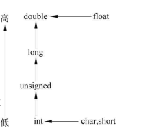

# 常量、变量、整形、实型和字符型(要有代码证明)

## 1.C语言的数据类型

### 基本类型（Primitive Types）

1. **整数类型（Integer Types）**：

    - `char`：最小的整数类型，通常用于存储字符。
    - `int`：基本的整数类型，有不同的尺寸和符号。
    - `short int` 或 `short`：比标准 `int` 小的整数。
    - `long int` 或 `long`：比标准 `int` 大的整数。
    - `long long int` 或 `long long`：比 `long int` 更大的整数。

    这些整数类型都可以用 `signed` 或 `unsigned` 修饰来表示符号或无符号的变量。

2. **浮点类型（Floating-Point Types）**：

    - `float`：单精度浮点数。
    - `double`：双精度浮点数。
    - `long double`：比双精度更大的浮点数。

3. **布尔类型（Boolean Type）**：

    - `_Bool`：在C99标准中引入，表示布尔值（真或假）。

4. **枚举类型（Enumeration Type）**：

    - `enum`：用于定义由一组命名的整数常量组成的类型。

5. **字符类型（Character Type）**：

    - `signed char`：表示有符号字符。
    - `unsigned char`：表示无符号字符。

### 构造类型（Constructed Types）

1. **数组类型（Array Types）**：
    - 用来定义具有固定大小和相同类型元素的集合。
2. **结构体类型（Structure Types）**：
    - `struct`：用来定义由多个不同类型数据组成的复合类型。
3. **共用体类型（Union Types）**：
    - `union`：用来定义可以存储不同数据类型但在任一时间只能存一个的变量。
4. **函数类型（Function Types）**：
    - 定义了函数的返回类型和参数类型。

### 指针类型（Pointer Types）

- 指针类型是对上述所有类型的指针表示，如 `int*` 表示指向 `int` 类型的指针。

### 空类型（Void Type）

- `void`：表明没有值，通常用于指定无返回值的函数或无类型的指针。

### 类型修饰符（Type Qualifiers）：

- `const`：指定变量的值不能改变。
- `volatile`：告诉编译器不要优化这样的变量，因为它可能会在程序的控制之外被改变。
- `restrict`：一个指针修饰符，表明指针是访问数据对象的唯一且初始的方式。

### 类型存储类（Type Storage-Class Specifiers）：

- `auto`：自动变量，通常不需要显式声明。
- `register`：提示编译器尝试将变量存储在寄存器中。
- `static`：静态存储期的变量。
- `extern`：表明变量或函数是在其他文件或本文件的其他位置定义的。

以上是C语言中数据类型的详细和完整列表。不同的编译器可能会提供额外的类型，但这些是标准的C语言所支持的类型。

### 对C语言中auto关键字的说明：

​	在C语言中，`auto` 关键字确实存在，但其作用可能并不像在C++中那样广为人知或频繁使用。在C语言标准中，`auto` 用于声明自动存储类的变量，这是局部变量的默认存储类别。然而，由于所有局部变量默认就是自动存储类别，因此在实际编程中几乎不需要显式地使用 `auto` 关键字。

##### 	**C语言中的自动存储类别 (`auto`)**

- **定义**：`auto` 关键字用于声明自动存储类别的变量。这意味着变量具有自动存储期，它们在声明它们的代码块（通常是一个函数）开始执行时被自动创建，在离开该代码块时被自动销毁。
- **使用场景**：局部变量默认为自动存储类别，所以通常不需要显式指定 `auto`。

**例子**

在C语言中，你可能见到这样的代码：

```c
void function() {
    int a;        // 默认为自动存储类别
    auto int b;   // 显式声明为自动存储类别
}
```

这里的 `a` 和 `b` 都是自动变量，它们在 `function` 调用时被创建，在函数返回时被销毁。指定 `auto` 对 `b` 没有实际的影响，因为这是默认行为。

##### 	**C++ 中的 `auto`**

​	值得一提的是，在C++11及以后的版本中，`auto` 关键字被重新定义用于类型推断。在C++中，`auto` 使得编译器能够自动推断变量的类型，这与C语言中的用法完全不同。例如：

```cpp
auto x = 5;  // x 被推断为 int
auto y = 3.14; // y 被推断为 double
```

##### **总结**

​	尽管在C语言中存在 `auto` 关键字，其用途主要是历史性的，现代C语言程序中几乎不使用它，因为局部变量默认就是自动存储类别。与之相比，C++中的 `auto` 关键字用于完全不同的目的，具有更现代和实用的语义。在学习或使用C语言时，通常可以忽略 `auto` 关键字，除非是出于兼容旧代码或特定文档要求的目的。

​	在现代C语言编程中，确实很少有使用`auto`关键字的场景。这主要是因为`auto`关键字的默认行为（声明自动存储类别的变量）已经是所有局部变量的默认状态。局部变量默认就是自动存储类别，所以在大多数情况下，显式使用`auto`关键字是多余的。历史和其他语境：

1. **历史背景**：
    - 在C语言的早期版本中，`auto`关键字可能被更频繁地使用，那时编程风格和实践还在形成中。随着语言的发展和编程实践的成熟，显式使用`auto`逐渐变得不常见。
2. **教育目的**：
    - 在教授C语言的存储类别时，`auto`关键字有时会被用来示例说明，以帮助学生理解不同存储类别之间的区别，尽管它的实际用途不大。
3. **代码示例和文档**：
    - 一些老旧的教材或文档可能仍然使用`auto`关键字来声明变量，特别是那些追溯到C语言标准化之前的资料。

​	现代用途：除了局部变量默认为自动存储类别外，实际上没有必要或建议使用`auto`关键字。这并不是说`auto`关键字完全无用，而是它的功能已经被内置到了局部变量的默认行为中。在C语言中，其他存储类别关键字如`static`, `extern`, 和 `register`（虽然`register`的实际效果也已被现代编译器优化几乎忽视）提供了更有实际意义的存储类别控制，它们改变了变量的链接属性或存储期，这对于程序的特定行为是有影响的。	

​	总之，除了作为历史和教育工具之外，`auto`关键字在现代C语言编程中没有实际的使用场景。它是一个遗留的关键字，对于新的代码和项目，了解它的存在和背景即可，无需在实际开发中使用。如果你正在编写或维护C语言代码，通常不需要，也不推荐使用`auto`关键字。

## 2.C++语言的数据类型(并与C语言对比)

### 基本类型（Primitive Types）

1. **整数类型（Integer Types）**：
   
    - C++包含了C语言的所有整数类型，并且在C++11以后的标准中增加了固定宽度的整数类型（如 `int8_t`, `uint32_t` 等）。
    
2. **浮点类型（Floating-Point Types）**：
    - C++继承了C语言的所有浮点类型（`float`, `double`, `long double`）。
    
3. **布尔类型（Boolean Type）**：
   
    - C++使用 `bool` 而不是 `_Bool`（C99引入）。
    
    特别说明：
    
    **1.C++下：**
    
    在C++中，`bool` 类型具有两个可能的值：`true` 和 `false`。根据C++标准：
    
    `true` 被定义为等于 1。`false` 被定义为等于 0。
    
    当进行逻辑操作或条件测试时，`true` 表示条件为真，而 `false` 表示条件为假。这与整数值的处理方式相似，其中非零值在条件语句中被视为真（`true`），而零值被视为假（`false`）。
    
    下面是一个简单的例子来说明 `bool` 类型的使用：
    
    ```cpp
    bool a = true;
    bool b = false;
    
    if (a) {
        std::cout << "a is true" << std::endl;
    }
    
    if (!b) {
        std::cout << "b is false" << std::endl;
    }
    ```
    
    在这个例子中，`a` 被初始化为 `true`，因此在条件语句中它被视为真。相反，`b` 被初始化为 `false`，因此 `!b` （b 的逻辑非）为真。
    
    类型转换：在C++中，可以将整数类型隐式转换为 `bool` 类型。当这种转换发生时，任何非零整数都会转换为 `true`，而零值转换为 `false`。反过来，`bool` 类型也可以转换为整数类型，其中 `true` 转换为 1，`false` 转换为 0。
    
    总结：`false` 在 `bool` 类型中表示为零值，`true` 表示为非零值，通常是 1。这使得 `bool` 类型在表达逻辑条件时非常直观和有效。
    
    **2.C语言下：**
    
    在C语言中，情况有所不同，因为C语言标准在C99之前并没有正式的 `bool` 类型。从C99开始，引入了 `_Bool` 类型以支持布尔逻辑。此外，标准库 `<stdbool.h>` 提供了 `bool`、`true` 和 `false` 的宏定义，从而使得使用布尔类型更符合其他语言的习惯。
    
    C语言中的 `bool` 类型：C99 标准中引入的 `_Bool` 类型，其值只能是 0（表示 `false`）或 1（表示 `true`）。
    
    - C99 标准中引入的 `_Bool` 类型，其值只能是 0（表示 `false`）或 1（表示 `true`）。
    
    - 引入 `<stdbool.h>` 头文件后，可以使用 `bool` 作为 `_Bool` 的别名，以及 `true` 和 `false` 作为宏，分别定义为 1 和 0。
    - 这意味着在包含了 `<stdbool.h>` 的程序中，`true` 和 `false` 本质上就是整数常量 1 和 0。
    
    示例：
    
    ```c
    #include <stdio.h>
    #include <stdbool.h> // 包括对 bool, true, false 的定义
    
    int main() {
        bool a = true;
        bool b = false;
    
        if (a) {
            printf("a is true\n");
        }
    
        if (!b) {
            printf("b is false\n");
        }
    
        return 0;
    }
    ```
    
    在这个例子中，使用了 `<stdbool.h>` 来定义 `bool` 类型的变量。这里的 `true` 和 `false` 被定义为整数常量 1 和 0。
    
    类型转换：在C语言中，任何非零值在布尔上下文中都被视为 `true`，而零值被视为 `false`。这与C++相似，但在C中这种转换更多地依赖于整数值的隐式转换规则。
    
    总结：虽然C语言在C99之前没有原生的布尔类型，通过引入 `<stdbool.h>`，C99和之后的版本提供了与其他现代语言相似的布尔逻辑支持。在这种情况下，`true` 和 `false` 直接映射到 1 和 0，使得布尔逻辑在C程序中的表达更加直接和清晰。
    
4. **字符类型（Character Type）**：
   
    - C++保留了C语言的 `signed char` 和 `unsigned char`，同时增加了 `char16_t`, `char32_t`（C++11引入）用于Unicode字符表示。
    
5. **空类型（Void Type）**：
    - C++也有 `void` 类型，与C语言相同。
    
6. **宽字符类型（Wide Character Type）**：
    - C++有 `wchar_t` 类型用于宽字符表示。

### 构造类型（Constructed Types）

1. **数组类型（Array Types）**：
    - C++的数组类型与C语言相同。
2. **结构体类型（Structure Types）**：
    - C++的 `struct` 与C语言的 `struct` 类似，但在C++中，结构体成员可以是函数。
3. **共用体类型（Union Types）**：
    - C++的 `union` 与C语言的 `union` 类似。
4. **枚举类型（Enumeration Type）**：
    - C++有 `enum` 类型，而且C++11还引入了类型安全的枚举 `enum class`。

### 类和模板

- C++引入了面向对象编程的类（`class`），与结构体类似，但提供了封装、继承和多态等特性。
- 模板（`template`）是C++中的泛型编程特性，允许编写代码模板以适应任何数据类型。

### 指针和引用类型

- C++保留了C语言的指针类型，并且引入了引用类型（`&`），提供了另一种形式的间接访问。

### 新的类型修饰符（New Type Modifiers）

- `auto`：在C++11中重新定义，用于类型推导。
- `decltype`：在C++11中引入，用于查询表达式的类型。

### 用户定义的类型（User-Defined Types）

- 类（`class`）、结构体（`struct`）、共用体（`union`）和枚举（`enum`）都可以用来定义新的类型。

### 类型别名

- `typedef`：与C语言相同。
- `using`：C++11引入的新的类型别名语法。

### 类型特性查询

- C++11引入了一系列类型特性查询关键字，如 `std::is_integral`, `std::is_class` 等。

### 原子类型（Atomic Types）

- C++11引入了原子类型 `std::atomic`，用于无锁编程。

### 类型存储类（Type Storage-Class Specifiers）

- 与C语言相同，C++也有 `auto`、`register`、`static`、`extern`，但它们的用法可能有所不同，特别是 `auto`。

C++数据类型的这些扩展使得它比C语言有更多的表现力和更强的类型安全性，允许进行更复杂的抽象和更严格的编程错误检查。

## 3.C/C++语言的常用数据类型所占用的内存空间大小

在C和C++语言中，数据类型所占用的内存空间大小部分依赖于操作系统（OS）、编译器实现以及编译器本身的编译选项（如对齐选项）。以下是一些常见数据类型在32位和64位操作系统上的典型内存占用大小。请注意，这些大小可能会有所变化，特别是对于结构体和类的内存对齐和填充（padding）。

### 整型：

| 数据类型             | 32位系统大小 | 64位系统大小 |
| -------------------- | ------------ | ------------ |
| `char`               | 1 字节       | 1 字节       |
| `int`                | 4 字节       | 4 字节       |
| `short`              | 2 字节       | 2 字节       |
| `long`               | 4 字节       | 8 字节       |
| `long long`          | 8 字节       | 8 字节       |
| `unsigned char`      | 1 字节       | 1 字节       |
| `unsigned int`       | 4 字节       | 4 字节       |
| `unsigned short`     | 2 字节       | 2 字节       |
| `unsigned long`      | 4 字节       | 8 字节       |
| `unsigned long long` | 8 字节       | 8 字节       |

### 浮点型：

| 数据类型      | 32位系统大小 | 64位系统大小 |
| ------------- | ------------ | ------------ |
| `float`       | 4 字节       | 4 字节       |
| `double`      | 8 字节       | 8 字节       |
| `long double` | 8 或 12 字节 | 16 字节      |

`long double` 的大小特别依赖于编译器和平台，有的平台下可能是 12 字节，有的可能是 16 字节。

### 指针：

| 数据类型         | 32位系统大小 | 64位系统大小 |
| ---------------- | ------------ | ------------ |
| 指针（任何类型） | 4 字节       | 8 字节       |

### 特殊类型：

| 数据类型  | 32位系统大小 | 64位系统大小 |
| --------- | ------------ | ------------ |
| `bool`    | 1 字节       | 1 字节       |
| `wchar_t` | 2 或 4 字节  | 2 或 4 字节  |

C++11 引入的 `char16_t` 和 `char32_t` 常用于Unicode字符表示，它们的大小分别是 2 字节和 4 字节，不受操作系统位数影响。

### 枚举：

枚举类型在C++中通常是 `int` 类型，因此通常也是 4 字节。然而，编译器可能会根据枚举值的范围选择更小的类型，如 `char` 或 `short`。

### 类和结构体：

类和结构体的大小取决于它们的成员大小和顺序，以及编译器的内存对齐规则。通常，类和结构体的大小至少等于所有成员大小的总和，但可能会更大，因为可能存在填充字节（padding）来满足特定的内存对齐要求。

这些是典型的大小，但具体情况应该用 `sizeof` 运算符在目标平台上直接检查。因为编译器的不同优化和对齐选项可能会改变实际的大小。

## 4.C/C++语言的常用数据类型取值范围

C/C++语言中常用数据类型的取值范围依赖于它们的大小（以字节计）和是否是有符号类型。以下是基于标准大小的一些常用数据类型的取值范围。请注意，实际取值范围可能因编译器和平台而异，特别是对于整型来说，它们通常遵循特定的数据模型（如ILP32或LP64）。

### 整型：

| 数据类型             | 取值范围                                                     |
| -------------------- | ------------------------------------------------------------ |
| `char`               | -128 到 127 或 0 到 255（取决于是否有符号，默认有符号）      |
| `signed char`        | -128 到 127                                                  |
| `unsigned char`      | 0 到 255                                                     |
| `int`                | -2,147,483,648 到 2,147,483,647                              |
| `unsigned int`       | 0 到 4,294,967,295                                           |
| `short`              | -32,768 到 32,767                                            |
| `unsigned short`     | 0 到 65,535                                                  |
| `long`               | -2,147,483,648 到 2,147,483,647（32位）<br />-9,223,372,036,854,775,808 到 9,223,372,036,854,775,807（64位） |
| `unsigned long`      | 0 到 4,294,967,295（32位）<br />0 到 18,446,744,073,709,551,615（64位） |
| `long long`          | -9,223,372,036,854,775,808 到 9,223,372,036,854,775,807      |
| `unsigned long long` | 0 到 18,446,744,073,709,551,615                              |

​	在C和C++语言中，unsigned long long 类型的大小不直接依赖于操作系统是32位还是64位，而是由编译器和目标平台的ABI（应用程序二进制接口）规范决定。不过，在大多数现代编译器和平台上，unsigned long long 被定义为一个64位的无符号整数类型，其典型内存占用大小如下：

​	32位操作系统：unsigned long long 通常占用 8字节（64位）。
​	64位操作系统：unsigned long long 同样占用 8字节（64位）。
​	这意味着，不管是在32位还是64位操作系统上，unsigned long long 类型通常都是固定的64位宽度，能够表示的数值范围是从0到18,446,744,073,709,551,615。

### 浮点型：

浮点类型的取值范围是由其表示法确定的，它包括尾数（或称为小数部分）和指数。IEEE 754标准定义了单精度和双精度浮点数的大小和范围。

| 数据类型      | 取值范围（大致）                             |
| ------------- | -------------------------------------------- |
| `float`       | 约 ±3.4E±38（7位有效数字）                   |
| `double`      | 约 ±1.7E±308（15位有效数字）                 |
| `long double` | 由实现定义，通常比 `double` 更大的范围和精度 |

> `float` 和 `double` 数据类型在C和C++中用于表示浮点数，即可以有小数部分的数。这两种类型的取值范围和精度由它们的内部表示决定，这通常遵循IEEE 754标准。
>
> IEEE 754标准简介
>
> IEEE 754标准定义了浮点数的存储格式，包括以下几个部分：
>
> - **符号位**（S）：1位，表示数的正负。
> - **指数位**（E）：`float`类型有8位指数，`double`类型有11位指数。
> - **尾数位**（M）或称为有效数字：`float`类型有23位尾数，`double`类型有52位尾数。
>
> 取值范围
>
> #### `float`
>
> - 尾数有23位，指数有8位。
> - 取值范围约为 ±1.4E-45（最小正数，即最小非零值）到 ±3.4E+38（最大正数）。
>
> #### `double`
>
> - 尾数有52位，指数有11位。
> - 取值范围约为 ±4.9E-324（最小正数，即最小非零值）到 ±1.7E+308（最大正数）。
>
> 如何计算取值范围
>
> 取值范围的计算基于指数的大小和尾数的精度。指数决定了数的范围，而尾数决定了数的精度。
>
> - **最小非零值**：最小非零值由最小的指数值（不考虑全0，因为全0指数用于表示0和非正规数）和最小的尾数值（即尾数为1）确定。
> - **最大值**：最大值由最大的指数值和最大的尾数值（尾数全为1）确定。
>
> 具体的范围计算涉及到对浮点数存储格式的深入理解，包括如何解释指数位（考虑偏移量）和如何将尾数与隐含的1组合来计算实际值。
>
> 特殊值
>
> IEEE 754还定义了特殊值，包括正负无穷大（表示溢出）、NaN（Not a Number，表示无效的计算结果）等。
>
> 精度
>
> - `float`的精度约为7个十进制位。
> - `double`的精度约为15个十进制位。
>
> 精度是指能够区分两个相邻值的能力，这由尾数的位数决定。更多的尾数位提供了更高的精度。
>
> ------------------------------------------------------------------------------------------------------------------------------------------
>
> ​	±1.4E-45 表示的是数值范围的一个约定表示法，用于表示最小的正浮点数和它的负对应值在 float 类型中的大致范围。这里的表示法有两部分组成：
>
> ​	± 符号表示这个范围同时适用于正数和负数(因为浮点数表示中包含了符号位（Sign bit），所以能够表示正数和负数。符号位为0时，表示该浮点数是正数；符号位为1时，表示该浮点数是负数 )。也就是说，这种类型的数可以表示从 -1.4E-45 到 +1.4E-45 的范围内的数值，包括两个极值。这意味着，float 类型可以表示非常接近于零的正数和负数，但不是零本身。
> ​	1.4E-45 是科学记数法的表示方式，其中 E 表示10的幂次。因此，1.4E-45 实际上是 1.4 × 10^-45，即1.4乘以10的负45次方。这是一个非常小的数，接近于零，但不等于零。
> ​	使用正负号的原因是浮点数既可以表示正数也可以表示负数，而最小的正浮点数和它的负对应值（即最小的负浮点数）在绝对值上是相等的，但符号不同。这个表示法是一种方便的方式，用来同时说明浮点数类型能够表示的最接近零的正数和负数的大小。

特别说明1：

在C和C++中，浮点数通常并不是精确的。这种不精确性主要来源于两个方面：**浮点数的表示方式**和**有限的精度**。

为什么浮点数不精确？

1. **有限的表示**： 浮点数在计算机中是使用IEEE 754标准表示的。这个标准为浮点数定义了特定的内存布局，包括符号位、指数位和尾数位（或称小数位）。因为这些部分的位数是有限的，所以只能表示一定范围和精度的数值。
2. **二进制基础**： 计算机使用二进制（基数为2）系统来存储数据，而某些十进制小数在二进制系统中无法精确表示。比如，十进制中的0.1在二进制中是一个无限循环小数，就像十进制中的1/3是0.333...一样。当这种类型的小数用有限的位数存储时，必须进行舍入，这导致了精度损失。
3. **舍入误差**： 由于存储空间的限制，浮点数的计算通常涉及舍入。IEEE 754标准规定了几种舍入模式，但最常用的是“最接近偶数”舍入。舍入会在非常细微的层面上改变实际存储的数值，这些小的改变可以在复杂的计算中累积，导致更大的误差。
4. **运算过程中的误差累积**： 浮点运算（如加法、乘法）本身也可能引入额外的误差。当两个浮点数进行运算时，它们的指数可能需要对齐，这可能导致对尾数的进一步舍入。结果是，连续的浮点运算越多，累积误差可能越大。

示例说明

考虑以下C++代码，它展示了浮点数精度问题的一个简单示例：

```cpp
#include <iostream>
#include <iomanip>

int main() {
    double a = 0.1;
    double b = 0.2;
    double c = a + b;

    std::cout << std::setprecision(17);
    std::cout << "a = " << a << std::endl;
    std::cout << "b = " << b << std::endl;
    std::cout << "c = " << c << std::endl;
    std::cout << "c == 0.3: " << (c == 0.3 ? "true" : "false") << std::endl;

    return 0;
}
```

输出可能不会如预期显示`c`等于0.3，而会显示`c`与0.3略有不同，且`c == 0.3`的结果为`false`。这是因为0.1和0.2在二进制中无法精确表示的结果。

结论

因此，在使用C/C++或任何其他使用浮点数的编程语言时，重要的是要意识到这些数值的固有不精确性，并在需要高精度计算时考虑使用其他方法或库，如任意精度计算库。在处理金融和其他需要精确小数运算的应用时，通常建议使用专门的库来避免这些问题。

特别说明2：

在C++中，由于浮点数的存储方式是基于IEEE 754标准的，某些十进制小数（如0.1和0.2）在二进制表示中不能被精确表示。它们将被转换成最接近的二进制近似值，这意味着存储在计算机内存中的实际浮点值略有偏差。

详细分析

在上面给定的示例中，变量`a`和`b`初始化为0.1和0.2。虽然您在代码中直接赋予了它们这些值，但它们在内存中的表示并不会精确地是0.1和0.2。当这些值存储为IEEE 754格式的浮点数时，会发生轻微的舍入误差。

当使用`std::setprecision(17)`来输出这些值时，您将能看到这些舍入后的实际值，通常会看到如下：

```cpp
a = 0.10000000000000001
b = 0.20000000000000001
```

这些输出显示了浮点数的实际存储值，而不是您可能期望的精确的十进制值。这些轻微的差异是由于二进制浮点表示的固有限制所致。

运算后的比较

进一步地，当您计算`c = a + b`并比较`c`与0.3时，同样可能会看到不符合直觉的结果。由于`a`和`b`的值本身就带有误差，它们的和`c`同样会带有误差，导致`c`可能不会精确等于0.3。因此，输出`c == 0.3`的结果可能为`false`。

编程实践提示

在实际的编程实践中，比较两个浮点数是否相等时应该非常小心。建议不直接使用`==`运算符来比较浮点数。相反，应该使用一个小的容忍值（称为epsilon）来确定两个浮点数是否“足够接近”：

```cpp
#include <cmath> // For std::fabs

bool areAlmostEqual(double x, double y, double epsilon = 1e-10) {
    return std::fabs(x - y) < epsilon;
}
```

这种方法可以有效避免由于浮点数精度问题导致的直接比较失败。

因此，`a`和`b`在输出时，将显示为它们的实际存储值，这些值可能与期望的0.1和0.2略有不同。理解和处理这种类型的精度问题是进行科学计算和工程编程时的一个重要方面。

### 其他类型：

| 数据类型  | 取值范围                                     |
| --------- | -------------------------------------------- |
| `bool`    | `true` 或 `false`                            |
| `wchar_t` | 由实现定义，但通常能够表示最广泛使用的字符集 |

对于枚举类型，其取值范围通常与底层整型相同（通常是 `int`）。

要获得特定平台和编译器上的确切取值范围，可以查看 `<limits.h>`（在C中）或 `<climits>`（在C++中）以及 `<float.h>` 或 `<cfloat>`（对于浮点数）。C++还提供了 `<limits>` 头文件，其中包含了模板化的标准库功能，可以用来查询数据类型的属性，例如 `std::numeric_limits<T>::max()` 可以用来确定类型 `T` 的最大可能值。

​	补充：`uint64_t` 和 `uint32_t` 是固定宽度的无符号整数类型，分别是64位和32位宽。它们的范围是：

- `uint32_t`：0 到 4,294,967,295
- `uint64_t`：0 到 18,446,744,073,709,551,615

这些类型在 `<stdint.h>`（C）或 `<cstdint>`（C++）头文件中定义，并确保在不同的平台上具有相同的大小和范围。

## 5.常量和变量

在编程中，常量和变量是基本概念，用于存储数据。它们在程序执行期间占用内存空间，但它们之间有一个关键区别：变量的值可以改变，而常量的值一旦设置就不能更改。

### 各类型数据

#### 整型数据

​	在C和C++中，整数按照数制基础可以划分为十进制、八进制或十六进制。十进制是基于10，八进制是基于8，十六进制是基于16。每种表示法有其特定的前缀或格式，让编译器知道数值是以哪种数制来解释的。

十进制（Decimal）

- **没有特定前缀**。
- 十进制是最常用的数制，用于日常计数和表示。
- **示例**：`123`, `0`, `98765`

八进制（Octal）

- **前缀为 `0`（零）**。
- 八进制数由数字0-7组成。
- 在某些老的编程环境或特定应用中，如文件权限设置在Unix/Linux系统中，仍然使用八进制表示。
- **示例**：`0123` 表示十进制的 `83`。

十六进制（Hexadecimal）

- **前缀为 `0x` 或 `0X`**。
- 十六进制数由数字0-9和字母A-F（或a-f）组成，其中A-F代表十进制的10-15。
- 十六进制广泛用于编程中，特别是在处理颜色、内存地址等方面，因为它可以更紧凑地表示比较大的数值，且每两位十六进制数刚好对应一个字节。
- **示例**：`0x7F`, `0x1A3`, `0xFFEE`

示例代码

下面的C/C++代码展示了如何声明和使用这些不同数制的整型数据：

```c
#include <stdio.h>

int main() {
    int decimal = 255;      // 十进制
    int octal = 0377;       // 八进制，等价于十进制的255
    int hex = 0xFF;         // 十六进制，同样等价于十进制的255

    printf("Decimal: %d\n", decimal);
    printf("Octal: %d\n", octal);
    printf("Hexadecimal: %d\n", hex);

    return 0;
}
// 其实打印时还可以以指定数制(十进制、八进制或十六进制)进行打印,见《6.数据的输出与数据的输入》中内容
```

​	在这个例子中，三个整数变量虽然使用不同的数制表示，但它们都存储了相同的值（十进制的255）。输出会显示这三个变量的十进制值，证明它们实际存储的值是相等的。

#### 实型数据

​	实型数据简称实数，在C/C++语言中称为浮点数(带小数部分的数)。

**实型常量的两种表示形式 :**

​	（1）十进制数表示形式：0.12、3.14159。 

​	（2）指数表示形式：指数形式使用 `E` 或 `e` 来表示10的幂。这种形式在表示非常大或非常小的数时非常有用。当使用指数表示法时，`E`（或小写的 `e`）后面跟着的数字表示10的指数。如果指数是正数，可以省略加号（`+`），但负数必须明确写出减号（`-`）。例如：

- `168E2` 或 `168e2` 表示 `168 × 10^2 = 16800`。其实等价于 `168E+2` 或 `168e+2`。
- `168E-8` 或 `168e-8` 表示 `168 × 10^-8 = 0.00000168`。

**实型变量的分类:**

​	C语言中，实型变量分为单精度和双精度两种类型。 

​	（1）float：单精度变量。 

​	（2）double：双精度变量。

**举例1:**

```c
#include <stdio.h>

int main() {
    // 单精度浮点数
    float singlePrecision = 3.14159f;
    float singleExp = 1.68E2f; // 等价于 168.0

    // 双精度浮点数
    double doublePrecision = 0.000000168;
    double doubleExp = 168E-8; // 等价于 0.00000168

    printf("Single Precision Decimal: %f\n", singlePrecision);
    printf("Single Precision Exponential: %f\n", singleExp);
    printf("Double Precision Decimal: %lf\n", doublePrecision);
    printf("Double Precision Exponential: %lf\n", doubleExp);

    return 0;
}
```

**举例2:**

```cpp
// 打印精度问题探讨：
/*
在C语言中，printf函数用于格式化输出数据，其中%f和%lf是用于格式化浮点数的转换说明符。不同的说明符和它们的精度指定符（如.20在%.20f中）会影响输出的格式和精度。下面详细解释这些格式说明符的作用和区别：

	%f 和 %lf
%f: 用于格式化输出float或double类型的浮点数。在C99及之后的标准中，%f可以用于double类型的数据，因为默认情况下，float类型的参数会被提升为double类型当作printf的参数（这是由于C语言的默认参数提升规则）。
%lf: 在C语言的早期版本中，%f用于float，而%lf用于double。但从C99开始，%f和%lf都可用于double，因为printf中的float类型的实参在传递前已自动提升为double。%lf的引入主要是为了与scanf的%lf（读取double类型的浮点数）保持一致。

	精度指定符 .20 在 %f 和 %lf 中的使用
%.20f 或 %.20lf: 这种格式指定符用来设置浮点数输出的小数点后的精度，此处为20位小数。无论是%.20f还是%.20lf，它们实际上在printf中的行为是相同的，都会打印出一个浮点数（double），小数点后保留20位数字。选择使用%f还是%lf主要是为了代码的可读性和一致性。

如果要输出更高精度的浮点数，可以使用%.20f或%.20lf。下面是修改后的示例代码：
*/
#include <stdio.h>
int main() {
    // 单精度浮点数
    float singlePrecision = 3.14159f;
    float singleExp = 1.68E2f; // 等价于 168.0

    // 双精度浮点数
    double doublePrecision = 0.000000168;
    double doubleExp = 168E-8; // 等价于 0.00000168

    printf("Single Precision Decimal: %.20f\n", singlePrecision);
    printf("Single Precision Exponential: %.20f\n", singleExp);
    printf("Double Precision Decimal: %.20lf\n", doublePrecision);
    printf("Double Precision Exponential: %.20lf\n", doubleExp);

    return 0;
}
/*在这个修改后的代码中，%.20f和%.20lf被用来确保所有浮点数都打印出小数点后20位的精度。尽管对于float类型，超出其精度的数字（一般是7位小数）可能没有实际意义，但这可以清楚地展示如何控制浮点数的输出精度。
结论：
总的来说，%f和%lf在printf中的行为是相同的，但%lf可以在代码中提供额外的清晰度，尤其是在与scanf函数交互时，其中%lf用于读取double类型的数据。精度指定符（如.20）可以用于控制输出的精度，适用于%f和%lf。*/


////////////////////////////////////////////////////////////////////////////////////////
/*在C++中，对于printf函数而言，%f和%lf的使用与C语言中描述的非常相似。这是因为C++在很多方面继承了C的标准库，包括stdio.h中的printf函数。因此，C++中printf的格式化行为与C语言保持一致。

	%f 和 %lf 在C++中的使用
%f 和 %lf：
在C++中，printf使用%f或%lf格式化说明符来打印浮点数（即float或double类型）的行为与C语言中的相同。由于C++也采用默认参数提升规则，float类型的值在传递给printf时自动提升为double。
因此，无论是%f还是%lf，它们在printf中都用于格式化double类型的值。使用%lf虽然在打印时与%f等效，但它主要是为了与scanf中的用法保持一致，scanf使用%lf来读取double类型的输入。
	精度指定符 .20 的使用
%.20f 或 %.20lf：
使用这些精度指定符可以控制浮点数输出时小数点后的位数，这里是20位。这对于需要精确控制输出格式的情况非常有用，例如在科学计算、工程领域或任何需要精确数值输出的应用中。
在C++中，这种精度控制与C中的行为相同，都是为了提供可预测的输出格式。
示例代码
下面是一个在C++中使用printf的示例：*/
#include <iostream>
#include <cstdio> // For printf

int main() {
    double num = 123456.7890123456789;

    printf("Default double output: %f\n", num);
    printf("Double output with 20 decimal places: %.20f\n", num);

    return 0;
}
/*C++中更现代的替代方案
虽然printf在C++中仍可使用，但C++提供了更现代的I/O库，如iostream，其中std::cout与流操作符<<提供了类型安全的替代方案，能够处理类型自动推导和更丰富的格式化功能。例如：*/
#include <iostream>
#include <iomanip> // For std::setprecision  包含了用于输入输出流格式化的库，这里主要使用了std::setprecision来设置浮点数输出的精度

int main() {
    double num = 123456.7890123456789;
    
	/*使用std::cout来输出字符串和变量。std::endl用于在输出后添加一个换行符，并刷新输出流的缓冲区，确保内容立即显示在控制台或其它输出设备上。*/
    std::cout << "Default double output: " << num << std::endl;
    
    /* std::fixed是一个操作符，用于设置浮点数的输出格式为定点格式（即非科学计数法），这通常与std::setprecision一起使用，以控制输出中小数点后的位数。std::setprecision(20)设置随后输出的浮点数小数精度为20位。这意味着浮点数将被格式化为小数点后有20个数字，不论这些数字的实际意义如何*/
    std::cout << "Double output with 20 decimal places: "
              << std::fixed << std::setprecision(20) << num << std::endl;

    return 0;
}
/*这个程序展示了如何在C++中格式化输出浮点数，特别是如何控制小数点后的位数。这种方法在需要精确控制输出格式的财务应用、科学计算等领域非常有用。使用std::fixed和std::setprecision可以明确地定义输出的外观，使得输出更易于阅读和理解。*/
```


#### 字符型数据

**字符常量(或叫做字符字面量)**

​	在单引号中包围的单个字符。

- 除了直接使用可见字符（如 `'a'`、`'b'`、`'1'` 等）外，还可以使用转义序列来表示控制字符或者特殊字符（如 `'\n'` 表示换行，`'\t'` 表示制表符，`'\0'` 表示空字符）。
- 在C和C++中，字符常量实际上是整型数据，因此它们在内存中占据一个或多个字节，这取决于编译器和目标平台。通常，它们的类型是 `int`。

字符常量示例：

```c
char ch1 = 'a';
char ch2 = '\n';
char ch3 = '\0';
```

**字符串常量(字符串字面量)**

​	是在双引号中包围的字符序列。

- 字符串常量自动在末尾包含一个空字符（`'\0'`），用于标记字符串的结束。这意味着字符串 `"hello"` 实际在内存中表示为 `{'h', 'e', 'l', 'l', 'o', '\0'}`。
- 字符串可以包含转义字符，比如 `"Line1\nLine2"` 中的 `\n` 代表新行。
- 如果字符串中显式包含 `\0`，它将被视为字符串的一部分，直到第一个 `\0` 出现。例如，`"asd\0asdasd"` 实际上在C或C++程序中作为 `{'a', 's', 'd', '\0'}` 使用，因为第一个 `\0` 标记了字符串的结束。

字符串常量示例：

```c
const char* str1 = "Hello, world!";
const char* str2 = "Line1\nLine2";
const char* str3 = "asd\0asdasd";  // 只会识别到 "asd"
```

**总结**

​	在编程实践中，了解字符和字符串字面量的这些基本特性对于处理文本数据非常重要，尤其是在需要对字符串进行操作或解析时。字符常量和字符串常量在C和C++中的这种行为提供了在内存中精确地控制它们的方式，这对于性能敏感型应用或底层编程尤为关键。

#### 整型字面量实型字面量后缀探讨

**实型字面量后缀**

- **`F` 或 `f`**：此后缀将实型字面量指定为`float`类型，而不是默认的`double`类型。
- **`L` 或 `l`**：用于浮点数时，这些后缀指定字面量为`long double`类型，提供比标准`double`更大的尺寸和/或精度（依赖于编译器和平台）。

​	默认情况下，没有任何后缀的浮点数字面量，如 `3.14159` 或 `1.68E2`，会被视为 `double` 类型。当在浮点数字面量后添加一个 `f` 或 `F` 后缀时，该字面量被视为 `float` 类型，例如 `3.14159f`。使用 `l` 或 `L` 后缀（例如 `3.14159L`）会将字面量指定为 `long double` 类型。

特殊：不加 `f` 后缀的影响

- 如果一个浮点数字面量如 `3.14159` 被赋值给一个 `float` 变量，但没有使用 `f` 后缀，编译器会首先将该数视为 `double` 类型，然后在赋值时将其转换为 `float` 类型。这可能会导致精度上的细微差异，尤其是在数值非常大或非常小的情况下。
- 在绝大多数情况下，这种隐式转换不会导致问题，但最佳实践是使用 `f` 后缀明确表示这是一个 `float` 类型的字面量，以避免不必要的精度损失和提高代码清晰度。

特殊：`double` 类型的数值加上 `f` 后缀

- 如果你对一个本应为 `double` 类型的浮点数添加 `f` 后缀，如 `1.68E2f` 被认为是 `float` 类型，然后你将其赋值给一个 `double` 类型的变量，它会首先被创建为 `float` 类型，然后在赋值时被转换为 `double` 类型。这种转换可能导致精度不必要的损失，因为 `float` 的精度低于 `double`。

示例代码

```c
#include <stdio.h>
int main() {
    float singlePrecision = 3.14159; // 没有 'f', 但隐式转换为 float
    float singleExp = 1.68E2f;       // 显式声明为 float

    double doublePrecision = 0.000000168f; // 'f' 使它先被当作 float，再转换为 double
    double doubleExp = 168E-8;             // 默认为 double

    printf("Floats: %f, %f\n", singlePrecision, singleExp);
    printf("Doubles: %lf, %lf\n", doublePrecision, doubleExp);

    return 0;
}
/*在这个例子中，doublePrecision 被初始化为一个 float，显示了如何不恰当地使用 f 后缀可能会引入精度问题。在实际编程中，应当根据变量的数据类型正确选择使用 f 或省略它。*/
```


**整型字面量后缀**

- **`U` 或 `u`**：这些后缀指定字面量为`unsigned`类型。未加修饰的整数字面量默认为`signed`。使用`U`或`u`，可以确保数值被处理为无符号数，这对于大于或等于`INT_MAX+1`的值特别重要。

说明：当在C或C++中使用未加修饰的整数字面量时，默认情况下，这些整数被视为`signed`类型。这个默认的行为对处理特定数值范围内的数据是有效的，但在处理非常大的数值时，如果超过了`signed int`的最大限制，就可能遇到问题。这是因为使用`signed`整数可能导致整数溢出或未定义行为，特别是当值预期为正值且超过`signed`类型的正值范围时。

超过`INT_MAX`的影响：

在C和C++中，整数类型的范围受其大小（通常为32位或64位）限制：

​	对于32位`int`类型，`signed int`的范围大约是`-2,147,483,648`到`2,147,483,647`（即`-2^31`到`2^31 - 1`）。

​	当您有一个数值如`2,147,483,648`（即`2^31`），如果将其视为`signed int`，它会导致溢出，因为这个值超出了`signed int`的正值最大范围。

溢出的结果：

​	**溢出**: 在C和C++中，如果一个`signed`整数因为赋值或计算超出其表示范围，将发生溢出。溢出的行为是未定义的，这可能导致程序崩溃、产生错误的结果或安全漏洞。

​	**未定义行为**：对于`signed`整数的溢出，C和C++标准没有定义应当发生什么，这意味着编译器可以自由决定如何处理这种情况。

使用`U`或`u`后缀的重要性：

通过在整数字面量后添加`U`或`u`后缀，您可以明确地告诉编译器这个字面量应该被处理为`unsigned int`类型：

​	`unsigned int`的范围是`0`到`4,294,967,295`（即`0`到`2^32 - 1`）对于32位整数。这意味着它可以安全地存储`2,147,483,648`而不发生溢出。

​	使用无符号类型可以避免溢出的风险，确保数值在预期的正值范围内正确处理。

示例

假设在不使用`U`后缀的情况下声明了一个大于`INT_MAX`的数值：

```c
int main() {
    int a = 2147483648; // 这将引起编译错误或在某些平台上导致溢出
    unsigned int b = 2147483648U; // 正确处理
    printf("%u\n", b);
    return 0;
}
```

​	在这个例子中，不加`U`后缀的声明会导致问题，而加了`U`后缀的声明则能确保数值在无符号整数的范围内正确处理。因此，明确指定整数类型为`unsigned`通过使用`U`或`u`后缀是非常重要的，尤其是在处理可能超过`signed int`范围的大数值时。这样做有助于提高程序的可靠性和稳定性。

但是如果这样呢？`unsigned int b = 2147483648;`

没有使用`U`或`u`后缀，这种情况下的处理依赖于编译器和平台，但可能存在潜在问题。具体情况如下：

字面量类型解析

1. **字面量类型**：在C和C++中，如果一个整数字面量没有任何后缀且其值在`int`能表示的范围内，它默认为`int`类型。如果值超出`int`的范围，但在`long int`或`unsigned long int`范围内，则根据值的大小和可用的整数类型自动升级为`long int`或`unsigned long int`。
2. **整数溢出和类型升级**：对于字面量`2147483648`，在一个32位系统上，这个数正好超过了`signed int`的最大值（`2147483647`），但在`unsigned int`的范围内（最大到`4294967295`）。不带`U`的字面量可能会被编译器解释为`long int`（取决于编译器和平台），因为它超出了`signed int`的范围。

编译器的行为

- **不同平台的差异**：在64位编译器（如现代GCC或Clang）上，即使未加`U`后缀，该字面量可能也不会引起错误，因为`long int`通常足够大（通常为64位）以容纳这个数。然而，在32位系统或某些特定的编译器配置下，这可能导致警告或错误，因为`2147483648`默认为`signed long`，然后被隐式转换为`unsigned int`。
- **潜在的警告**：在某些编译器上，即便可以编译通过，也可能会发出警告，指出从`signed`到`unsigned`的隐式类型转换可能不是预期的行为。

最佳实践

为避免任何不确定性或依赖于特定平台/编译器的行为，最好明确使用`U`或`u`后缀，确保编译器正确解析字面量的类型，如：

```c
unsigned int b = 2147483648U;
```

​	这样，明确告诉编译器这是一个`unsigned int`字面量，确保无论在哪个平台或使用哪个编译器，都能正确地处理这个数值，避免潜在的类型混淆和隐式转换问题。总之，使用`U`或`u`后缀是处理大整数字面量的安全做法，它提供了代码的可移植性和清晰的类型意图表达。

- **`L` 或 `l`**：这些后缀指定整型字面量为`long`类型。不过，使用小写的`l`有时可能与数字`1`混淆，因此推荐使用大写的`L`。
- **`LL` 或 `ll`**：指定字面量为`long long`类型，适用于非常大的整数值。

举例

```c
#include <stdio.h>

int main() {
    unsigned int uValue = 100u;       // Unsigned int
    unsigned long ulValue = 1000000UL; // Unsigned long
    unsigned long long ullValue = 1234567890123ULL; // Unsigned long long

    float fValue = 3.14159f;          // Float
    long double ldValue = 3.141592653589793238L;   // Long double

    printf("Unsigned int: %u\n", uValue);
    printf("Unsigned long: %lu\n", ulValue);
    printf("Unsigned long long: %llu\n", ullValue);
    printf("Float: %f\n", fValue);
    printf("Long double: %Lf\n", ldValue);

    return 0;
}
```

​	同上面描述实型字面量后缀的两种特殊情况那样，整型对应也存在对应的类似问题，此处不予讨论，太多情况需要考虑了。


**特别说明**

​	在C和C++中，浮点类型（实型数据）不存在无符号（unsigned）的版本。浮点类型默认允许表示正数、负数以及零。主要的浮点类型包括：

1. **`float`**：通常实现为32位单精度浮点数。
2. **`double`**：通常实现为64位双精度浮点数。
3. **`long double`**：精度至少等于`double`，但具体的位数取决于编译器和目标平台，通常用于需要比`double`更高精度的场合。

浮点数的性质

浮点数的设计允许它们表示非常宽广的数值范围，这是通过将数字存储为尾数（或称为有效数字）和指数的组合来实现的。这种表示方式允许浮点数存储正数和负数，而无需像整型那样需要明确指定是否为“无符号”。

浮点数的符号位

浮点数标准（例如IEEE 754）为浮点数定义了一个符号位，该位位于数字的最高位：

- 如果符号位为0，表示数值为正（包括零）。
- 如果符号位为1，表示数值为负。

这种方式使得浮点数能够在不牺牲数值范围的情况下，自然地表示正数和负数。

示例

以下是一个简单的C程序示例，展示了如何声明和使用浮点数，并输出它们的一些属性：

```c
#include <stdio.h>

int main() {
    float a = 3.14f;
    double b = -3.14;
    long double c = 3.14L;

    printf("float: %f\n", a);
    printf("double: %lf\n", b);
    printf("long double: %Lf\n", c);

    return 0;
}
```

​	这个例子中没有“无符号浮点数”，因为所有浮点类型默认支持正负数表示。对于数值处理，这提供了更大的灵活性和直观性，尤其是在科学计算和工程领域中，这些领域经常需要处理各种正负变化的数值。

​	总结来说，不存在无符号实型（浮点型）数据的概念，因为浮点数类型的设计本身就包括了对正负数的支持。

### 整形(长短无符号)、字符类型的范围

​	整型和字符类型的范围通常不使用指数形式来表示，因为它们是基于整数的数据类型，通常以整数的形式表达其范围。不过，我们可以计算出表示它们所需的比特数，并间接使用指数形式表达这一点。

**整型和字符类型的范围**

​	整型和字符类型的范围取决于它们在内存中占用的位数（bit）。例如，一个8位的`char`可以存储 28=25628=256 个不同的值。如果是无符号类型，它的范围是从0到255；如果是有符号类型（通常是使用二进制补码表示），它的范围是从 −128−128 到 127127。

**用指数形式表示范围**

虽然我们通常不使用指数形式直接表示整型或字符类型的范围，我们可以使用指数来描述它们能表示的值的数量，特别是当我们讨论类型的位宽时。这种表示方法特别适用于描述数据类型能覆盖的“数量空间”。

**整型**

- **8位无符号整型 (`uint8_t`)**：范围是 00 到 28−128−1，即 00 到 255255。
- **8位有符号整型 (`int8_t`)**：范围是 −27−27 到 27−127−1，即 −128−128 到 127127。
- **16位无符号整型 (`uint16_t`)**：范围是 00 到 216−1216−1，即 00 到 65,53565,535。
- **32位无符号整型 (`uint32_t`)**：范围是 00 到 232−1232−1，即 00 到 4,294,967,2954,294,967,295。

**字符类型**

- **字符 (`char`)**：如果是无符号，范围是 00 到 28−128−1；如果是有符号，范围是 −27−27 到 27−127−1。

**示例**

假设我们有一个16位的无符号整型，其范围我们可以这样描述：

- **数值范围**：从 00 到 65,53565,535。
- **指数形式描述**：可以表示 216216 个不同的值。

这种方式虽然不是传统的指数表示数值范围的方法，但它有效地利用了指数来描述整型和字符类型的数据能力，尤其是在比较或计算不同位宽的类型时非常有用。

**结论**

虽然我们不通常用指数形式来直接表示整型或字符类型的范围，通过指数我们可以了解这些类型可表示的值的总数，这在处理底层数据结构或进行系统设计时非常重要。这种表达方式更多地用于理解和教育，帮助我们清晰地看到不同数据类型的存储能力和限制。

### 变量

变量是一个数据存储位置，其值在程序执行期间可以被修改。每个变量都有一个数据类型，决定了变量可以存储的数据的类型（如整数、浮点数、字符等）、所占内存的大小以及如何解释存储的位模式。

在C或C++中，声明变量时，必须指定其类型。例如：

```c
int age = 30; // 在C和C++中声明一个整数变量age并初始化为30
```

变量声明后，可以在程序中使用该变量存储、检索和修改数据。

### 常量

常量是一种只能被赋值一次且其值在程序执行期间不允许改变的变量。常量提供了一种保护数据不被意外修改的方式，使得程序更易于理解和维护。

在C语言中，可以使用`#define`预处理指令或`const`关键字来定义常量。在C++中，推荐使用`const`关键字。

- 使用`#define`预处理器定义常量：

```c
#define PI 3.14159
```

- 使用`const`关键字定义常量：

```c
const int maxUsers = 100; // 在C和C++中
```

`const`关键字告诉编译器，任何尝试修改变量`maxUsers`的操作都是非法的，这样的尝试会导致编译时错误。

### 比较

- **修改权限**：变量的值可以在其生命周期内多次修改，而常量一旦被赋值后，其值就不可更改。
- **使用场景**：常量用于那些在程序执行过程中不需要改变的值，如圆周率π、一周中的天数等。变量则用于那些在执行过程中可能会改变的值，如用户年龄、账户余额等。
- **安全性**：使用常量可以提高程序的安全性，防止数据被意外修改，特别是对于全局常量而言。

通过合理使用常量和变量，可以提高程序的清晰度、可维护性和安全性。

## 6.C/C++语言保留字、转义字符和ASCII表

C和C++语言都有一系列的保留字（也称为关键字），这些保留字具有特定的语义，不能用作变量名或其他标识符。以下是C和C++语言中常见的保留字列表，注意C++包含了C的所有保留字，并增加了更多。

### C语言保留字

- `auto`
- `break`
- `case`
- `char`
- `const`
- `continue`
- `default`
- `do`
- `double`
- `else`
- `enum`
- `extern`
- `float`
- `for`
- `goto`
- `if`
- `inline` (C99)
- `int`
- `long`
- `register`
- `restrict` (C99)
- `return`
- `short`
- `signed`
- `sizeof`
- `static`
- `struct`
- `switch`
- `typedef`
- `union`
- `unsigned`
- `void`
- `volatile`
- `while`
- `_Bool` (C99)
- `_Complex` (C99)
- `_Imaginary` (C99)

### C++语言保留字

C++保留字包括C中的所有保留字，加上以下这些：

- `alignas` (C++11)
- `alignof` (C++11)
- `asm`
- `atomic_cancel` (C++20)
- `atomic_commit` (C++20)
- `atomic_noexcept` (C++20)
- `auto` (用法在C++中有所改变)
- `bool`
- `catch`
- `char16_t` (C++11)
- `char32_t` (C++11)
- `class`
- `compl`
- `concept` (C++20)
- `const_cast`
- `constexpr` (C++11)
- `consteval` (C++20)
- `constinit` (C++20)
- `decltype` (C++11)
- `delete`
- `dynamic_cast`
- `explicit`
- `export`
- `false`
- `final` (C++11)
- `friend`
- `import` (C++20)
- `inline` (用法在C++中有所改变)
- `module` (C++20)
- `mutable`
- `namespace`
- `new`
- `noexcept` (C++11)
- `nullptr` (C++11)
- `operator`
- `override` (C++11)
- `private`
- `protected`
- `public`
- `reinterpret_cast`
- `requires` (C++20)
- `static_assert` (C++11)
- `static_cast`
- `synchronized` (C++20)
- `template`
- `this`
- `thread_local` (C++11)
- `throw`
- `true`
- `try`
- `typeid`
- `typename`
- `using` (用法在C++中有所改变)
- `virtual`
- `volatile` (用法在C++中有所改变)
- `wchar_t`

请注意，随着C++标准的更新，可能会增加新的保留字。

7.转义字符和ASCII表

### 转义字符

在C和C++中，转义字符用于表示那些不能直接在代码中表示的字符，或者具有特殊意义的字符。以下是一些常用的转义字符：

- `\a`：响铃（警告）
- `\b`：退格
- `\f`：换页
- `\n`：换行
- `\r`：回车
- `\t`：水平制表符
- `\v`：垂直制表符
- `\\`：反斜杠
- `\'`：单引号
- `\"`：双引号
- `\?`：问号
- `\0`：空字符（NULL字符）
- `\ooo`：八进制数表示的字符（ooo代表八进制数）
- `\xhh`：十六进制数表示的字符（hh代表十六进制数）

### ASCII码表

ASCII（American Standard Code for Information Interchange，美国信息交换标准代码）是一种字符编码标准，用于表示英文字符。以下是ASCII码表的一个简略版，展示了一些基本的字符及其对应的十进制、十六进制和八进制编码：

| DEC  | OCT  | HEX  | BIN      | 缩写/符号 | HTML实体 | 描述                                |
| :--- | :--- | :--- | :------- | :-------- | :------- | :---------------------------------- |
| 0    | 000  | 00   | 00000000 | NUL       | &#000;   | Null char (空字符)                  |
| 1    | 001  | 01   | 00000001 | SOH       | &#001;   | Start of Heading (标题开始)         |
| 2    | 002  | 02   | 00000010 | STX       | &#002;   | Start of Text (正文开始)            |
| 3    | 003  | 03   | 00000011 | ETX       | &#003;   | End of Text (正文结束)              |
| 4    | 004  | 04   | 00000100 | EOT       | &#004;   | End of Transmission (传输结束)      |
| 5    | 005  | 05   | 00000101 | ENQ       | &#005;   | Enquiry (请求)                      |
| 6    | 006  | 06   | 00000110 | ACK       | &#006;   | Acknowledgment (收到通知)           |
| 7    | 007  | 07   | 00000111 | BEL       | &#007;   | Bell (响铃)                         |
| 8    | 010  | 08   | 00001000 | BS        | &#008;   | Back Space (退格)                   |
| 9    | 011  | 09   | 00001001 | HT        | &#009;   | Horizontal Tab (水平制表符)         |
| 10   | 012  | 0A   | 00001010 | LF        | &#010;   | Line Feed (换行键)                  |
| 11   | 013  | 0B   | 00001011 | VT        | &#011;   | Vertical Tab (垂直制表符)           |
| 12   | 014  | 0C   | 00001100 | FF        | &#012;   | Form Feed (换页键)                  |
| 13   | 015  | 0D   | 00001101 | CR        | &#013;   | Carriage Return (回车键)            |
| 14   | 016  | 0E   | 00001110 | SO        | &#014;   | Shift Out / X-On (不用切换)         |
| 15   | 017  | 0F   | 00001111 | SI        | &#015;   | Shift In / X-Off (启用切换)         |
| 16   | 020  | 10   | 00010000 | DLE       | &#016;   | Data Line Escape (数据链路转义)     |
| 17   | 021  | 11   | 00010001 | DC1       | &#017;   | Device Control 1 (设备控制1)        |
| 18   | 022  | 12   | 00010010 | DC2       | &#018;   | Device Control 2 (设备控制2)        |
| 19   | 023  | 13   | 00010011 | DC3       | &#019;   | Device Control 3 (设备控制3)        |
| 20   | 024  | 14   | 00010100 | DC4       | &#020;   | Device Control 4 (设备控制4)        |
| 21   | 025  | 15   | 00010101 | NAK       | &#021;   | Negative Acknowledgement (拒绝接收) |
| 22   | 026  | 16   | 00010110 | SYN       | &#022;   | Synchronous Idle (同步空闲)         |
| 23   | 027  | 17   | 00010111 | ETB       | &#023;   | End of Transmit Block (传输块结束)  |
| 24   | 030  | 18   | 00011000 | CAN       | &#024;   | Cancel (取消)                       |
| 25   | 031  | 19   | 00011001 | EM        | &#025;   | End of Medium (介质中断)            |
| 26   | 032  | 1A   | 00011010 | SUB       | &#026;   | Substitute (替补)                   |
| 27   | 033  | 1B   | 00011011 | ESC       | &#027;   | Escape (溢出)                       |
| 28   | 034  | 1C   | 00011100 | FS        | &#028;   | File Separator (文件分割符)         |
| 29   | 035  | 1D   | 00011101 | GS        | &#029;   | Group Separator (分组符)            |
| 30   | 036  | 1E   | 00011110 | RS        | &#030;   | Record Separator (记录分离符)       |
| 31   | 037  | 1F   | 00011111 | US        | &#031;   | Unit Separator (单元分隔符)         |
| 32   | 040  | 20   | 00100000 |           | &#32;    | Space (空格)                        |
| 33   | 041  | 21   | 00100001 | !         | &#33;    | Exclamation mark                    |
| 34   | 042  | 22   | 00100010 | "         | &#34;    | Double quotes                       |
| 35   | 043  | 23   | 00100011 | #         | &#35;    | Number                              |
| 36   | 044  | 24   | 00100100 | $         | &#36;    | Dollar                              |
| 37   | 045  | 25   | 00100101 | %         | &#37;    | Procenttecken                       |
| 38   | 046  | 26   | 00100110 | &         | &#38;    | Ampersand                           |
| 39   | 047  | 27   | 00100111 | '         | &#39;    | Single quote                        |
| 40   | 050  | 28   | 00101000 | (         | &#40;    | Open parenthesis                    |
| 41   | 051  | 29   | 00101001 | )         | &#41;    | Close parenthesis                   |
| 42   | 052  | 2A   | 00101010 | *         | &#42;    | Asterisk                            |
| 43   | 053  | 2B   | 00101011 | +         | &#43;    | Plus                                |
| 44   | 054  | 2C   | 00101100 | ,         | &#44;    | Comma                               |
| 45   | 055  | 2D   | 00101101 | -         | &#45;    | Hyphen                              |
| 46   | 056  | 2E   | 00101110 | .         | &#46;    | Period, dot or full stop            |
| 47   | 057  | 2F   | 00101111 | /         | &#47;    | Slash or divide                     |
| 48   | 060  | 30   | 00110000 | 0         | &#48;    | Zero                                |
| 49   | 061  | 31   | 00110001 | 1         | &#49;    | One                                 |
| 50   | 062  | 32   | 00110010 | 2         | &#50;    | Two                                 |
| 51   | 063  | 33   | 00110011 | 3         | &#51;    | Three                               |
| 52   | 064  | 34   | 00110100 | 4         | &#52;    | Four                                |
| 53   | 065  | 35   | 00110101 | 5         | &#53;    | Five                                |
| 54   | 066  | 36   | 00110110 | 6         | &#54;    | Six                                 |
| 55   | 067  | 37   | 00110111 | 7         | &#55;    | Seven                               |
| 56   | 070  | 38   | 00111000 | 8         | &#56;    | Eight                               |
| 57   | 071  | 39   | 00111001 | 9         | &#57;    | Nine                                |
| 58   | 072  | 3A   | 00111010 | :         | &#58;    | Colon                               |
| 59   | 073  | 3B   | 00111011 | ;         | &#59;    | Semicolon                           |
| 60   | 074  | 3C   | 00111100 | <         | &#60;    | Less than                           |
| 61   | 075  | 3D   | 00111101 | =         | &#61;    | Equals                              |
| 62   | 076  | 3E   | 00111110 | >         | &#62;    | Greater than                        |
| 63   | 077  | 3F   | 00111111 | ?         | &#63;    | Question mark                       |
| 64   | 100  | 40   | 01000000 | @         | &#64;    | At symbol                           |
| 65   | 101  | 41   | 01000001 | A         | &#65;    | Uppercase A                         |
| 66   | 102  | 42   | 01000010 | B         | &#66;    | Uppercase B                         |
| 67   | 103  | 43   | 01000011 | C         | &#67;    | Uppercase C                         |
| 68   | 104  | 44   | 01000100 | D         | &#68;    | Uppercase D                         |
| 69   | 105  | 45   | 01000101 | E         | &#69;    | Uppercase E                         |
| 70   | 106  | 46   | 01000110 | F         | &#70;    | Uppercase F                         |
| 71   | 107  | 47   | 01000111 | G         | &#71;    | Uppercase G                         |
| 72   | 110  | 48   | 01001000 | H         | &#72;    | Uppercase H                         |
| 73   | 111  | 49   | 01001001 | I         | &#73;    | Uppercase I                         |
| 74   | 112  | 4A   | 01001010 | J         | &#74;    | Uppercase J                         |
| 75   | 113  | 4B   | 01001011 | K         | &#75;    | Uppercase K                         |
| 76   | 114  | 4C   | 01001100 | L         | &#76;    | Uppercase L                         |
| 77   | 115  | 4D   | 01001101 | M         | &#77;    | Uppercase M                         |
| 78   | 116  | 4E   | 01001110 | N         | &#78;    | Uppercase N                         |
| 79   | 117  | 4F   | 01001111 | O         | &#79;    | Uppercase O                         |
| 80   | 120  | 50   | 01010000 | P         | &#80;    | Uppercase P                         |
| 81   | 121  | 51   | 01010001 | Q         | &#81;    | Uppercase Q                         |
| 82   | 122  | 52   | 01010010 | R         | &#82;    | Uppercase R                         |
| 83   | 123  | 53   | 01010011 | S         | &#83;    | Uppercase S                         |
| 84   | 124  | 54   | 01010100 | T         | &#84;    | Uppercase T                         |
| 85   | 125  | 55   | 01010101 | U         | &#85;    | Uppercase U                         |
| 86   | 126  | 56   | 01010110 | V         | &#86;    | Uppercase V                         |
| 87   | 127  | 57   | 01010111 | W         | &#87;    | Uppercase W                         |
| 88   | 130  | 58   | 01011000 | X         | &#88;    | Uppercase X                         |
| 89   | 131  | 59   | 01011001 | Y         | &#89;    | Uppercase Y                         |
| 90   | 132  | 5A   | 01011010 | Z         | &#90;    | Uppercase Z                         |
| 91   | 133  | 5B   | 01011011 | [         | &#91;    | Opening bracket                     |
| 92   | 134  | 5C   | 01011100 | \         | &#92;    | Backslash                           |
| 93   | 135  | 5D   | 01011101 | ]         | &#93;    | Closing bracket                     |
| 94   | 136  | 5E   | 01011110 | ^         | &#94;    | Caret - circumflex                  |
| 95   | 137  | 5F   | 01011111 | _         | &#95;    | Underscore                          |
| 96   | 140  | 60   | 01100000 | `         | &#96;    | Grave accent                        |
| 97   | 141  | 61   | 01100001 | a         | &#97;    | Lowercase a                         |
| 98   | 142  | 62   | 01100010 | b         | &#98;    | Lowercase b                         |
| 99   | 143  | 63   | 01100011 | c         | &#99;    | Lowercase c                         |
| 100  | 144  | 64   | 01100100 | d         | &#100;   | Lowercase d                         |
| 101  | 145  | 65   | 01100101 | e         | &#101;   | Lowercase e                         |
| 102  | 146  | 66   | 01100110 | f         | &#102;   | Lowercase f                         |
| 103  | 147  | 67   | 01100111 | g         | &#103;   | Lowercase g                         |
| 104  | 150  | 68   | 01101000 | h         | &#104;   | Lowercase h                         |
| 105  | 151  | 69   | 01101001 | i         | &#105;   | Lowercase i                         |
| 106  | 152  | 6A   | 01101010 | j         | &#106;   | Lowercase j                         |
| 107  | 153  | 6B   | 01101011 | k         | &#107;   | Lowercase k                         |
| 108  | 154  | 6C   | 01101100 | l         | &#108;   | Lowercase l                         |
| 109  | 155  | 6D   | 01101101 | m         | &#109;   | Lowercase m                         |
| 110  | 156  | 6E   | 01101110 | n         | &#110;   | Lowercase n                         |
| 111  | 157  | 6F   | 01101111 | o         | &#111;   | Lowercase o                         |
| 112  | 160  | 70   | 01110000 | p         | &#112;   | Lowercase p                         |
| 113  | 161  | 71   | 01110001 | q         | &#113;   | Lowercase q                         |
| 114  | 162  | 72   | 01110010 | r         | &#114;   | Lowercase r                         |
| 115  | 163  | 73   | 01110011 | s         | &#115;   | Lowercase s                         |
| 116  | 164  | 74   | 01110100 | t         | &#116;   | Lowercase t                         |
| 117  | 165  | 75   | 01110101 | u         | &#117;   | Lowercase u                         |
| 118  | 166  | 76   | 01110110 | v         | &#118;   | Lowercase v                         |
| 119  | 167  | 77   | 01110111 | w         | &#119;   | Lowercase w                         |
| 120  | 170  | 78   | 01111000 | x         | &#120;   | Lowercase x                         |
| 121  | 171  | 79   | 01111001 | y         | &#121;   | Lowercase y                         |
| 122  | 172  | 7A   | 01111010 | z         | &#122;   | Lowercase z                         |
| 123  | 173  | 7B   | 01111011 | {         | &#123;   | Opening brace                       |
| 124  | 174  | 7C   | 01111100 | \|        | &#124;   | Vertical bar                        |
| 125  | 175  | 7D   | 01111101 | }         | &#125;   | Closing brace                       |
| 126  | 176  | 7E   | 01111110 | ~         | &#126;   | Equivalency sign (tilde)            |
| 127  | 177  | 7F   | 01111111 |           | &#127;   | Delete                              |


## 7.关于'\0'的补充


在C和C++中，字符串常量（即字符串字面量，如`"hello"`）在内存中的表示总是自动以空字符（`'\0'`）结尾。这是因为C和C++使用空字符来标记字符串的结束，这样的设计允许程序知道字符串何时结束，而无需另外存储字符串的长度。因此，对于你的第一个问题：

- 当你使用`printf("asdjlaskdl\n");`这样的语句时，字符串常量`"asdjlaskdl\n"`确实会在内存中以`"asdjlaskdl\n\0"`的形式存储，即在`'\n'`之后自动补充一个`'\0'`字符来标识字符串的结束。

对于哪些情况下遇到`'\0'`就代表结束的问题，以下是一些常见的场景：

### C风格字符串

在C（以及C++中使用C风格字符串时）中，字符串是通过字符数组表示的，并且使用空字符`'\0'`作为字符串的结束标志。任何时候，只要函数或操作涉及C风格字符串，遇到`'\0'`都表示字符串结束。这包括：

- 字符串处理函数，如`strcpy()`, `strlen()`, `strcat()`等，它们在处理字符串时，遇到`'\0'`就会停止操作。
- 字符串输出函数，如`printf()`、`puts()`，在输出字符串时，遇到`'\0'`停止输出。
- 字符串比较函数，如`strcmp()`，在比较字符串内容时，遇到任一字符串的`'\0'`则认为比较结束。

### 字符数组

当你手动处理字符数组时，如果你将其作为字符串使用，同样需要在末尾添加`'\0'`来标示字符串的结束。例如，如果你创建了一个字符数组来存储字符串，你需要确保在数据填充完毕后的下一个位置放置`'\0'`。

### C++ std::string

在C++中，`std::string`类的对象自动管理字符串的结束，并不需要用户显式地添加`'\0'`。`std::string`内部会处理好所有与字符串结束相关的事宜。不过，如果你从`std::string`对象获取C风格的字符串视图（通过调用`.c_str()`方法），返回的字符数组仍然是以`'\0'`结尾的。

总之，`'\0'`作为字符串结束的标志主要适用于C风格的字符串和字符数组。在使用这些类型时，必须确保字符串正确以`'\0'`结尾，以避免出现未定义行为。而在C++中使用`std::string`时，这一点是自动处理的，不需要程序员关心。

## 8.数值型数据之间的混合运算

​	不同类型数值变量进行混合运算时，系统会尝试将它们的变量类型统一，然后再做混合运算，并且系统会选取参与运算的变量中能表达最大数字的变量类型作为其他变量转换的目标类型。

​	

​	C++中基本数据类型之间的隐式类型提升顺序。在C++中，当不同类型的变量进行运算时，较低精度的类型会自动提升到较高精度的类型，以避免数据丢失。这种自动的类型提升被称为隐式类型转换或隐式类型提升。这个过程确保了运算的准确性和数据的完整性。

如上图所示：

​	（1）该图纵向向上的箭头表示当运算对象为不同类型时转换的方向。例如，如果一个int型要和一个long型做运算 ，则依据从低类型往高类型转换（上图中已经标出越在下面的类型越属于低类型），int类型要首先转成long类型，然后再和long类型做运算，结果当然也为long类型 。同理，如果long类型要和上图中的不同类型变量做混合运算时的转double类型做运算，则long类型首先转成double类换规则型 ，然后再和double类型做运算，结果当然也为double类型。
​	（2）该图横向向左的箭头表示必须转换，如char类型和short类型做运算，则char类型必须先转成int类型，short也必须先转成int类型，
然后两者做运算，结果为int类型。同理，即便是两个float类型做运算，每个float类型也都必须先转成double类型，然后两者做运算，结果为
double类型。该内容取自于资料，根据这些说法进行了测试，某些测试结果与描述并不一致，例如两个float类型做运算，结果仍旧为
float类型。测试代码如下（仅供参考，为防止计算出错，笔者强烈建议混合运算时尽量保持类型一致并且保证运算结果不要溢出）：

```cpp
float a = 2.2f;
float b = 3.5f;
//以下 auto 的含义是以及如何进行数据类型的隐形, 如果存在隐形转换则体现在下面的赋值一行, 举各自不同类案
auto result1 = a + 12.4; // result1 是 double 类型, 12.4 是 double 类型, a 是 float 类型
auto result2 = a + b;    // result2 是 float 类型

char ac = 2, bc = 3;
auto result3 = ac + bc;  // result3 是 int 类型

short as = 1, as2 = 6;
auto result4 = as + as2; // result4 是 int 类型

long aaa = 15;
float bbb = 16.7f;
auto result5 = aaa + bbb; // result5 是 float 类型
```

​	不过，值得注意的是，具体的转换规则可能因编译器和所使用的语言标准（C89、C99、C11等）而异。

​	（3）再看一例（数据类型提升和隐式类型转换）：

```cpp
// 例子1--整数除数
int num = 5980;
int divisor = 1000;
double result;
result = static_cast<double>(num / divisor);
/*
这里 num 和 divisor 都是整数类型。
当它们进行除法运算 (num / divisor) 时，结果自然是整数类型，因为没有涉及到比 int 更高精度的类型，所以不会发生类型提升。
结果为整数 5，这是因为在整数除法中，小数部分被舍弃。
使用 static_cast<double> 将结果从 int 转换为 double 类型。这是一个显式的类型转换，转换后的结果是 5.0。
*/

// 例子2--整数除数
int num = 浮点除数;
double floatDivisor = 1000.0;
double result;
result = num / floatDivisor;
/*
num 是整数，而 floatDivisor 是浮点数（double 类型）。
根据你提供的图表，当整数 (int) 与浮点数 (double) 进行运算时，整数将被提升到浮点数的精度，即 int 转换为 double。
这里的除法运算是在浮点数精度下执行的，因此能够保留小数部分，结果是 5.98。
*/
```

区别

- **类型提升与精度损失**：第一段代码在进行运算时未进行类型提升，导致精度损失（整数除法舍弃小数）。第二段代码中的运算由于涉及 `double` 类型，触发了从 `int` 到 `double` 的自动类型提升，保留了小数精度。

- **运算结果的类型和精度**：第一段代码结果为 `5.0`（先完成整数运算后转换为浮点数），而第二段代码直接得到浮点结果 `5.98`。

​	这展示了在编程中如何通过选择合适的数据类型来控制计算的精度和行为，以及如何通过理解隐式和显式类型转换来预测和确保代码的输出结果。

​	（4）补充：

​	在C++中，当你写一个没有任何后缀的小数字面量，比如 `3.14`，它默认是`double`类型的。这是C++中的标准行为，以确保浮点字面量有足够的精度。

​	如果你想明确指定一个浮点字面量的类型为`float`，可以在数字后添加`f`或`F`后缀，比如 `3.14f`。同样地，对于`long double`，有些编译器允许使用`l`或`L`后缀，如 `3.14L`。

​	这种默认行为确保了在不指定具体类型的情况下，浮点数的处理既精确又高效，因为`double`提供了比`float`更好的精度，适合用于大多数需要浮点计算的场合。

### 编译器警告

​	在C和C++中，当你执行两个不同类型的基本数据类型的算术运算时，通常会发生类型提升或类型转换。在你的例子中，`i` 是一个 `int` 类型，而 `b` 是一个 `float` 类型。这里涉及到的是整型和浮点型的算术运算。

```c
int i = 12;
float b = 12.4f;
int aaa = i + b;
```

**类型转换**

​	在这种情况下，当 `int` 与 `float` 相加时，`int` 会被隐式转换为 `float`，因此 `i + b` 操作实际上是在浮点数域中进行的。这意味着 `i` 先转换为 `float`（即 `12.0`），然后与 `12.4f` 相加，结果是 `24.4f`。

**赋值给整数**

​	然后，你尝试将这个浮点数结果 `24.4f` 赋值给一个整型变量 `aaa`。这里发生的是从 `float` 到 `int` 的隐式类型转换，这种转换会导致数值的截断，只保留整数部分，即 `24`。

**编译器警告**

​	多数现代编译器在这种隐式类型转换发生时，尤其是可能导致精度损失的情况，会发出警告。这是因为从浮点数到整数的转换可能不是程序员预期的，尤其在精确度关键的应用中可能会导致问题。

例如，在GCC和Clang中，如果启用了 `-Wall` 或更具体的 `-Wconversion` 警告，你很可能会看到一个关于隐式类型转换导致可能丢失数据的警告。

**改进的做法**

为了避免编译器警告并明确表达程序的意图，推荐显式地进行类型转换，或者处理变量类型以确保适当的数值处理：

1. **显式转换**：

   ```c
   int aaa = (int)(i + b);
   ```

   这通过C风格的类型转换明确地将 `float` 转换为 `int`，清楚地表明你了解并接受了精度损失。

2. **使用浮点数存储结果**：

   ```c
   float aaa = i + b;
   ```

   如果你希望保留小数部分，可以改用浮点型变量存储结果。

​	这些方法可以帮助你更好地控制程序的行为，并使意图更加清晰，同时减少编译器的警告和潜在的运行时错误。

### 精度丢失

​	将double变量和int变量赋值给一个double变量。会导致数据不精确吗？

​	将一个`int`变量和一个`double`变量赋值给另一个`double`变量在大多数情况下是安全的，不会导致精度丢失。这是因为`int`到`double`的转换通常能够精确进行，因为大多数整数值可以在`double`的表示范围内精确表示。然而，从`double`到`double`的赋值则取决于`double`值的具体大小和精度。

**赋值过程解析**

1. **从`int`到`double`的转换**：
   - 当你将一个`int`变量赋值给一个`double`变量时，`int`值会被转换为`double`。因为`double`类型有足够的精度来精确表示整数（只要这个数不是异常地大，超过了`double`类型可以精确表示的范围），所以这种转换通常不会导致任何精度丢失。
   - 例如，`int i = 42;` 赋值给 `double d; d = i;`，在这种情况下，`d`将精确地存储值`42.0`。
2. **从`double`到`double`的赋值**：
   - 当一个`double`变量赋值给另一个`double`变量时，值直接复制，理论上没有精度丢失。但是，原始`double`值本身可能已经由于先前的计算而不是完全精确的。
   - 例如，如果`double`变量是某些计算（如除法或者涉及无理数的计算）的结果，那么它可能已经包含了舍入误差。赋值操作本身不会增加额外的误差，但是保留了原有的舍入误差。

**特别注意的场景**

- 当涉及到非常大的整数时，可能会存在问题。例如，如果整数值超过了`double`类型能够精确表示的最大整数值（约为253253），那么赋值时可能会丢失精度。这是因为`double`类型使用了浮点表示方法，其中一部分位用于存储指数，一部分位用于存储尾数（有效数字）。尾数的位数限制了可以精确表示的整数范围。
- 在实际应用中，即使是`double`类型也不能精确表示所有的十进制小数。例如，`0.1`这样的简单值就不能在二进制浮点数中精确表示，可能导致意外的结果。

**总结**

在大多数实际应用中，将`int`和`double`赋值给`double`变量通常是安全且无需担心精度丢失的。但是，理解浮点数的基本工作原理和其潜在的限制是重要的，尤其是在进行科学计算或需要高精度计算的领域中。

## 9.字符(变量)和字符串(变量)相关

### 字符(变量)相关

​	在C和C++语言中，字符确实是由单引号包围的，这是语言规范中定义的字符字面量的表示方式。使用单引号可以明确地表示一个字符，区别于用双引号包围的字符串字面量。这种区分对于编译器在处理这些值时非常重要，因为它们决定了存储和处理数据的方式。

#### 字符

- **单字符字面量**：例如，`'a'`, `'1'`, `'@'` 等，都是由单引号包围的字符。
- **转义字符**：例如，`'\n'`（换行符），`'\t'`（制表符），这些也使用单引号，并且用反斜杠开始的转义序列表示不可打印或特殊的字符。

#### 字符变量

在定义字符变量时，你将使用单引号来指定赋给变量的字符字面量。例如：

```c
char c = 'a';  // 在C/C++中定义一个字符变量c，并初始化为'a'
```

这里的 `'a'` 是一个字符字面量，表示字符 `a` 的ASCII码值（在ASCII表中为97）。这种方式告诉编译器 `c` 是一个字符类型的变量，它存储的是一个字符。

#### 字符串与字符的区别

- **字符串**：字符串是由双引号包围的字符序列，例如 `"Hello, world!"`。在C/C++中，字符串实际上是以 null 字符 `'\0'` 结尾的字符数组。
- **字符**：字符是单个字符，用单引号表示，如 `'a'`。在内存中，字符占用一字节（在标准ASCII中，或更多依赖于编码，如UTF-8）。

#### 使用场景

- **操作单个字符**：当你需要在程序中处理单个字符时，你会使用字符变量。这在读取或写入文件、处理用户输入、进行字符转换等情况下很常见。
- **操作字符串**：当处理由多个字符组成的文本时，你会使用字符串。字符串用于存储更复杂的数据，如句子或文本段落。

#### 结论

确实，无论在定义字符变量时还是使用字符字面量，都应该使用单引号来包围字符，这是C和C++中的标准规范。区别于字符，字符串则使用双引号，并且通常关联到字符数组的概念，尤其是在C语言中。理解这些基本的语法规则对于编写有效和正确的C/C++代码是非常重要的。

### 字符串(变量)相关

**字符必须用单引号给引起来**：在C和C++中，字符常量是用单引号（`'`）括起来的，例如 `'a'`, `'1'`, 或 `'\n'`。字符常量应该只包含一个字符，并用单引号括起。

**char字符的个数**：标准的字符常量确实只能包含单个字符，如 `'a'` 或 `'\n'`。然而，C语言还支持多字符常量，这种常量包含多个字符，如 `'AB'`。多字符常量在C和C++中是合法的，但它们的具体值依赖于具体的编译器实现，因此使用它们通常不是一个好主意，因为它们的行为在不同的编译器间可能不一致。多字符常量在C和C++中是合法的，但不推荐使用。

**字符串中包含的字符个数必定是大于等于1的**：字符串字面量是用双引号（`"`）括起来的，包括了终止的空字符（null terminator）`'\0'`。一个空字符串字面量是 `" "`，这实际上包含了1个字符，即空字符`'\0'`。所以，最小的字符串长度是1（只包含空字符）。如果您的意思是至少包含一个可见字符加上一个空字符，那么字符串长度至少是2，但表达式应该更准确。字符串至少包含一个字符（空字符），使用双引号括起。空字符串字面量`""`实际上是长度为1的字符串。

字符示例

```c
char c = 'a';  // 正确的字符定义
char d = 'ab'; // 错误，这实际上会被视为多字符常量
```

字符串示例

```cpp
char str[] = "";  // 正确，定义一个只包含空字符的字符串
```

**对于`char a[] = {'a'};`单独说明**：在C和C++中，`char a[] = {'a'};`这种声明并没有语法错误。这是一个有效的字符数组声明，编译器会正确处理并分配存储空间。这行代码定义了一个只有一个元素的字符数组，该元素被初始化为 `'a'`。这个定义确实创建了一个字符数组，但这个定义并不构成一个字符串的完整定义，因为它没有包括一个空字符 (`'\0'`) 来标示字符串的结束。这是字符数组与字符串之间的一个重要区别。

- **字符数组**：可以包含任意字符，不必以空字符结束。`char a[] = {'a'};` 定义了一个只有一个字符 'a' 的字符数组，它不自动包含空字符。
- **字符串**：在C和C++中，一个字符串被定义为一个以空字符 (`'\0'`) 结尾的字符数组。这使得字符串函数（如 `strlen`，`strcpy` 等）能够知道字符串何时结束。

如果意图是定义一个只包含单个字符 'a' 的字符串，应该这样写：

```c
char a[] = {'a', '\0'};
// 或者更常见的定义方式：
char b[] = "a";
```

这两种方式都会创建一个含有两个字符的数组：字符 'a' 和一个空字符 `'\0'`，这才是一个正确定义的字符串。

​	当定义 `char a[] = {'a'};` 时，创建了一个字符数组，而不是一个字符串。这个数组不会自动在末尾添加空字符。如果您使用字符串处理函数来处理 `a`，可能会导致错误或未定义行为，因为这些函数会寻找终止的空字符来确定处理的边界。确保理解字符数组与字符串的区别是重要的，特别是在处理涉及字符串操作的函数时。字符数组不自动包括一个空字符，除非显式添加，而字符串定义需要包含这个空字符以确保字符串操作的正确性和程序的安全。

​	虽然这种声明(`char a[] = {'a'};`)在语法上没有问题，但重要的是理解其行为和限制：

- **数组大小**：这个数组的大小为1。这意味着数组中只有一个元素，且没有为字符串结束的空字符（`'\0'`）留出空间。
- **使用场景**：由于数组不以空字符结束，使用像`strlen()`或`strcpy()`这样依赖于空字符终止的标准字符串函数来处理这个数组可能会导致运行时错误，如越界访问内存。

想安全地使用字符串操作函数，应该确保数组以空字符结尾。例如：

```c
char a[] = {'a', '\0'};
// 或者更简单地：
char b[] = "a";
```

​	这样声明的数组`a`和`b`都是正确的C字符串，它们包含了两个元素：字符 `'a'` 和一个空字符 `'0'`。这使得它们可以安全地被标准字符串函数处理，而不会引起越界错误。虽然`char a[] = {'a'};`在技术上是正确的，但它创建的是一个不以空字符结尾的字符数组，而不是一个标准的以空字符终止的字符串。在实际编程中，理解这种区别非常重要，尤其是在涉及到内存管理和安全的上下文中。确保您的字符数组根据用途适当地以空字符结尾，可以避免潜在的运行时错误。

#### 字符串字面量和字符串变量

1. **字符串字面量**：在C和C++中，用双引号包围的文本是字符串字面量。例如，`"Hello, world!"` 是一个字符串字面量。这意味着它是直接嵌入在代码中的固定字符串。

2. **字符串变量**：通常指的是能够存储字符串字面量或其他字符串数据的变量。在C中，字符串变量通常是指向`char`的指针，或者是`char`数组。例如：

    ```c
    char str[] = "Hello, world!";
    char *strPtr = "Hello, world!";
    ```

    在这两个例子中，`str` 是一个字符数组，它的内容可以被修改，而 `strPtr` 是一个指向字符串字面量的指针，通常指向的内容不应该被修改。

#### 字符串和字符的存储区别

1. **字符串的自动 null 终止**：在C和C++中，字符串字面量会自动在末尾加上一个 null 字符（`'\0'`），这是字符串的结束标志。因此，字符串 `"Hello"` 实际上在内存中被存储为 `{'H', 'e', 'l', 'l', 'o', '\0'}`。这个 null 字符用于标示字符串的结束，这对于大多数字符串操作函数（如 `strlen` 或 `strcpy`）来判断何时停止处理是必需的。
2. **字符的存储**：单个字符，如 `'a'`，仅由单引号包围，并且在内存中只占用一个字节（在标准ASCII使用的环境中）。字符不会自动添加任何终止符，因为它们本身就是单个字节的数据。

#### 示例

以下是一些基本示例，展示字符串和字符的使用区别：

```c
// 字符串
char str[] = "Hello";
printf("%s\n", str);  // 输出字符串，字符串自动以'\0'结尾

// 字符
char ch = 'A';
printf("%c\n", ch);  // 输出单个字符
```

#### 字符串特别说明1

​	在C和C++中，字符串字面量总是自动以一个 null 字符（`'\0'`）结尾，无论其内容如何。这是语言规范中明确定义的，确保了所有的字符串字面量都可以被标准的字符串处理函数正确处理。

​	如果在字符串字面量中已经包含了一个或多个 null 字符，编译器还是会在最后再添加一个额外的 `'\0'`。这意味着字符串的实际存储长度会比视觉上看到的长度多一个字符。

​	示例说明

例如，考虑以下的字符串定义：

```c
char str[] = "Hello\0World";
```

​	在这个例子中，字符串字面量 `"Hello\0World"` 包含了一个显式的 null 字符（`'\0'`），它位于 `"Hello"` 和 `"World"` 之间。尽管如此，整个字符串在内存中的存储会是 `{'H', 'e', 'l', 'l', 'o', '\0', 'W', 'o', 'r', 'l', 'd', '\0'}`。编译器在字符串的最后自动加上的 `'\0'` 确保了字符串的正确终止。

​	为什么要这样做？自动添加终止的 `'\0'` 是为了保证字符串处理的一致性和安全性。C和C++中的大多数字符串处理函数（如 `strlen`, `strcpy`, `printf` 等）依赖于这个 null 字符来确定字符串的结束位置。如果没有这个自动添加的 null 字符，这些函数就会继续读取内存，直到偶然遇到一个 null 字符为止，这可能导致读取超出字符串分配的内存范围，引发安全漏洞，如缓冲区溢出。

​	无论字符串字面量的内容如何，C和C++编译器总是会在其末尾自动添加一个 `'\0'`。即使字符串中已经包含一个或多个 null 字符，也会再加上一个，确保字符串的处理总是安全且一致的。这是语言设计中的一个重要特性，旨在减少常见的字符串处理错误。

#### 字符串特别说明2

看这个例子：

```cpp
char aa[100] = "askdjaskljdlkas\0asdasda";//100字节大小
cout << sizeof(aa) << endl;

const char* p = "dkjwad\0wdakd";
cout << sizeof(*p) << endl;//1
cout << sizeof(p) << endl;
```

​	上面这个示例涉及到C++中字符串的存储和表示，尤其是关于空字符`'\0'`在字符串中的作用。

字符数组的存储和大小

在代码中，`char aa[100] = "askdjaskljdlkas\0asdasda";`定义了一个100字节的字符数组`aa`，并用一个字符串字面量初始化它。这个初始化过程涵盖了以下几点：

1. **字符串字面量**：字符串`"askdjaskljdlkas\0asdasda"`包含了显式的空字符`'\0'`。在C和C++中，字符串字面量自动在末尾加上一个空字符，但由于您已经在字符串中显式包含了一个`'\0'`，字符串的实际内容在这个第一个`'\0'`处被“截断”（至少在大多数字符串操作中是这样处理的）。
2. **内存占用**：数组`aa`总是占用100字节的内存空间，因为您已经声明了数组的大小为100。`sizeof(aa)`将输出`100`，表示整个数组的大小。
3. **字符串实际占用**：初始化时，字符串直到第一个显式的`'\0'`被复制到`aa`中，后面的内容虽然还在数组中，但在标准的字符串处理函数中通常不可见。

指针和指针解引用的大小

接下来的代码段是关于指针的：

```cpp
const char* p = "dkjwad\0wdakd";
cout << sizeof(*p) << endl; // 输出1，因为*p解引用指针，得到一个char，sizeof(char)总是1。
cout << sizeof(p) << endl;  // 输出指针的大小，通常是4或8，取决于平台（32位或64位）。
```

- **字符串`"dkjwad\0wdakd"`**：这里，字符串同样在第一个`'\0'`处被视为结束。尽管内存中`'\0'`之后的`"wdakd"`仍存在，但标准字符串函数如`printf`或`cout << p`会在遇到第一个`'\0'`时停止输出。

字符串字面量中的'\0'

​	尽管`"askdjaskljdlkas\0asdasda"`和`"dkjwad\0wdakd"`中包含额外的内容，这些内容在大多数情况下由于字符串字面量在`'\0'`处的截断而不会被输出或处理。这不是由编译器“截断”而是由字符串的处理方式（如何解释字符串的结束）决定的。

结论

- 字符数组`aa`占用100字节，初始化后包含字符串直到第一个`'\0'`，后续内容在使用标准字符串函数时通常不会被访问。
- 指针`p`指向的字符串在第一个`'\0'`处视为结束，在输出时通常看不到后续内容。
- 在处理包含内嵌`'\0'`的字符串时，应特别注意字符串的实际内容和如何处理这些内容，特别是在涉及安全和数据完整性的上下文中。

​	aa字符数组或者p指向的字符串(字面量)实际存储的字符内容是代码中所写的那部分内容，但是程序输出字符串时是会在遇到第一个字符串结束标志后就结束输出了。

在C和C++中，字符串被处理为字符序列，这些字符序列以空字符（`'\0'`）作为结束标志。尽管在内存中`aa`数组或`p`指向的字符串可能包含在空字符`'\0'`之后的额外字符，但在标准的字符串处理和输出操作中，这些额外的字符是不可见的，因为这些操作在遇到第一个`'\0'`时停止。

- **字符数组 `aa`**：在您的示例中，`char aa[100] = "askdjaskljdlkas\0asdasda";`，数组`aa`实际上包含了整个字符串（包括第一个`'\0'`之后的所有字符），因为您声明了数组的大小为100，并用字符串初始化它。但是，当使用像`printf`、`cout`等标准输出函数来输出`aa`时，输出会在第一个遇到的`'\0'`处停止。
- **字符串指针 `p`**：对于`const char* p = "dkjwad\0wdakd";`，`p`指向的字符串字面量同样在内存中包含全部字符，但是像`cout << p`这样的操作会在`'\0'`处停止输出。

示例：

```cpp
#include <iostream>
using namespace std;

int main() {
    char aa[100] = "askdjaskljdlkas\0asdasda";
    const char* p = "dkjwad\0wdakd";

    // 输出字符串，直到第一个 '\0'
    cout << "aa: " << aa << endl;
    cout << "p: " << p << endl;

    // 手动输出全部字符，显示数组和指针后的内容
    cout << "aa (full array): ";
    for (int i = 0; i < 100; ++i) {
        if (aa[i] != '\0') {
            cout << aa[i];
        } else {
            cout << "\\0";  // 显示 \0 以标示空字符的位置
        }
    }
    cout << endl;

    // 对于指针，我们通常不知道后面跟了多少内容，除非额外的长度信息可用
    // 因此，通常不会尝试打印后面的内容，除非你确切知道数据的布局和长度
    return 0;
}
```

即使在内存中字符数组和指针指向的字符串包含更多的数据，标准的字符串输出操作只处理到第一个空字符`'\0'`为止。要显示完整的内容或处理嵌入有`'\0'`的数据，你需要特殊的处理逻辑，如在示例中手动遍历数组或字符串。这种行为确保了字符串操作的一致性和可预测性，但也需要在处理可能含有内嵌空字符的数据时格外小心。

#### 字符串特别说明3

问1：字符串末尾的结束标志是由编译器自动加的，但是输出字符串时遇到第一个字符串结束标记就停止输出的话是由C/C++语言本身决定的

答1：

字符串末尾的空字符

1. **自动添加的空字符**：在C和C++中，当使用字符串字面量（如 `"hello"`）时，编译器自动在字符串的末尾添加一个空字符（`'\0'`）。这意味着字符串字面量 `"hello"` 在内存中实际上存储为 `{'h', 'e', 'l', 'l', 'o', '\0'}`。这个空字符是字符串的标准结束标志，使得各种字符串操作能够知道何时停止处理。
2. **显式包含的空字符**：如果在字符串字面量中显式包含一个或多个空字符，如 `"hello\0world"`(其实对于这个字符串)，那么这些空字符也会被存储在字符串中。在这种情况下，标准字符串函数（如 `printf` 或 `std::cout`）会在遇到第一个空字符时停止输出，即使后面还有其他字符。

输出操作的行为

- **由语言规定的行为**：C和C++标准库中的字符串处理函数（包括输出函数）在遇到字符串的第一个空字符时停止处理字符串。这不是编译器自动做的，而是字符串处理函数根据语言标准设计的行为。例如，`printf` 函数和 `std::cout` 在打印一个字符串时，都会检查每个字符，一旦遇到空字符就结束输出。

示例

```cpp
#include <iostream>
using namespace std;

int main() {
    char str[] = "hello\0world";

    // 使用 cout 输出字符串，它会在第一个 '\0' 停止
    cout << "Using cout: " << str << endl;

    // 使用 printf 输出字符串，它也会在第一个 '\0' 停止
    printf("Using printf: %s\n", str);

    return 0;
}
```

在上述代码中，无论是使用 `cout` 还是 `printf`，输出都将在 "hello" 后的空字符处停止，不会显示 "world"。

总的来说，字符串末尾的空字符确实是由编译器自动加上的，至少对于字符串字面量而言是这样。而字符串函数在遇到第一个空字符时停止处理的行为，则是由C/C++语言规定的，确保了字符串操作的安全性和预测性。这种设计模式在很大程度上简化了字符串的处理，但同时也需要程序员注意在处理含有内嵌空字符的数据时的特殊情况。

问2：对于字符串已经有了显式的'\0'了，编译器仍然会在末尾加上'\0'吗？

答2：

​	即使在字符串字面量中显式包含一个或多个空字符（`'\0'`），编译器在处理这类字符串时依然会在其末尾自动添加一个空字符。这是为了确保字符串符合C和C++标准，即所有的字符串字面量都自动以空字符结束。

为何编译器这样做

- **字符串定义**：在C和C++中，字符串被定义为以空字符（`'\0'`）结尾的字符序列。这个规定不仅适用于内存中的字符串变量，还适用于源代码中的字符串字面量。
- **确保一致性**：自动添加空字符确保了所有字符串字面量都是完整的、合法的C字符串，这样标准的字符串函数（如 `strlen`、`strcpy` 等）才能正确处理这些字符串。
- **预防错误**：自动在字符串字面量末尾加上空字符可以防止潜在的字符串溢出和访问越界错误，这对于保持程序的稳定性和安全性至关重要。

示例解释

如果定义一个字符串字面量，如 `char str[] = "hello\0world";`，尽管字符串中已经包含了一个显式的空字符，编译器仍会在字符串的最后再加上一个空字符。因此，实际存储的字符串将是 `"hello\0world\0"`，这样的内存布局有两个空字符。

```cpp
#include <iostream>
using namespace std;

int main() {
    char str[] = "hello\0world";
    int i = 0;

    // 手动打印每个字符，直到遇到第二个 '\0'
    while (true) {
        if (str[i] == '\0') {
            cout << "\\0";
            if (str[i + 1] == '\0') break;  // 如果遇到连续的两个 '\0' 则终止
        } else {
            cout << str[i];
        }
        i++;
    }
    cout << endl;

    return 0;
}
```

在这个例子中，程序将手动遍历数组并打印每个字符，包括显式和隐式的空字符，直到连续的两个空字符表示字符串的实际结束。

编译器自动在所有字符串字面量的末尾添加空字符是C和C++语言规范的一部分，这种做法即使在字符串中显式包含了空字符也不例外。这确保了字符串处理的一致性和安全性，减少了因字符串不正确结束而导致的程序错误。

无论字符串字面量中任意位置是否显式包含空字符（`\0`），编译器都会在字符串字面量的末尾自动添加一个空字符。这确保了字符串总是以 `\0` 结束，符合 C 和 C++ 语言中字符串的定义。

对于字符串 `"aa\0"` 和 `"aa"`：

- **`"aa\0"`**：虽然字面量中显式包含了一个空字符，但编译器仍会在其后添加一个额外的空字符。因此，内存中的表示实际上是 `{'a', 'a', '\0', '\0'}`。
- **`"aa"`**：此字符串字面量不包含显式的空字符，因此编译器会在末尾添加一个空字符。内存中的表示为 `{'a', 'a', '\0'}`。

内存表示

以下是一个示例，展示如何在 C++ 程序中检验这些字符串的实际内存布局：

```cpp
#include <iostream>
#include <cstring>  // For std::strlen

int main() {
    const char* str1 = "aa\0";
    const char* str2 = "aa";

    // 输出字符串及其长度
    std::cout << "str1: ";
    for (int i = 0; str1[i] || str1[i + 1]; i++) {  // 输出到连续的两个 '\0'
        if (str1[i] == '\0') std::cout << "\\0";
        else std::cout << str1[i];
    }
    std::cout << std::endl;

    std::cout << "str2: ";
    for (int i = 0; str2[i]; i++) {
        if (str2[i] == '\0') std::cout << "\\0";
        else std::cout << str2[i];
    }
    std::cout << "\\0"; // 显示末尾的 '\0'
    std::cout << std::endl;

    // 使用 strlen 检验长度
    std::cout << "Length of str1: " << std::strlen(str1) << std::endl;
    std::cout << "Length of str2: " << std::strlen(str2) << std::endl;

    return 0;
}
```

在这个程序中：

- `str1` 会打印 `"aa\0\0"`，因为它包含一个显式的 `\0`，后面紧跟着编译器添加的 `\0`。
- `str2` 会打印 `"aa\0"`，只包含编译器自动添加的末尾 `\0`。

这种自动添加空字符的机制是 C 和 C++ 为确保字符串处理的安全性和一致性而设计的。通过自动结束所有字符串字面量，语言标准帮助程序员避免了字符串未正确终止带来的一系列潜在问题。

#### 总结

- 使用双引号的只能是字符串字面量或指向这些字面量的字符串变量。
- 字符串自动以 null 字符（`'\0'`）结尾，这对于C/C++中的字符串处理函数至关重要。
- 单个字符使用单引号包围，存储为单字节数据，没有自动附加的终止符。

理解这些基本的语法和行为是编写有效且安全的C/C++代码的基础。

### 术语统一

字符字面量与字符常量

- **字符字面量**（如 `'a'`）在C和C++中通常等价于**字符常量**，它们是相同的概念，表示单个字符的固定值，用单引号包围。
- 这些确实与**字符**（可能是变量，如 `char c;`）不同。字符变量可以修改其值，而字符常量或字面量的值是固定的。

字符串字面量与字符串常量

- **字符串字面量**（如 `"Hello"`）等价于**字符串常量**，它们都表示一个字符数组，这个数组以空字符（`'\0'`）结尾，用双引号包围。
- 这与**字符串**（可能是指字符数组或字符串类的变量，如 `char str[50];` 或 `std::string s;`）不同。字符串变量的内容可以在运行时被修改或更新，而字符串常量（字面量）则是不可变的。

多字符字面量

- **多字符字面量**（如 `'ABCD'`）是一个特殊的概念，在C和C++中用单引号包围多个字符。它们实际上被存储为一个整型常量，其类型为 `int`。由于编译器处理多字符字面量的方式可能不一致，因此它们的行为并不跨平台一致，不推荐在跨平台编程中使用。
- 多字符字面量的使用相对少见，它们主要出现在需要将几个字符打包存储在一个整数中的特定情境下，这种用法主要依赖于编译器的具体实现和目标平台。

​	对这些术语的理解有助于区分在编程中遇到的不同类型的常量和变量，以及它们在内存中的存储和使用方式。这种理解对于编写更清晰、更健壯的代码至关重要。

## 10.其他补充(const修饰的指针是否需要定义时初始化)

在C和C++中，对于指针声明为 `const` 类型的情况，其处理依赖于 `const` 修饰的是指针本身还是指针所指向的数据。这里的具体语法和含义有所区别，而且对初始化的需求也不尽相同。

### 1. `const` 修饰指向的数据

如果声明如 `const int *ptr;`，这意味着 `ptr` 是一个指针，指向 `int` 类型的常量数据。这里的 `const` 修饰的是 `ptr` 所指向的 `int` 数据，而非 `ptr` 本身。这种情况下，`ptr` 可以在声明后重新指向另一个地址，但不能通过 `ptr` 修改其指向的数据。

**初始化要求**：对于这种类型的指针，初始化不是必需的。你可以声明一个未初始化的指针，然后在后面的代码中为其赋值。然而，使用未初始化的指针是危险的，因为它可能含有任意值（野指针），导致未定义行为。因此，最佳实践是在声明时初始化指针。它是一个指向常量整数的指针。这意味着不能通过`ptr`修改其所指向的整数值，但是指针`ptr`本身可以改变，指向其他地址。这种指针不一定非要在声明时立即初始化，但未初始化的指针是危险的，因为它可能含有随机垃圾值，导致未定义行为。

​	在C和C++中，声明一个指针类型为 `const 类型*` 意味着指针指向的数据是常量，即不能通过这个指针修改所指向的数据。然而，指针本身可以在初始化后改变，指向另一个地址。

​	对于任何类型的指针（无论是 `const 类型*` 还是其他），在声明时不初始化确实是合法的，但这通常不是一个好的做法，因为未初始化的指针包含不确定的值（通常是垃圾值），这可能导致程序错误或未定义行为，如：

```cpp
const int* ptr;  // 未初始化的指针
std::cout << *ptr;  // 未定义行为，因为 ptr 没有初始化指向一个有效的内存地址
```

推荐做法

- **立即初始化**：声明指针时最好立即初始化，哪怕是初始化为 `nullptr`。这样可以保证指针的值是确定的，避免潜在的错误或安全隐患。

```cpp
const int* ptr = nullptr;  // 指向 null，显示指针当前不指向任何有效内存
```

- **后续赋值**：如果出于某种原因需要稍后初始化指针，确保在使用指针之前已正确赋值。

​	在C和C++中，尽管技术上允许声明未初始化的指针，但推荐在声明时立即初始化指针，以避免未定义的行为或难以追踪的错误。通过这种做法，您可以确保代码的安全性和可维护性。

​	虽然指针 `const 类型*` 声明了指向常量的数据，但指针本身可以修改指向其他地址。如果您想阻止指针指向其他地址，应使用 `类型* const` 形式，这样指针本身是常量(后面讨论到了)。

```c
// 这样可以
const char *p = nullptr;
p = "adjlajdlkadj";
// 这样也是可以的
const char *p1 = "adjlajdlkadj";
p1 = "sdasdasd";// p1可以再指向其他

// 不能通过 `p1` 修改其指向的数据的例子，待添加。
```

### 2. `const` 修饰指针本身

如果声明如 `int* const ptr;`，这意味着 `ptr` 本身是一个常量，即指针的值（它存储的地址）不能被修改，但通过 `ptr` 可以修改其所指向的 `int` 数据。

**初始化要求**：对于这种类型的指针，初始化是必需的。因为 `ptr` 被声明为常量，你必须在声明时指定其值，之后 `ptr` 的值就不能再改变了。如果不在声明时给 `ptr` 赋值，编译器将报错，因为后续没有机会再对 `const` 指针赋值。它是一个指向整数的常量指针。这意味着指针`ptr`本身不能改变指向（即不能指向另一个地址），但是可以通过`ptr`修改其所指向的整数值。这种指针也需要在声明时初始化。

```c
char* const p = nullptr;
p = "adjlajdlkadj";// 不行,会针对p提示"表达式必须是可修改的左值"

// 只有这样可以：
char* const p = "adjlajdlkadj";
// 且p不能再指向其他，会针对p提示"表达式必须是可修改的左值"
```

### 3. `const` 修饰指向的数据和指针本身

声明如 `const int* const ptr;` 表示 `ptr` 是一个指向 `int` 常量的常量指针。这里，`ptr` 既不能更改它所指向的地址，也不能通过 `ptr` 修改其指向的数据。它是一个常量指针，指向一个常量整数。这意味着指针`ptr`本身不能被修改（即不能指向另一个地址），同时通过`ptr`也不能修改其所指向的整数值。这个指针需要在声明时进行初始化。

**初始化要求**：这种类型的指针同样必须在声明时初始化，因为 `ptr` 既被声明为指向常量的数据，同时 `ptr` 本身也是一个常量。

### 4. `const`  普通类型

**`const int a = 100;`**:

- 这种情况中，`a`是一个常量整数，它的值被初始化为100并且之后不能更改。这是`const`修饰基本数据类型的典型用法。因为`a`是`const`，所以必须在声明时初始化。如果你尝试声明`const int a;`而不初始化，编译器将报错，因为未初始化的`const`变量是不合法的。

### 总结

​	是否需要在声明时初始化 `const` 指针，取决于 `const` 是修饰指针还是指向的数据，或者两者都修饰。如果 `const` 修饰指针本身，则必须在声明时初始化指针。这是因为常量（在这里是指针）一旦被赋值后就不能改变，所以需要在创建时即确定其值。如果仅修饰指向的数据，则初始化虽不强制，但出于安全和可靠性的考虑，通常也推荐进行初始化。

- 对于常量`const int a = 100;`，由于`const`关键字的限制，它必须在定义时被初始化。这是因为一旦定义后，其值就不可更改，所以没有机会在声明后再为其赋值。
- 对于`const`指针（无论是指向常量的还是本身作为常量的），也**通常**需要在声明时进行初始化，因为一旦声明后，其中一个或两个特性（指向的值或指针的指向）将不能更改，所以最好在声明时就明确它们的状态。

在C和C++中，使用`const`对变量或指针进行限制，既可以保护数据不被意外修改，也可以对编程意图进行明确。初始化常量和常量指针是最佳实践，可以避免代码中潜在的错误和安全风险。对于`const int a = 100;`这样的声明，初始化是必需的，而对于像`const int *ptr`这样的指针，虽然可以稍后初始化，但最好在声明时就指定其值。

## 11.char*指向字符/字符串

在C语言中，字符和字符串在语法上的处理有所不同。以下是针对你的每个声明的解释：

1. **`char *p = "I";`**
   - 这是合法且正确的。这里 `"I"` 是一个字符串字面量，虽然只包含一个字符 `I` 和一个隐含的空字符 `\0` 作为字符串的结尾。`p` 是一个指针，指向这个字符串字面量存储的位置。
2. **`char *p = "Iahjsdlkasjdlk";`**
   - 这同样是合法且正确的。在这里，`"Iahjsdlkasjdlk"` 也是一个字符串字面量，包含多个字符后跟一个隐含的 `\0`。`p` 指向这个字符串的首字符。
3. **`char *p = 'a';`**
   - 这是不正确的。这里 `'a'` 是一个字符字面量，而不是字符串字面量。在C语言中，字符字面量实际上是整数类型（通常是 `int`），所以这相当于尝试将整数赋值给字符指针。这会导致编译错误，因为类型不匹配。

### 正确的字符指针初始化

对于第三种情况，如果你的意图是指向一个单一的字符，你应该这样做：

```c
char c = 'a';  // 单个字符
char *p = &c;  // 指针p指向字符c
```

在这种情况下，`p` 是一个指针，指向 `c` 的地址，而 `c` 存储了字符 `'a'`。

### 字符串和字符的区别

- 字符串在C中通过以 null 结尾的字符数组表示，即使是单一字符的字符串，也需要由双引号包围并以 null 字符 `\0` 结尾。
- 单个字符使用单引号，并在语义上被视为较小的整数（通常是 `int` 类型）。

因此，正确理解和使用字符与字符串及它们的指针是非常重要的，尤其是在类型安全和指针操作方面。

## 12.char[]指向字符/字符串

对于 `char` 数组在C语言中的处理也是和`char*`类似的，只是有一些具体的差别需要注意，特别是在初始化和使用上。

### 字符数组的初始化

当你声明一个字符数组并进行初始化时，可以用类似于字符串指针的方式，但实际的存储和行为有所不同：

1. **初始化为字符串字面量**：

   ```c
   char arr[] = "Hello";
   ```

   在这种情况下，`arr` 是一个数组，其大小自动设置为字符串字面量的长度加上一个用于字符串结尾的 null 字符（`\0`）。上例中，`arr` 的长度将是6（5个字符加上一个 `\0`）。

2. **初始化为单个字符列表**：

   ```c
   char arr[] = {'H', 'e', 'l', 'l', 'o', '\0'};
   ```

   这里，`arr` 明确给出了每个元素，包括字符串结束的 null 字符。你需要手动包括 `\0`，如果你想使用标准的字符串函数处理这个数组。

### 字符数组与字符串指针的区别

- **存储**：
  - **字符数组**：字符直接存储在数组中，数组分配的内存大小等于数组初始化时的大小，可以在运行时修改数组中的字符。
  - **字符串指针**：通常指向一个字符串字面量，这个字面量存储在程序的只读数据段，不应被修改。修改指向字符串字面量的指针指向的数据可能导致未定义行为。
- **修改能力**：
  - **字符数组**：可以在不改变数组地址的前提下修改数组内容。
  - **字符串指针**：可以改变指针的指向，使其指向不同的字符串字面量或字符数组。但如果它指向的是一个字符串字面量，修改这些字符是不安全的。

### 使用场景

- **字符数组**更适用于需要存储和修改字符串数据的场景。
- **字符串指针**适用于不需要修改字符串内容，或者需要指向多个不同字符串的场景。

总之，字符数组在C语言中提供了一种灵活的方式来处理固定大小的字符串数据，允许在数组内部修改数据，而字符串指针提供了指向字符串的灵活性，但要注意指针指向的内容的可修改性。正确选择使用字符数组还是字符串指针，取决于具体的应用需求和上下文。

### `char arr[] = 'o';`错误初始化

`char arr[] = 'o';` 这种声明方式，在C语言中确实是不合法的，但需要稍微纠正一下解释的细节。

**错误原因**

主要的原因是 `'o'` 是一个字符字面量，它确实在C中被视为整数（通常是 `int` 类型的值）。然而，数组初始化的上下文要求与所声明的数组类型兼容的值或表达式。对于 `char` 数组，期望的是一个字符串字面量（例如 `"o"`），或是一个逗号分隔的、用花括号括起来的字符列表（例如 `{'o', '\0'}`），因为：

- **字符串字面量**（如 `"o"`）会自动包括一个结尾的空字符 `'\0'`，使之成为一个以 null 结尾的字符串。
- **字符字面量**（如 `'o'`）表示单个字符的整数值，不适用于直接初始化字符数组，除非使用逗号分隔的列表格式。

**正确的使用方式**

如果要声明并初始化一个包含单个字符 `o` 的 `char` 数组，正确的方法是：

1. **使用字符串字面量**：

   ```c
   char arr[] = "o";
   ```
   
   这里 `"o"` 实际上在内存中表示为两个字节：字符 `o` 和自动加上的空字符 `'\0'`。

2. **使用字符列表**：

   ```c
   char arr[] = {'o', '\0'};
   ```
   
   这种方式显式地定义了一个包含两个元素的数组，第一个是 `o`，第二个是字符串的结束符 `'\0'`。

   ```c
   char arr[] = {'o'};// 这样也是可以的
   // 不等价于char arr[] = "o";
   ```
   
   上面这样初始化：
   
   1. **数组初始化**：在C语言中，数组可以通过在花括号中列出它们的初始值来初始化。`char arr[] = {'o'};` 正确地声明了一个字符数组 `arr`，并且初始化第一个元素为 `'o'`。
   2. **数组大小**：这里，数组 `arr` 的大小会自动确定为初始化列表中的元素数量。因为只提供了一个元素 `'o'`，所以 `arr` 的大小是 1。这意味着 `arr` 只包含一个字符，没有自动加入的空字符（null terminator `'\0'`），所以它不是一个以 null 结尾的字符串，只是一个单一字符的数组。
   
   **注意事项**
   
   - 如果你的目的是使用 `arr` 作为字符串处理（例如，传递给 `printf` 或其他字符串处理函数），你需要确保数组以 null 字符结尾。在这种情况下，你应该显式地包括 null 字符：
   
     ```c
     char arr[] = {'o', '\0'};
     ```
   
     或者使用字符串字面量进行初始化，这将自动包括 null 字符：
   
     ```c
     char arr[] = "o";
     ```
   
   - 如果只是需要一个字符数组，而不需要字符串的行为（比如不需要字符串的结尾符），则 `char arr[] = {'o'};` 是合适的。
   
   **应用示例**
   
   ​	如果你只是想存储和处理单个字符，而不关心字符串的操作，`char arr[] = {'o'};` 是有效且合适的。这对于某些特定的数据处理或在嵌入式系统中操作单个字符数组时可能是需要的。
   
   ​	总之，`char arr[] = {'o'};` 在C语言中是有效的，创建了一个单元素字符数组。这种声明方式正确地初始化了数组，且数组的大小和内容符合你的指定。这与尝试使用单个字符字面量来初始化数组（如 `char arr[] = 'o';`，这是不正确的）是不同的。

**结论**

​	字符字面量是整数类型的，但更确切地说，`char arr[] = 'o';` 的错误在于尝试用一个单独的字符字面量来初始化一个期望字符串（或字符列表）的数组。这导致了类型不匹配，因为数组初始化期望的是一个可以逐项赋值到数组中的元素序列或等价的单个字符串字面量。因此，这会在编译时引发错误。

​	在C语言中，将整数（在这种情况下是字符字面量）用于初始化预期为字符串或字符数组的数组是不允许的，因为这构成了类型不匹配。字符字面量实际上是整数类型，这在尝试用它来初始化字符数组时会导致编译错误。为什么会这样？

- **字符字面量的类型**：在C中，字符字面量，如 `'o'`，实际上是一个整数（通常是 `int`）。它代表了字符在字符集中的整数编码（例如，在ASCII编码中，`'o'` 的值是111）。
- **数组的初始化**：在C语言中，数组初始化需要数据类型相匹配。对于字符数组，它期望的初始化数据是一个字符序列（字符串字面量，如 `"o"`，会被编译器自动处理为包含尾随空字符的字符数组），或者一个花括号括起来的字符列表，明确包括结束的空字符（`'\0'`），如 `{'o', '\0'}`。

尝试用一个表示整数的字符字面量来初始化一个字符数组是不合法的，因为这样做违反了C语言中数组初始化的类型匹配规则。

## 13.const数组

​	在C和C++中，确实有“const数组”的概念。使用`const`关键字修饰数组表示数组的元素是常量，不能被修改。`const`修饰的数组通常用于保护数据，确保数据不会被程序意外修改，这对于维护数据的完整性非常有帮助。

### `const`数组的定义

- **`const int[]` 或 `int const[]`**：这两种写法在功能上是等价的。它们都声明了一个整数数组，数组的每个元素都是常量。这意味着一旦数组被初始化，其元素就不能被更改。

### 例子和解释

对于数组的每个元素来说，`const`修饰意味着这些元素不能被赋新值。下面是一些示例代码：

```c
const int arr1[] = {1, 2, 3};  // arr1的元素不能被修改
int const arr2[] = {4, 5, 6};  // arr2的元素不能被修改
```

在这两个例子中：

- `arr1`和`arr2`都是整数数组，它们的元素被初始化为指定的值。
- 由于使用了`const`，所以这些数组的任何元素都不能被改变。尝试修改这些元素，如`arr1[0] = 10;`，将导致编译错误。

### 使用场景

- **数据保护**：当你想确保数据不被修改时，使用`const`数组是一个好方法。这在函数参数传递中尤其有用，例如，你可以将数组作为参数传递给函数，同时使用`const`来防止函数修改数组的内容。
- **内存和执行优化**：编译器可以对`const`数据进行优化，因为知道数据不会被改变。这可能导致更有效的代码生成，尤其是在嵌入式系统或资源受限的环境中。

### 注意事项

- **初始化必须**：由于数组的元素被声明为常量，因此必须在声明时初始化。之后这些元素就不允许被修改。
- **使用`const`的数组与指针**：当你有一个指向数组的指针时，指针指向的数组数据是否可以修改，取决于指针声明中`const`的位置。

```c
const int *ptr = arr1;  // ptr是指向const int的指针，不能通过ptr修改所指向的数据
```

- const与指针的其他组合见《10.其他补充(const修饰的指针是否需要定义时初始化)》中

总之，`const`数组是一个非常有用的功能，可以帮助程序员保护数据不被错误修改，同时使代码更安全、更易于维护。
