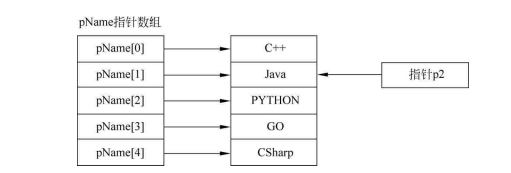
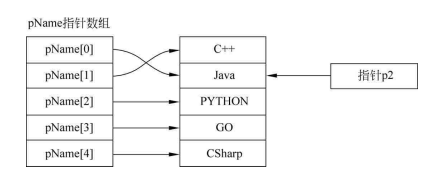

# 指针数组、指针的指针与main函数参数

## 1.指针数组概念回顾

​	一个数组，其元素均为指针类型数据，称为指针数组，换句话说，指 针数组中的每一个元素都是一个指针变量，指针数组的定义形式如下：

```c
类型标识符 *数组名[数组长度]
```

举例来看一个例子：`int *p[4];`

​	这实际上是一个误解，声明 `int *p[4];` 实际上定义了一个指针数组，而不是一个指向四个整数的数组的指针。因为`[]` 操作符比 `*` 操作符具有更高的优先级，所以声明首先被解释为 `p` 是一个具有4个元素的数组。之后，`*` 操作符应用于这个数组的每个元素，表明数组的每个元素都是指向 `int` 类型的指针。因此，`p` 是一个数组，每个元素都能存储一个 `int` 类型的指针。如果你想要声明一个指向包含四个整数的数组的指针，应该使用括号来正确设置优先级，像这样：`int (*p)[4];`。这里，括号确保了 `*p` 被视为一个整体，表明 `p` 是一个指针(和指针定义是类似的了)，它指向一个含有4个整数的数组。

​	正确声明一个指向含有4个整数的数组的指针的方式是：`int (*p)[4];`。这个代码是定义了一个指向一维数组的指针变量。这里的括号非常关键，它们改变了优先级，确保了`*p`是作为一个整体被声明，意味着`p`是指向一个数组的指针，这个数组包含了4个整数。这种指针可以指向一个具有4个整数的数组。

​	不要混淆了“指针数组”与“数组指针”。这两者虽然听起来相似，但它们是完全不同的类型。前者是一个数组，每个元素都是一个指针，指向一个整数；而后者是一个指针，指向一个完整的数组。

​	如何创建一个指向字符串的指针数组以及如何使用它：

- **指针数组的声明和初始化：**

    ```c
    const char * pName[] = {"C++", "Java", "PYTHON", "GO", "CSharp"};
    ```

    这是一个指针数组，它包含了5个元素，每个元素都是一个`const char*`类型，指向一个字符串常量。

- **使用`sizeof`运算符来获取数组的大小：**

    ```c
    int iSize1 = sizeof(pName);        // 获取整个数组的大小，即所有指针的大小总和
    int iSize = sizeof(pName[0]);      // 获取数组中一个元素（指针）的大小
    ```

- **用数组中的指针访问和打印字符串：**

    ```c
    for (i = 0; i < iSize; i++) {
        printf("pName[%d] = %s\n", i, pName[i]);
    }
    ```

- **下图说明了数组中每个指针如何指向不同的字符串常量，并且展示了如何通过一个指针`p2`指向`"JAVA"`字符串。**



- **演示如何交换两个字符串指针：**

    ```c
    const char *pTmp;
    pTmp = pName[0];      // pTmp指向"C++"
    pName[0] = pName[1];  // pName[0]现在指向"Java"
    pName[1] = pTmp;      // pName[1]现在指向"C++"
    ```

    这段代码通过临时指针`pTmp`来交换`pName[0]`和`pName[1]`的值，即交换了指向`"C++"`和`"Java"`的指针。

- **用更新后的指针数组打印字符串：**

    ```c
    for (i = 0; i < iSize; i++) {
        printf("pName[%d] = %s\n", i, pName[i]);
    }
    ```

    ​	该循环遍历更新后的`pName`数组，打印出每个元素（指针）指向的字符串。

- **在交换两个指针之后数组的状态，显示`pName[0]`现在指向`"Java"`，而`pName[1]`指向`"C++"`。**

​	如下图所示：




## 2.指向指针的指针

### 双重指针的概念

​	双重指针是指一个指针变量存储了另一个指针变量的地址。如果第一个指针指向了一个具体的数据，那么第二个指针则是指向第一个指针的指针。

例如，双重指针的声明可以是：

```c
char **pp;
```

这声明了一个`pp`变量，它是一个指向`char*`类型的指针，也就是它可以存储一个字符指针的地址。

```c
int **pp;
```

这声明了一个`pp`变量，它是一个指向`int*`类型的指针，也就是它可以存储一个整数指针的地址。

### `*`和`**`的优先级

​	在解释双重指针的概念时，还提到了运算符`*`和`**`的优先级问题。`*`用来表示指针，而`**`表示双重指针。重要的是理解它们在声明和使用时的区别。`*`用于访问指针指向的值，`**`则用于访问双重指针指向的指针所指向的值。

### 示例1: 指针数组的打印

代码示例展示了如何使用双重指针打印字符串数组：

```c
const char **pp;
pp = pName[0];    // 假设pName是一个指向字符串的指针数组
printf("pp = %s\n", *pp);  // 打印pp指向的字符串，假设pName[0]指向"Java"
```

### 示例2: 基本类型指针的赋值

另一个例子演示了如何使用双重指针对基本类型变量进行操作：

```c
int abc = 5;
int *pabc = &abc;
int **ppabc = &pabc;
printf("abc = %d\n", abc);     // 打印变量abc的值
printf("abc = %d\n", *pabc);   // 通过指针pabc打印abc的值
printf("abc = %d\n", **ppabc); // 通过双重指针ppabc打印abc的值
```

​	这里，`abc`是一个整型变量，`pabc`是一个指向`abc`的指针，而`ppabc`是指向`pabc`的指针。通过`*pabc`可以访问`abc`的值，而通过`**ppabc`也可以访问`abc`的值，因为`ppabc`指向了`pabc`，而`pabc`指向了`abc`。

### 注意事项

​	在讨论双重指针时，提到了重要的一点：使用未初始化的指针是危险的，因为它可能指向任何地方。因此，在使用指针之前，总是应该确保它们指向了合法的内存地址。如果一个双重指针没有被正确初始化，通过它进行赋值或解引用操作可能导致未定义行为，包括程序崩溃。

​	总结而言，讨论了双重指针的定义、声明和使用，以及如何正确地操作指针变量和双重指针变量。提供了示例代码，说明了如何通过双重指针访问数据，以及如何使用双重指针来修改存储在其他指针中的地址。同时，强调了初始化指针的重要性以避免潜在的风险。


## 3.指针数组作为main函数参数

​	在C语言中，`main` 函数的一般形式为: `int main(){...}`。可以看到main后面跟随的圆括号内是空的，没有内容。其实这个main函数是可以有参数的，也就是说系统调用main函数时，可以给main函数传递参数。

​	在C语言中，`main` 函数可以接收命令行参数，这是通过定义 `main` 函数时包含两个参数来实现的：`argc` 和 `argv`。`argc` 表示传递给程序的命令行参数的个数，而 `argv` 是一个指针数组，指向传递给程序的每个参数的字符串表示。

### main函数的参数定义

```c
int main(int argc, char *argv[]) {
    // 函数体
}
```

在这个定义中：

- `argc` (argument count) 是一个整型值，表示命令行参数的数量，包括程序的名称。

    **另一解释**：`int argc`：参数计数（Argument Count），表示传递给 `main` 的参数数量，包括程序名本身。

- `argv` (argument vector) 是一个指针数组，其中每个元素都是一个 `char*`，指向一个字符串。这些字符串是命令行上提供的参数，`argv[0]` 是程序的名称，`argv[1]` 是第一个参数，以此类推。

    **另一解释**：`char *argv[]` 或 `char **argv`：参数向量（Argument Vector），一个指向字符串数组的指针，每个字符串是一个命令行参数，`argv[0]` 是程序的名称。

这允许用户从命令行向程序传递信息，例如文件名、选项标志等。

### 使用main函数参数的例子

​	当运行一个程序时，可以通过命令行传递参数。例如，在Linux下运行 `./program param1 param2` 时，`param1` 和 `param2` 是传递给程序的参数。在 `main` 函数中可以这样处理这些参数：

```c
#include <stdio.h>

int main(int argc, char *argv[]) {
    printf("Number of arguments: %d\n", argc);
    for (int i = 0; i < argc; i++) {
        printf("Argument %d: %s\n", i, argv[i]);
    }
    return 0;
}
```

如果在命令行执行程序时写入：

```sh
./program arg1 arg2 arg3
```

`argc` 将会是 `4`（因为包括了程序名），并且 `argv` 数组将会包含以下内容：

- `argv[0]`：`"./program"`（程序的名称）
- `argv[1]`：`"arg1"`
- `argv[2]`：`"arg2"`
- `argv[3]`：`"arg3"`

当使用如 Visual Studio 这样的集成开发环境时，也可以在项目属性中设置命令行参数。这样，当你从 IDE 启动程序时，这些参数将传递给 `main`。

### 通过命令行传递参数

你还可以通过命令行传递参数给程序。在命令行界面（例如Windows命令提示符或Linux的终端）中，你可以输入程序的路径和名称，后跟任何你希望传递的参数：

```sh
MyProject.exe arg1 arg2 arg3
```

程序将会接收并处理这些参数，如上面的 `main` 函数例子所示。

​	总结来说，指针数组作为 `main` 函数的参数提供了从外部向程序传递运行时信息的灵活性。它允许用户传递不定数量的参数，而这些参数可以是任何由用户定义的字符串。这在很多类型的程序中都是一个常用且有用的功能，尤其是在需要处理用户输入的工具或应用程序中。