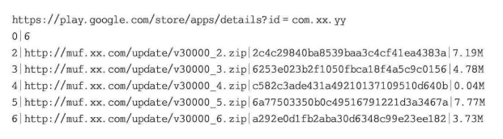

# 文件的打开、关闭、读写与实战操练

## 1.文件的打开

​	文件在进行读或者写之前，必须要先打开，在读或者写结束之后，必须要关闭，否则会造成资源泄漏或读写失败。

​	文件的打开要调用fopen函数。一般形式如下：

```c
FILE *fp;// FILE是一个结构体,fp是指向结构体FILE的指针变量(文件指针)
fp = fopen(文件名,文件使用方式); // 其实文件名和文件使用方式都是字符串
```

​	如如下代码：

```c
FILE *fp = NULL;
fp = fopen("A1","r");// 打开名字叫做"A1"的文件,"r"表示文件使用方式为只读
```

如果上面的代码无法编译通过，提示类似“error C4996：'fopen'：This functionr variableMay be un safe”这样的错误，考虑在源程序文件头增加：

```c
#pragma warning(disable: 4996)
```

​	这里注意到，fopen函数返回一个指向A1文件的指针，这个指针被赋值给了fp。这样，就可以认为fp指向了A1文件。
FILE结构体：每次用fopen函数打开一个文件，系统都会开辟出一块内存，这块内存大小是sizeof（FILE），这块内存用来存放和文件相关的信息，诸如文件名、文件使用方式、当前文件位置等。
​	通过调用fopen函数，可以告诉系统三个信息：

​	(1)需要打开的文件名。

​	(2)文件使用方式，如是读还是写，“r”表示读，后面会讲到。

​	(3)让哪个指针变量指向被打开的文件，这里是fp指针变量。

文件使用方式如下表格所示：

| 文件模式字符    | 含义                                                         | 备注                                   |
| --------------- | ------------------------------------------------------------ | -------------------------------------- |
| "r" (读取)      | 为读文件打开一个文本文件，文件必须存在                       |                                        |
| "w" (写入)      | 为写数据到文件打开一个文本文件，文件不存在则创建，否则文件内容被覆盖 |                                        |
| "a" (追加)      | 为追加数据到文件打开一个文本文件                             | 文件指针置于文件末尾                   |
| "r+" (读写)     | 为读写文件打开一个文本文件                                   | 文件必须存在                           |
| "w+" (读写)     | 为读写数据到文件打开一个文本文件                             | 文件不存在则创建，否则文件内容被覆盖   |
| "a+" (追加读写) | 为读写数据到文件打开一个文本文件                             | 文件指针置于文件末尾，文件不存在则创建 |

​	上面的内容不必强制记忆下来，可以记住几个常用的就可以了，如r、w、a。当然也是有一些规律的：

​	（1）有w表示往文件中写入。
​	（2）有r表示从文件中读出。
​	（3）有b表示二进制文件。
​	（4）有a表示追加内容到文件末尾。
​	（5）有“+”表示既能从文件中读出，又能往文件中写入。

​	还需要知道的是，每个打开的文件都有一个当前位置指针，其实就是保存在FILE结构里的一个char*型的字符指针（不同版本编译器可能细节不同，但道理都相同）。这个位置指针的用途就是代表当前从文件的哪个位置开始读/写数据，对于读来讲，每读出1字节数据，这个位置指针会自动往后移动1字节，以指向下一字节，这样，下次再读时自然就从下一字节开始。

​	当用fopen函数打开文件时，有可能打开失败，例如文件不存在时一定会打开失败，此时fopen函数就会返回一个空（NULL）。看如下代码：

```c
FILE *fp;
fp = fopen("A1", "r");
if (fp == NULL) {
  // 文件打开失败的处理代码
  // ……
}
```


## 2.文件的关闭

​	文件只有在成功用fopen函数打开之后，才存在文件关闭的问题，否则，不存在关闭的问题。
​	在用fopen函数打开文件成功后，一般都会对文件进行读写操作，读写完毕之后，应该关闭这个文件。为什么要关闭这个文件呢？有两个原因：
​	（1）释放这个文件占用的内存资源，如果资源使用后却不释放，那么，当资源耗尽就会导致程序运行崩溃，所以必须养成资源用完后及时释放的好习惯。
​	（2）往文件中写数据时不会立即往磁盘上写，系统会把数据写到一个叫“缓冲区”的地方，缓冲区满时系统才往磁盘文件上写，写完之后把缓冲区清空继续等待用户往文件中写数据。试想，当把数据往文件中写时，假如缓冲区此时没满，那么在没有关闭文件的情况下退出了程序的运行（或者突然停电导致计算机关机），那么缓冲区中的数据就没来得及写到磁盘文件上，造成数据丢失。关闭文件这个动作会触发系统把缓冲区中的数据立即写到磁盘上，这就避免了缓冲区中的数据丢失问题。

​	所以，打开的文件在不使用时及时关闭，非常有必要。

​	文件关闭后，fp就不能再被使用（读/写文件），否则程序会报异常。fclose（）函数有返回值，一般0表示关闭成功，非0表示关闭失败，但该返回值用处不大（例如如果文件关闭失败，再关闭一次应该也还会失败），所以一般不用去理会这个返回值。


- 当通过`fopen`函数成功打开文件后，应当在文件不再需要时关闭，这是一个良好的编程习惯。
- 介绍了使用`fclose`函数来关闭文件，并解释了如果不关闭文件可能导致的问题。

### 文件关闭的正确操作

- **文件指针检查**：在调用`fclose`函数之前，应该先检查文件指针是否为`NULL`。这是为了避免对一个没有成功打开的文件尝试关闭操作，可能导致未定义行为。

- **内存和缓冲**：关闭文件是为了释放与文件相关的资源，包括内存和缓冲区。如果文件在程序结束前没有被关闭，可能会导致数据丢失，因为缓冲区内的数据可能没有被实际写入磁盘。

- **关闭文件的示例**：

  ```c
  fclose(文件指针);
  ```

### 文件关闭的安全检查

- 给出了一个示例，说明了如何安全地关闭文件：

  ```c
  if(fp != NULL) {
      fclose(fp); // 在此处fclose函数用于关闭文件
  }
  ```

  这段代码检查文件指针`p`是否为`NULL`，如果不是，则调用`fclose`函数关闭文件。如果`fp`是`NULL`，则不执行任何操作。

### 异常情况处理

- 提到了即使`fclose`函数通常很可靠，但是在极端情况下，关闭文件操作可能会失败。如果发生失败，`fclose`函数会返回一个错误代码。这通常发生在底层I/O错误时，比如磁盘写入故障。


## 3.文件的读写

​	文件读写有许多相关的函数，这里介绍几个常用的。

### 1.fputc函数：

- **基本用途**：`fputc`函数用于向文件中写入一个字符。此函数将字符写入与文件指针关联的文件中。

- **返回值**：如果成功，`fputc`函数返回写入的字符的ASCII值；如果失败或达到文件末尾（EOF），则返回`EOF`（通常定义为-1）。EOF是End Of File（文件末尾）的缩写，是系统提供 的一个宏定义，代表-1。如下：

    ```c
    #define EOF (-1)
    ```

- 示例代码：

    ```c
    FILE *fp; // FILE是一个结构，fp是指向结构FILE的指针变量(文件指针)
    fp = fopen("FTest.txt", "w"); // 打开文件以写入
    if (fp == NULL) 
    {
        printf("文件打开失败\n");
    } else {
        // 文件打开成功流程才会走到这里
        char reco = fputc('a', fp); // 写入字符'a'
        if (reco == EOF) { // 检查写入是否成功。注意fputc失败时，会返回EOF
            // 写失败时的处理代码
            // 错误处理
        }else
        {
            reco = fputc('d', fp);// 这里并没有判断是否协成功,不建议这样写,不安全
            reco = fputc('e', fp);// 这里依旧没有判断是否写成功
        }
        fclose(fp); // 在文件打开成功的情况下，应该及时关闭文件
    }
    ```

​	在上面的范例中有几点说明： ·

- 当执行到fopen这行代码时，文件写入方式指定为w，表示为写而打开一个文本文件FTest.txt，FTest.txt刚开始是不存在的，因此，如果fopen执行成功，则系统会创建该文件，如果该文件存在，则fopen执行成功时该文件中原始的内容会被覆盖。
- 调用fopen函数时可以指定所要打开的文件路径，但范例中并没有指定路径，系统可能会到当前项目所在的目录（通过Visual Studio来运行时）或该可执行程序目录（双击直接运行可执行程序）寻找FTest.txt文件并尝试打开，如果该文件并不存在， 系统会在当前项目所在的目录或该可执行程序所在的目录下创建FTest.txt文件。

### 2.fgetc函数：

- **基本用途**：`fgetc`函数用于从文件中读取一个字符。此函数从与文件指针关联的文件中读取下一个字符。

- **返回值**：如果成功，`fgetc`函数返回读取的字符的ASCII值；如果遇到文件末尾或出现错误，则返回`EOF`。

- 示例代码：

    ```c
    FILE *fp;
    fp = fopen("FTest.txt", "r"); // 打开文件以读取
    if (fp == NULL) {
        printf("文件打开失败\n");
    } else {
        // 文件打开成功流程才会走到这里
        char reco = fgetc(fp); // 读取一个字符。每读取一个字符，文件当前位置指针自动向下走一个字符
        while (reco != EOF) { // 循环直到文件末尾. 读入失败或者到文件结束这个条件才不成立
            putchar(reco); // 输出读取的字符(输出到屏幕上)
            reco = fgetc(fp); // 继续读取下一个字符
        }
        fclose(fp); // 关闭文件
    }
    
    /*上面代码可以改进：使用 int ch 而不是 char ch，因为 EOF 是一个特别的标志，其值通常为 -1，而 char 可能不足以表示这个值。改进之后的代码如下：*/
    FILE *fp;
    fp = fopen("FTest.txt", "r"); // 打开文件以读取
    if (fp == NULL) {
        printf("文件打开失败\n");
    } else {
        // 文件打开成功流程才会走到这里
        int reco = fgetc(fp); // 读取一个字符。每读取一个字符，文件当前位置指针自动向下走一个字符
        while (reco != EOF) { // 循环直到文件末尾. 读入失败或者到文件结束这个条件才不成立
            putchar(reco); // 输出读取的字符(输出到屏幕上)
            reco = fgetc(fp); // 继续读取下一个字符
        }
        fclose(fp); // 关闭文件
    }
    ```

​	上面的范例有个弊端，该范例中是用EOF（-1）来判断读入的内容是否到达文件结束。但一旦该文件中真存在一个值为-1的字符（该字符的十六进制是FF，用fgetc读入进来就是-1），那么，用EOF这种判断方式来 判断是否读到文件结束，就会出现错误，所以需要换一种范例写法，引入 feof函数。--------------》(纠正)：在文本模式（"r"）中使用`fgetc`时，通常不会遇到文件中实际包含字节值为`0xFF`（或-1，即`EOF`）的情况，因为这样的值不是有效的文本字符。因此，使用`EOF`作为判断文件结束的条件在文本模式中是恰当的，且通常不会引起错误。如果文件中存在值为-1的字符，使用`EOF`来判断文件结束会出现错误，这实际上是针对以二进制模式（"rb"）打开文件的情况。在二进制模式下，文件中可以包含任何字节值，包括`0xFF`。在这种情况下，使用`EOF`来检测文件结束就可能会导致误判，因为二进制数据中的`0xFF`会被误认为是文件结束标志。这时，确实应该使用`feof()`函数来确定是否真的到达了文件的末尾。在处理可能包含任何字节数据的文件（如二进制文件），则需要明确使用"rb"模式，并且在这种情况下使用`feof()`会更加合适。在只处理文本数据的情况下，使用"r"模式并依赖`EOF`来判断文件结束是符合预期的。那么示例代码其实是没有什么问题的，只有在上面的示例代码是以二进制形式打开时("rb")才可能有问题，才需要引入feof函数。(仍旧是错误的，见下面的纠正内容)

#### fgetc 和 EOF的特别说明

- `fgetc`函数从文件中读取一个字符，并返回一个`unsigned char`转换成`int`的值，或者在文件末尾或发生错误时返回`EOF`。`EOF`通常定义为-1。
- 在文本模式下，`fgetc`会正确处理文件的编码和换行符，返回文件中的字符直到文件结束。
- 在二进制模式下读取文件时，数据是按原样读取的，不会进行任何转换。

#### 关于判断EOF的问题

- 在文本模式下，理论上你不会遇到字符编码自身就是`EOF`的情况。文本文件应该只包含有效的文本字符，`EOF`用作控制值，标示输入流的终点。
- 在二进制模式下（例如，如果使用`fopen`的"rb"模式打开文件），文件中的数据可能包括任何可能的字节值（0到255），包括`0xFF`。如果这些字节值被直接读取，它们可能会被误解为`EOF`。然而，`fgetc`在二进制模式下会按字节读取，仍然会返回这些实际字节值，而`EOF`只在真正达到文件末尾或出错时返回。

#### 使用feof来更安全地检测文件末尾

​	使用`feof()`函数可以更准确地检测到文件末尾，`feof()`仅在达到文件末尾后才返回非零值。这意味着你应该在读取循环后检查`feof()`，以确定循环是否因为到达文件末尾而终止。

```c
FILE *fp;
fp = fopen("FTest.txt", "r");  // 打开文件以读取
if (fp == NULL) {
    printf("文件打开失败\n");
} else {
    int c;
    while ((c = fgetc(fp)) != EOF) {  // 读取字符直到EOF
        putchar(c);  // 输出字符
    }
    if (feof(fp)) {
        printf("到达文件末尾\n");
    } else {
        printf("读取过程中发生错误\n");
    }
    fclose(fp);  // 关闭文件
}
```

​	在文本模式（"r"）下打开和读取文件时，使用`EOF`作为结束的标识是合适的，因为在这种模式下，`EOF`确实标志着文件内容的结束。这种模式下，文件读取函数（如`fgetc`）不会把文件中的任何有效字符误识为`EOF`。`EOF`仅在没有更多数据可读时返回，这通常意味着已到达文件末尾。

​	在文本文件中，字符数据通常不会包含字节值为`0xFF`的内容，这个值在ASCII或一般文本编码中不是有效字符。因此，当你在处理普通的文本数据时，按照文本模式读取并使用`EOF`来检测文件末尾是完全可行的。这是文件I/O操作中常见的做法，特别是在处理纯文本内容时。

​	如果处理的文件是二进制文件，或者在一些特殊情况下（例如在某些系统中可能会以文本模式存储二进制数据），才需要考虑可能遇到字节值为`0xFF`的情况，并采取其他措施（如使用`feof()`）来正确判断文件是否结束。但对于标准文本文件，您的理解和应用是完全正确的。使用文本模式保存或处理文本文件时，通常不会在文件中出现`EOF`（-1 或 `0xFF`）作为一个字节的内容。在文本文件的上下文中，`EOF`不是一个存储在文件中的字符，而是一个由文件系统或文件读取API使用的状态指示器，用于表示没有更多数据可以读取。在编写和读取文本文件时，API如`fopen`, `fgetc`, `fprintf`等，都会遵守文本处理的规则，例如在Windows系统中自动处理换行符（将`\r\n`转换为`\n`），并且不会将`EOF`字符写入文件中。这意味着您在使用这些标准库函数时不必担心`EOF`会作为一个实际字符出现在您的文本数据中。因此，在大多数情况下，使用`EOF`来判断文本文件的结束是安全且正确的方法。只有在涉及二进制数据处理时，才需要特别注意`EOF`可能与数据值冲突的情况。

文本模式 ("r") 和二进制模式 ("rb") 的差别：

1. **文本模式 ("r")**：
    - 在文本模式下打开文件，文件I/O函数（如`fgetc`）会自动处理特定于操作系统的换行符转换。例如，在Windows中，它会将`\r\n`转换成`\n`，在读取时自动处理这些转换，使得文件读取跨平台更为一致。
    - 文本模式下，返回`EOF`代表真正的文件末尾。由于文本文件不应包含字节`0xFF`作为有效数据，使用`EOF`来判断文件结束通常是安全的。
2. **二进制模式 ("rb")**：
    - 在二进制模式下，数据按字节精确读取，不进行任何转换。这在处理二进制文件或需要确保数据不被修改的情况下非常有用。
    - 如果文件内容包含可能与`EOF`（-1，即`0xFF`）冲突的数据，那么使用`EOF`来判断结束就可能引发问题，因为二进制数据可以包括任意字节值。


#### 最终纠正(以此为准)

​	标准的C语言文件输入函数（如 `fgetc()`）不会将二进制数据中的任何单个字节误认为是文件结束标志（EOF）。让我们详细解释为什么这个说法是错误的：

**文件输入和EOF**

- **返回值和数据类型**：`fgetc()` 之所以返回 `int` 类型而不是 `char`，正是为了区分所有可能的单字节值（0到255）和特殊的EOF标志。EOF通常定义为 `-1`，这个值在 `unsigned char` 能表示的范围之外。
- **二进制读取**：当以二进制模式打开文件并使用 `fgetc()` 读取时，该函数会按原样返回文件中的每一个字节。如果读取的字节是 `0xFF`，该函数会将其作为 `255` 返回（在大多数平台上），这与 `EOF`（-1）明显不同。

**为什么不会误认为EOF**

- **无歧义的值**：在二进制读取过程中，无论文件数据中出现什么字节值，`fgetc()` 都不会将其误解为EOF。EOF是一个特定的、定义明确的值（-1），只有当真正到达文件末尾或发生读取错误时，`fgetc()` 才会返回这个值。
- **处理0xFF**：在文件数据中出现的 `0xFF` 仅仅是255这个数值的一种表达，它在 `fgetc()` 的返回类型 `int` 中会被准确识别和处理，不会与 `-1` 混淆。

​	因此，上述陈述是基于对C语言标准I/O行为的误解。在实际应用中，无论文件中的数据如何，只有在没有更多数据可读时，`feof()` 才会检测到EOF，`fgetc()` 也只有在这种情况下才会返回 `-1`。在处理二进制文件时，正确理解和检查EOF是非常重要的，以确保数据的正确读取和处理。

​	在任何模式下，无论是文本模式（"r"）还是二进制模式（"rb"），`fgetc()` 函数返回 `EOF` 通常确实表明已经到达了文件的末尾或者在读取过程中发生了错误。`fgetc()` 不会因为读取到某个特定的数据字节，如 `0xFF`，而返回 `EOF`。`EOF` 的返回独立于文件内容，它是一个特定的、与有效字符编码区分开的值（通常是 `-1`）。这意味着无论文件是以文本模式还是二进制模式打开，当你使用 `fgetc()` 时，都可以安全地依赖它返回的 `EOF` 来判断是否到达了文件末尾或发生了错误。这样的处理使得 `fgetc()` 成为处理文件输入时非常可靠的工具。不需要担心 `fgetc()` 在读取过程中错误地返回 `EOF`。只需注意，当它返回 `EOF` 时，应检查是否真的到达文件末尾或是否有错误发生，这可以通过额外检查 `feof()` 和 `ferror()` 来确认。`EOF` 的处理：`fgetc()` 读取到文件末尾或遇到错误时返回 `EOF`。它不是文件中的一个字节，而是一个用于指示文件读取终点的状态码。

​	一旦该文件中真存在一个值为-1的字符（该字符的十六进制是FF，用fgetc读入进来就是-1）。此句话是错误的：

1. **数据类型和返回值**：
    - `fgetc()` 函数从文件读取一个字节，并将其作为 `unsigned char` 转换为 `int` 类型返回。这意味着它返回的是 0 到 255 范围内的值，以及一个特殊的 `EOF` 值（通常定义为 `-1`）。
2. **关于 `0xFF` 和 `-1`**：
    - 在二进制模式（"rb"）下，`fgetc()` 会原样读取文件中的每个字节。如果文件中的数据字节是 `0xFF`，这在十六进制中表示 255。当 `fgetc()` 读到这个值时，它会返回 255，而不是 `-1`。
    - 在文本模式（"r"）下，同样地，`fgetc()` 会读取每个字节并正确返回其 `unsigned char` 转换到 `int` 的结果。即便在文本模式下，`0xFF` 也会被返回为 255。文本模式主要影响如何处理换行符和文件结束的识别，但不会改变如何返回正常的字节数据。
3. **误解的来源**：
    - 可能的误解来源于将 `fgetc()` 返回的正常数据值（如 `0xFF`）与 `EOF` 混淆。由于 `EOF` 被定义为 `-1`，因此除非 `fgetc()` 到达文件末尾或发生读取错误，否则它不会返回 `-1`。

​	因此，任何说法声称 "在文件中真实存在一个值为 `-1` 的字符" 是基于对 `EOF` 和字节数据如何在文件操作中被处理的误解。在任何标准的C语言环境中，无论是二进制模式还是文本模式，`fgetc()` 都不会将 `0xFF` 误解为 `EOF`。

#### 文本文件二进制文件中存储内容

##### 	(1).fgetc来读取文本文件二进制文件时：

​	在处理文件读取时，无论是在二进制模式（"rb"）还是文本模式（"r"）下，`fgetc()` 函数实际上不会读取到 `-1` 作为文件内容的一部分。`-1` 是特别保留的，用作 `EOF` 的值，表示已经到达文件的末尾或遇到读取错误。这是一种约定，以确保可以区分正常的数据和结束信号。

**`fgetc()` 返回值**：

- `fgetc()` 返回一个 `int` 类型的值。这允许它返回全部可能的 `unsigned char` 值（从 0 到 255），并且还有额外的空间来返回 `EOF`。
- 当 `fgetc()` 从文件中读取字节 `0xFF` 时，这将被转换并返回为 `255`（十进制）。这是因为 `0xFF` 在 `unsigned char` 中是 `255`，而在扩展到 `int` 类型时保持不变。

**EOF 的处理**：

- `EOF` 特意被设计为 `-1`，一个在正常的 `unsigned char` 范围之外的值，确保与任何有效的文件数据字节区分开来。
- `EOF` 仅在没有更多数据可读时返回，例如到达文件末尾或因为错误（如读取失败）而不能继续读取时。

不会遇到 `fgetc()` 实际读取到 `-1` 的情况。这意味着：

- 如果 `fgetc()` 返回 `255`，这表示它实际读取了字节 `0xFF`。
- 如果 `fgetc()` 返回 `-1`，这仅表示已达到文件末尾或发生读取错误。

​	因此，在编写处理文件数据的代码时，应该对 `fgetc()` 返回的 `-1` 值做出适当的结束处理，而不必担心它可能是文件数据的一部分。这种设计允许程序清晰地区分数据读取和流控制状态，是文件I/O操作中的一个重要特性。

​	对于标准C库中的文件读取函数，如 `fgetc()`，确实只会返回范围在 0 到 255 的值（对应于无符号字符的所有可能值）以及 `-1` 作为 `EOF` 的特殊标志。这样的设计确保了可以清晰地区分正常的字符数据和文件结束或错误信号。

​	其他文件读取函数和方法：如果不使用 `fgetc()` 来读取文件，C语言还提供了其他几种方式来处理文件输入和输出。这些方法的行为略有不同，但基本原则相似 —— 用于区分正常数据和错误或文件结束状态。

1. **`fgets()`**：
    - 这个函数用来读取一行，直到遇到换行符或者达到缓冲区限制。它返回一个指向字符串的指针，如果文件已到末尾或出现错误，则返回 `NULL`。
2. **`fread()`**：
    - 用于从文件流中读取多个数据项，每项大小固定。它返回成功读取的数据项数。如果这个数小于请求的数量，则可能是因为已到文件末尾或出现错误。
3. **`read()`（POSIX系统调用）**：
    - 不属于C标准库，但在Unix-like系统中广泛使用。它直接从文件描述符读取数据到缓冲区。返回读取的字节数，如果到达文件末尾，则返回 0，出错时返回 -1。

​	二进制和直接内存访问：如果需要处理非标准的数据格式或大量数据（如二进制文件），可能需要直接使用内存映射文件或系统级I/O操作。例如：

- **内存映射文件**：
    - 在支持的操作系统上，可以使用内存映射文件的技术，将文件内容映射到进程的地址空间。这使得文件访问就像访问内存数组一样简单高效。
- **系统级I/O操作**：
    - 如使用 Unix/Linux 的 `read()` 和 `write()` 系统调用，可以更精确地控制数据如何被读取和写入，包括非阻塞和异步I/O选项。

##### 	(2).文件中实际内容：

​	对于任何文件（无论是文本文件还是二进制文件），实际存储的数据都是以字节为单位的，而字节的范围是从 `0` 到 `255`。在这个范围内，没有字节的值是 `-1`。`-1` 是一个由很多编程环境用于特殊目的的值，比如表示错误或文件结束（EOF）。

​	**文本文件中的存储**

- **文本文件**：通常包含符合特定编码的字符（如ASCII或UTF-8）。在ASCII编码中，字符的值范围是 `0` 到 `127`，而在UTF-8等编码中，字符可能占多个字节，但每个字节的值也是在 `0` 到 `255` 范围内。
- **没有 `-1`**：在文本文件中，实际存储的数据（即使是文件中表示文本结束的字符，如文件末尾的 NULL 字符）也是正值。`-1` 作为 `EOF` 的符号，不会存储在任何类型的文件中，因为它是一个由文件读取函数在运行时用来通知调用者已达到文件末尾或发生错误的信号。

​	**二进制文件中的存储**

- **二进制文件**：可以包含任何 `0` 到 `255` 的字节值，用于表示各种数据类型，从文本数据到图像、音频或其他格式的数据。每个字节都是按其字面值处理，不赋予任何超出其数值含义的特殊意义。
- **没有 `-1`**：就像文本文件一样，二进制文件实际上也不会包含 `-1` 这个值。如果你在C或C++等语言中用 `fgetc()` 或类似的函数读取到 `-1`，这表示你已经到了文件的末尾或遇到了一个读取错误，而不是文件中真的有一个字节值为 `-1`。

​	**总结**

​	换句话说，无论是文本文件还是二进制文件，文件内容都不会“存有 `-1`”。`-1` 是用于编程环境中特定的上下文（如文件I/O）来表示结束或错误的状态，而不是文件内容的一部分。因此，你的理解基本正确，只需要进一步明确 `-1` 并非实际存储在文件中的数据。正如 `-1` 一样，`-2` 也不会作为一个字节值存储在文件中。在文件存储和文件读取过程中，数据是以字节为单位存储的，这意味着每个字节的取值范围从 `0` 到 `255`。这些值对应于 `unsigned char` 的数据范围，其中不包括任何负数。处理文件或其他数据流时，使用负数（如 `-1`、`-2` 等）来表示错误或特殊情况是一种常见的编程惯例。例如：**函数返回值**：很多系统调用或库函数在失败时会返回 `-1`，并设置全局变量 `errno` 来指示错误类型。**特殊标记**：一些函数可能使用不同的负值来表示不同类型的错误或状态。

##### 	(3).-1和-2如何存进文件

​	想将 `-1` 或 `-2` 等负数存储到文件中，你需要以某种方式将这些值编码为可以存储在文件中的形式。由于文件数据是以字节形式存储的，每个字节范围从 `0` 到 `255`，所以你不能直接存储一个负数，但可以使用以下几种方法：

**1. 使用补码表示**

在计算机系统中，负数通常使用补码（two's complement）形式存储。这意味着你可以将负数转换为补码，然后写入文件。例如：

- 对于 `-1`，在一个字节的补码表示中，它通常是 `0xFF`（十进制 255）。
- 对于 `-2`，在一个字节的补码表示中，它是 `0xFE`（十进制 254）。

这样存储意味着你在写入时将负数转换为其补码形式，而在读取时，需要将读取的字节重新解释为补码形式的负数。

**2. 以字符串形式存储**

你也可以将数字转换为字符串，然后写入文件。这种方法非常直观，容易实现，并且可以直接看到文件中的数字：

```c
#include <stdio.h>

int main() {
    FILE *fp = fopen("numbers.txt", "w");
    if (fp != NULL) {
        fprintf(fp, "%d\n", -1);
        fprintf(fp, "%d\n", -2);
        fclose(fp);
    } else {
        printf("无法打开文件\n");
    }
    return 0;
}
```

这段代码将 `-1` 和 `-2` 作为文本写入到文件中。当你查看文件时，会看到里面直接是 `-1` 和 `-2`。

**3. 使用二进制格式存储**

如果你需要在二进制文件中存储负数，可以直接写入它们的补码形式。这通常适用于需要高效存储和读取数值数据的场景：

```c
#include <stdio.h>

int main() {
    FILE *fp = fopen("binary_numbers.bin", "wb");
    if (fp != NULL) {
        int numbers[] = {-1, -2};
        fwrite(numbers, sizeof(int), 2, fp);
        fclose(fp);
    } else {
        printf("无法打开文件\n");
    }
    return 0;
}
```

这段代码将 `-1` 和 `-2` 作为整数直接以二进制形式写入文件。请注意，这里使用了 `sizeof(int)`，因为 `int` 类型通常是 4 字节。当这些数据被读取时，应当使用相同的数据类型（即 `int`）来正确解释。

**结论**

​	总的来说，存储负数到文件中需要一定的转换，无论是转换为补码、字符串还是直接以二进制形式。选择哪种方式取决于你的具体需求，例如是否需要可读性或特定的存储效率。

#### 如何理解 `0xFF` 和 `-1`(以此为准)

1. **数据类型**：
    - `0xFF` 是十六进制表示法，用于表示数值 `255`，如果它被视为一个无符号的八位整数（`unsigned char`）。
    - `-1` 在大多数计算机系统中采用二进制补码形式表示，对于一个典型的8位系统，`-1` 表示为所有位都是1（即 `11111111`），这在二进制中等同于 `0xFF`。但这种等价性依赖于解释这个二进制值的数据类型。
2. **类型转换和提升**：
    - 当 `0xFF` 从 `unsigned char` 转换为 `int` 时，如果没有明确指出它是有符号还是无符号，编译器通常会按照无符号值来处理，因此它被提升为 `255`。
    - 如果明确将 `0xFF` 作为 `signed char` 处理，然后提升到 `int`，在使用补码表示的系统中，它可能会被解释为 `-1`。
3. **在文件I/O中的应用**：
    - 在文件I/O操作中，函数如 `fgetc()` 返回 `int` 而不是 `char`，是为了能够包含所有可能的 `unsigned char` 值（0到255）以及一个额外的 `EOF` 值。`EOF` 被定义为一个不可能由任何有效的 `unsigned char` 值表示的值，通常为 `-1`。
    - 当 `fgetc()` 读取一个字节值 `0xFF` 时，它返回 `255`（如果是按无符号处理），而不是 `EOF`。只有当文件真正到达末尾或发生错误时，`fgetc()` 才返回 `-1`。

​	因此，`0xFF` 并不等于 `-1`，除非在特定的上下文（如明确解释为 `signed char`）中。在用于文件读取函数的上下文中，它们是两个完全不同的值，用于区分有效数据和流的结束或错误状态。

### 3.feof函数

- **功能说明**：`feof()` 函数用来检测流上的文件结束标志。如果已经达到文件的末尾，则返回非零值；否则返回0。
- **使用时机**：`feof()` 通常在读取循环之后使用，以确定循环结束是否由文件结束引起。

#### 示例代码解释

这部分代码展示了如何在文件读取循环中使用 `feof()` 来避免错误地处理文件结束条件。

```c
while (!feof(fp)) {
    // 读取并处理数据
}
```

这里使用 `while (!feof(fp))` 是为了说明只要没有达到文件末尾，就继续处理文件中的数据。但值得注意的是，这种方式可能在达到文件末尾前的最后一次迭代中导致错误或冗余的数据读取，因为 `feof()` 只在尝试读取过文件末尾后才会设置结束标志。

#### 代码示例

```c
FILE *fp;
fp = fopen("Test.txt", "rb"); // 以二进制模式打开文件
if (fp == NULL) {
    printf("文件打开失败\n");
} else {
    while (!feof(fp)) {
        char ch = fgetc(fp); // 尝试读取一个字符
        if (feof(fp)) {
            break; // 如果达到文件末尾，则退出循环
        }
        printf("%c", ch); // 输出字符
    }
    fclose(fp); // 关闭文件
}

/*	上面这种代码编写方式存在问题，因为它在每次循环开始前并不执行任何实际的读取操作就检查文件是否已结束。由于 feof() 只有在尝试读取超出文件内容后才会返回真（即文件指针已经越过文件末尾），这意味着在循环的最后一次迭代中，fgetc() 可能读取到无效数据（如果有的话），但循环仍然会执行，因为在那次读取之前并没有达到文件末尾。
	一个更有效且逻辑上正确的方法是先读取字符，然后检查是否读到文件末尾：*/
FILE *fp;
fp = fopen("Test.txt", "rb");  // 以二进制模式打开文件
if (fp == NULL) {
    printf("文件打开失败\n");
} else {
    int ch;  // 使用int而不是char来处理可能的EOF
    while ((ch = fgetc(fp)) != EOF) {  // 直接在条件中读取字符并检查EOF
        printf("%c", (char)ch);  // 输出字符
    }
    fclose(fp);  // 关闭文件
}/*
使用 int ch 而不是 char ch，因为 EOF 是一个特别的标志，其值通常为 -1，而 char 可能不足以表示这个值。
修改 while 循环的条件直接进行读取并检查是否为 EOF。这样可以确保只有在成功读取到有效字符后才进入循环体。
移除了内部的 feof(fp) 检查，因为它在这种情况下是多余的。
*/
```

这段代码尝试以二进制模式打开一个文本文件，并使用 `feof()` 来检测文件末尾，确保每个字符都被正确处理，直到真正的文件结束。

#### 注意事项

- 使用`feof()`检查文件结束应该小心，因为直到尝试过读取文件末尾后，`feof()` 才会返回真。这意味着循环中的读取操作可能会读取到EOF后还尝试一次，然后才通过 `feof()` 确认文件结束。例如：

    ```c
    /*
    	使用 feof() 函数检查文件结束时的一个常见误解是认为它可以预先告诉你下一次读取是否会到达文件末尾。然而，feof() 实际上只有在尝试读取超出文件内容后，也就是在文件结束符EOF已经被读取之后，才会返回非零值。这就可能导致在处理文件读取时出现冗余的读取尝试。
    	示例代码（存在问题的用法）:
    */
    #include <stdio.h>
    
    int main() {
        FILE *fp = fopen("example.txt", "r");  // 假设文件中有"Hello"这五个字符
        if (fp == NULL) {
            printf("文件打开失败\n");
            return 1;
        }
    
        int ch;
        while (!feof(fp)) {
            ch = fgetc(fp);  // 读取字符
            if (!feof(fp)) {
                printf("%c", ch);  // 输出字符
            }
        }
    
        fclose(fp);
        return 0;
    }
    /*在这个错误的示例中，代码试图通过检查 feof() 来避免在文件末尾后处理字符。然而，这里的问题是 feof() 只在尝试读取并超过文件内容后才会被设置，这意味着在 fgetc() 首次返回 EOF 之后循环(准确来说应该是指循环体)仍会多执行一次。由于 fgetc() 已经返回 EOF，无更多字符可读，循环中依然进行检查和可能的处理（例如尝试输出一个非法字符,这上面这个例子并没有这样做，但不排除其他情况下的可能，如打印出来这个EOF（
    	为什么输出 EOF 可能有问题
    	字符编码解释：当 printf("%c", ch); 接收到 -1 时，它将尝试将这个值转换为对应的字符。在大多数环境中，字符是按照无符号8位或者有符号的值处理的，因此 -1 可能被解释为一个特定的字符，这通常不是有效的或可打印的字符。
    	非法字符输出：输出一个代表 EOF 的字符可能导致输出流包含难以预料或不可打印的结果。在某些情况下，这可能导致输出设备上的错误行为或混乱，如终端程序可能对某些字符序列有特殊处理。
    	程序逻辑和清晰性：输出 EOF 作为字符不仅可能导致实际的运行时问题，也是一个糟糕的程序逻辑实践。它混淆了程序的意图，使得代码难以理解和维护，特别是对于未来的代码审查或修改。）
    ）
    ，从而可能导致错误的输出或其他错误处理。循环中的额外迭代是不必要的，并且可能引起逻辑上的混乱。但是下面这样做的话就不会产生这个问题。
    */
    
    // 示例代码（正确的用法）正确的做法是先读取字符，然后检查是否读到了 EOF，如下：
    #include <stdio.h>
    
    int main() {
        FILE *fp = fopen("example.txt", "r");  // 假设文件中有"Hello"这五个字符
        if (fp == NULL) {
            printf("文件打开失败\n");
            return 1;
        }
    
        int ch;
        while ((ch = fgetc(fp)) != EOF) {  // 直接检查fgetc()的返回值
            printf("%c", (char)ch);  // 输出字符
        }
    
        fclose(fp);
        return 0;
    }
    /*在这个更正后的示例中，fgetc() 直接读取字符并检查是否为 EOF。这样，只有在真正读到文件内容并未达到末尾时，才会进入循环体内部。这种方式不仅代码更简洁，而且可以避免不必要的错误和冗余操作。
    */
    ```

​	这种用法强调了在处理文件数据时应如何小心使用 `feof()`，以防在达到文件末尾时进行过多的或不必要的操作。

#### 对文本模式的特别说明(移动到对应位置)

### 文本模式下所有字符都是以ASCII码存储的吗？

​	在文本模式下，文件中的字符是否以ASCII码存储，这实际上取决于文件的编码方式和系统的处理方式。ASCII编码是最基本的字符编码，涵盖了0到127的字符集。然而，现代操作系统和程序常常使用扩展的字符集，如UTF-8、Windows的ANSI编码或其他多字节字符编码来支持更广泛的字符集，包括国际字符。

- **在ASCII兼容的编码中**（如UTF-8），基础的128个字符（0-127）与标准ASCII编码相同，这些字符通常包括英文字母、数字和基本的标点符号。
- **对于非ASCII字符**，如中文、日文、阿拉伯文字等，它们被编码为一个或多个字节的组合，具体取决于使用的编码方案。

​	因此，在文本模式下，字符的存储可能不仅仅是ASCII码，而是更复杂的编码形式，尤其是在国际化应用中。

​	在文本模式下，文件通常是按照字符进行存储的，但这也取决于操作系统和文件系统的具体实现。在大多数情况下，文本文件是按照字符进行存储的，每个字符占用一个字节的空间。每个字符可能是一个字母、数字、标点符号或其他可打印字符。

​	然而，一些特殊的编码方案（如UTF-8）允许一个字符由多个字节组成，特别是对于非ASCII字符（如中文、日文、俄文等），它们可能由多个字节表示。因此，在这种情况下，一个字符并不一定对应一个字节。

​	总的来说，对于大多数基于ASCII的文本文件，每个字符通常会占用一个字节的空间，但对于包含非ASCII字符或使用特殊编码的文件，一个字符可能占用多个字节的空间。


## 4.文件读写实战操练

### 1.fgets函数介绍

`fgets` 是一个在 C 语言标准库中广泛使用的函数，用于从文件或其他输入流中读取字符串。这个函数的主要用途是从指定的文件流中读取一行，直到达到换行符（`\n`）、文件结束（EOF）或者已读取指定的字符数减一（为了留出空间存放字符串终止符 `\0`）。

#### 函数原型

`fgets` 函数的原型定义在 `<stdio.h>` 头文件中：

```c
char *fgets(char *str, int n, FILE *stream);
```

- 参数

    ：

    - `str`：指向一个字符数组的指针，函数将读取的字符串存储在这个数组中。
    - `n`：指定最多读取的字符数。这个值应该足够大以包括字符串末尾的空字符 `\0`，所以实际能存储的最大字符数是 `n-1`。
    - `stream`：指向 `FILE` 对象的指针，代表要读取的文件流。这个流可以是标准输入（stdin）、一个文件或者其他任何类型的输入流。

#### 功能和行为

- **读取行为**：`fgets` 将从 `stream` 指定的文件或输入流中读取字符，直到遇到以下三种情况之一：
    1. 已经读取了 `n-1` 个字符。
    2. 遇到了换行符（`\n`），它会被读取并存储在字符串中，读取操作在此结束。
    3. 到达文件结束（EOF）。如果在任何字符读取之前遇到 EOF，则返回 NULL。
- **终止字符**：无论在何种情况下停止读取，`fgets` 都会在字符串的末尾自动添加空字符（`\0`）以形成一个完整的 C 字符串。
- **返回值**：
    - 如果成功读取一些字符，且未遇到文件结束，则函数返回 `str`，即存储结果的字符串的指针。
    - 如果在开始读取之前已处于文件结束状态或发生错误，将返回 `NULL`，并且 `str` 中的内容可能未定义。

#### 使用示例

下面是一个使用 `fgets` 读取用户输入的简单例子：

```c
#include <stdio.h>

int main() {
    char buffer[100];
    printf("请输入一行文本：\n");
    if (fgets(buffer, 100, stdin)) {
        printf("您输入的是：%s\n", buffer);
    } else {
        printf("读取错误或者已到达文件末尾。\n");
    }
    return 0;
}
```

#### 注意事项

- **安全性**：与 `gets` 函数相比，`fgets` 是更安全的选择，因为它允许指定缓冲区大小，避免了缓冲区溢出的风险。
- **换行符的处理**：由于 `fgets` 会包含换行符（如果行中有换行符），在处理字符串时可能需要去除这个换行符，尤其是在不希望它出现在最终字符串中的情况下。

`fgets` 是处理行输入非常实用的工具，尤其适合从文件或标准输入中读取文本数据。

### 2.实例

​	虽然没必要介绍太多很少用到的文件操作函数，但提供一个真实的范例供在实际工作中拿来就用却是非常有意义的一件事。 这里将展示一个有实用价值的功能：

​	游戏在线升级功能中的配置文件读取功能。这种读取功能适合于读取各种配置文件，请举一反三，达到最好的学习效果。网络游戏中经常用到游戏在线升级功能，该功能的工作原理是：从网络上下载一个游戏最新的配置文件到本地（配置文件一般都是文本文件），读取这个文件，然后跟原来的本地配置文件内容比较， 通过发现的差异来决定是否进行游戏的在线升级功能。

​	如下就是一个配置文件：

​	

​	该配置文件一共有7行，其中第2行是一个版本信息描述，正是通过这个信息的比较，确定是否进行游戏的在线升级。 要进行这样的演示：假定该配置文件已经下载到当前文件夹下，现在需要把这个文件一行一行读出来，显示在屏幕上。因为该文件的每一行就是一条相对完整的信息，看看如何利用文件相关的函数来读取该文件。

​	当前，配置文件内容已经保存到config.txt文件中。其实可以看到，每个文本行的末尾都有两个二进制数—— “0D 0A” ，通过查询完整的ASCII码表，不难发现，0D代表回车符， 0A代表换行符。这两个字符解释如下：

- 回车符（0D）：光标回到当前行开头，对应的转义字符是'\r'。

- 换行符（0A）：换到下一行，对应的转义字符是'\n'。 一般在Windows操作系统下的文本文件中，在一个文本行的末尾都会出现0D和0A连续使用的情形，代表换到下一行的开头，这就是在配置文件config.txt的每行的行尾都有一个“0D0A”的原因。
- 在 Unix 和 Unix-like 系统（如 Linux 和 macOS）中，行结束符通常是单个换行符（`\n`），ASCII 值为 `10` (`0x0A`)。
- 在 Windows 中，行结束符通常是一个回车符后跟一个换行符（`\r\n`），回车符 (`\r`) 的 ASCII 值为 `13` (`0x0D`)。

示例代码如下：

~~~ c
FILE *fp = fopen("config.txt", "r");
if (!fp)
{
    printf("文件打开失败\n");
}
else
{
    char LineBuf[1024];  // 申请一行最长,足够一行的长度了

    while (!feof(fp))
    {
        /*这行操作只是将 LineBuf 数组的第一个元素设置为 0，也就是 ASCII 的 NUL 字符，这相当于将字符串的起始位置标记为字符串结束符。这种做法常用于清空字符串或确保字符串以空字符串开始，从而防止未初始化数据导致的问题。这样做的目的是确保如果后续的 fgets 调用因为某些原因（如文件读取错误）没有成功读取任何数据，或者读取了一个空行，则 LineBuf 仍然是一个有效的空字符串，可以安全地进行字符串操作，如 strlen 或在输出中不显示任何内容。这是一种安全措施，以避免处理未初始化或残留的数据。*/
        LineBuf[0] = 0;  // 每次一个字符清零, 0相当于false（相当于给LineBuf清理成0）。
        if (fgets(LineBuf, sizeof(LineBuf) - 1, fp) == NULL)  // 每次从fp中读取一行，遇到\n(换行)结束，从上面的讨论中可以知道,config.txt文件中是有\r\n的,但是fgets读进来只读到了\n(换行),\r被舍弃了.那么可以这样认为,fgets中读到的\n就同时具有\r\n的能力,所以fgets在读一行时,遇到\r就舍弃,只保留\n
            continue;

        if (LineBuf[0] == '\0') // 文本文件中应该不会出现这种情况，但是作为商业代码, 这种判断还是加上,防止出现意外
            continue;

        lblprocstring:
            if (strlen(LineBuf) > 0)
            {
                /* 当使用 fgets() 从文件中读取数据时，这些行结束符通常会被包含在返回的字符串中。如果不移除这些字符，字符串处理可能会受到影响，特别是在输出或字符串比较时可能不符合预期。例如，如果要比较两个字符串或在输出中希望格式整洁一致，行结束符会导致问题。因此，检查并移除这些字符可以确保字符串仅包含有用的、有效的数据，而没有额外的控制字符。 具体流程如下：
1.检查行结束符：通过检查字符串的最后一个字符是否是 10 (0x0A) 或 13 (0x0D)，可以确定字符串的末尾是否有行结束符。
2.移除行结束符：如果发现行结束符，将其替换为字符串结束符 0（null terminator），这实际上是在清除字符串末尾的不需要的行结束符。
3.重复检查：使用 goto lblprocstring; 使程序回到检查点，这是为了处理可能出现的连续行结束符的情况，如 Windows 中的 \r\n。这确保了不仅仅是移除第一个行结束符，而是连续的所有行结束符都被清除。*/
                if (LineBuf[strlen(LineBuf) - 1] == 10 || LineBuf[strlen(LineBuf) - 1] == 13) //10(0x0A), 13(0x0D) : 如果行尾是换行, 回车等都截取掉
                {
                    LineBuf[strlen(LineBuf) - 1] = 0;  // 把这个设置为字符串结束标记0
                    goto lblprocstring;
                }
            }

        if (strlen(LineBuf) <= 0) // 如果一个空行则会出现这种情形
            continue;

        printf("%s\n", LineBuf);
    }
    fclose(fp);
}
~~~
