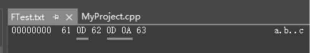
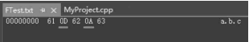

# 将结构体写入二进制文件再读出

## 1.将结构体写入二进制文件

​	讲解一个具体的针对文件的应用——将结构体写入二进制文件，用的时候再从二进制文件中读出来，在实际工作中也可能会用到类似的功能。

​	前面说过，文本文件或二进制文件是针对人类来讲的，而对于计算机，文件就是一堆字节流，并不区分文本文件还是二进制文件，这一点一定要记住。 首先，介绍一个新函数fwrite：用于向文件中写入数据。

### fwrite函数:

`fwrite` 函数是 C 语言标准库中的一个非常有用的函数，用于向文件写入数据。这个函数通常与 `fopen`, `fread`, 和 `fclose` 等函数一起使用，以支持文件的二进制写操作。`fwrite` 能够将数据块作为一个整体写入到文件流中，它特别适用于处理像结构体、数据数组等复杂数据类型的直接写入。

**函数原型**

`fwrite` 的原型定义在 `<stdio.h>` 头文件中，如下所示：

```c
size_t fwrite(const void *ptr, size_t size, size_t nmemb, FILE *stream);
```

参数说明：

- `ptr`：指向要写入文件的数据的指针。这个指针可以是任何类型的数据，包括数组、结构体或简单的数据类型。
- `size`：每个元素的大小（以字节为单位）。通常使用 `sizeof()` 运算符来确定单个数据元素的大小。
- `nmemb`：要写入的元素数量，即 `ptr` 指向的数据块中的元素总数。
- `stream`：指向 `FILE` 对象的指针，该对象代表一个已打开的文件，该文件应该已经准备好进行写入操作。

**返回值**

`fwrite` 返回成功写入的元素总数。这个值应该与参数 `nmemb` 相等。如果返回的数量小于 `nmemb`，通常表示在写入过程中发生了错误或达到了文件末尾。

**功能和行为**

`fwrite` 函数以二进制形式将数据从内存写入到文件。它不会进行任何转换（如换行符转换），这使得它特别适合于写入结构体或其他二进制数据。它的行为不受文件打开模式（文本模式或二进制模式）的影响，总是按字节直接写入。

**使用示例**

假设你有一个结构体数组需要写入到一个文件中：

```c
#include <stdio.h>

typedef struct {
    int id;
    float score;
    char name[50];
} Student;

int main() {
    FILE *fp = fopen("students.bin", "wb");
    if (fp == NULL) {
        printf("无法打开文件\n");
        return 1;
    }

    Student students[] = {
        {1, 90.5, "Alice"},
        {2, 85.6, "Bob"},
        {3, 92.1, "Carol"}
    };

    size_t num_written = fwrite(students, sizeof(Student), 3, fp);
    if (num_written < 3) {
        printf("写入错误\n");
    }

    fclose(fp);
    return 0;
}
```

这个例子中，`fwrite` 将一个包含三个学生信息的结构体数组写入到一个二进制文件中。每个学生的信息包括一个整数 ID、一个浮点数成绩和一个字符数组姓名。

**注意事项**

- 使用 `fwrite` 写入数据时，应确保文件以适当的模式（通常是 `"wb"` 或 `"ab"`）打开，以避免任何转换错误。
- 对于跨平台的应用，直接使用 `fwrite` 写入如结构体这样的复合类型需要考虑字节对齐和大小端问题。这些因素可能会影响文件的可移植性。

`fwrite` 是处理文件写入非常强大的工具，特别是在需要高效率写入大量数据时。它直接操作字节，提供了高度的控制能力，适用于多种数据存储场景。


### 将结构体写入二进制文件：

​	把一个结构体写入文件的示例代码如下：

```c
struct stu   //定义一个结构体
{
    char name[30];
    int age;
    double score;
};

int main()
{
    struct stu student[2];
    strcpy(student[0].name, "张三 abc");
    student[0].age = 21;
    student[0].score = 92.1f;

    strcpy(student[1].name, "李四 def");
    student[1].age = 19;
    student[1].score = 86.2f;

    FILE *fp;
    fp = fopen("structfile.bin", "wb"); // 文件名修改成这样, 这里注意文件的打开方式wb, 表示以二进制形式写入
    if (fp == NULL)
    {
        printf("文件打开失败");
    }
    else
    {
        int structlen = sizeof(struct stu); // 计算单个结构体的大小
        // 一次写入2个结构体 
        // 其实如果第二个参数写成sizeof(struct stu) * 2, 第三个参数写成1, 也是对的
        int result = fwrite(&student, sizeof(struct stu), 2, fp); 
        fclose(fp); // 关闭文件
    }
}

```

​	有几个注意事项（坑点）说一下： 

​	（1）对于要保存到文件中去的结构体，结构体成员中不要出现指针类型成员。因为指针类型成员所指向的内存地址很可能会失效（如再次运行程序时该地址就会失效），一旦引用了失效的地址会导致程序运行崩溃。 

​	（2）结构体成员的字节对齐问题，这个问题与编译器有关，前面曾经提过。例如，上面代码中的stu结构体所占用的内存大小应该是42字节 （char数组占30字节+int占4字节+double占8字节），但用sizeof查看结构体stu大小时却是48字节。为什么？就是因为Visual Studio编译器为了提高程序运行效率，有时候可能一个结构体成员变量所占的内存不够8字节整数倍时，会调整成8字节整数倍。

​	但问题来了，如果这段程序拿到Linux操作系统上并用gcc编译器来编译运行，gcc编译器有可能不是调整成8字节整数倍，而是调整成4字节整数倍。所以在Linux操作系统上，用sizeof查看结构体stu大小时结果可能不是48，而是44。

​	那请想一想，这段程序如果在Windows操作系统上执行，往structfile.bin文件里写数据时，写的是48\*2=96字节，但如果把这个structfile.bin拿到Linux操作系统平台上并从其中读数据，读出来的可能是44*2=88字节，显然读出的数据肯定出错。如何解决这个问题？有两个办法：

​	①在相同的操作系统平台上使用该程序，如都在Windows或者都在Linux上，不要跨平台。 

​	②定义结构体之前用“#pragma pack（1）”代码行设置结构体对齐方式为1字节对齐，按1字节对齐的方式就等于告诉编译器不要去对齐，结构体成员实际是多少字节，就多少字节。如果想恢复默认的字节对齐方式，在定义完结构体之后可以使用“#pragma pack（）”代码行取消刚刚所设置的结构对齐方式（恢复为默认的字节对齐方式）。这样，不管什么操作系统平台，结构体stu都固定占42字节，写入文件是42\*2=84 字节，读出来也是42*2=84字节，那么，跨平台使用这段代码来读入或读出文件内容都不会出现问题。修改后的stu结构定义代码如下：

```c
#pragma pack(1) // 按1字节对齐结构体
struct stu   // 定义一个结构体
{
    char name[30];
    int age;
    double score;
};
#pragma pack() // 回复默认的字节对齐方式
```


## 2.从二进制文件中读出结构体数据

### fread函数简介：

`fread` 函数是 C 标准库中用于从文件流中读取数据的函数。它与 `fwrite` 配合使用，常用于处理二进制文件或任何需要按块读取数据的场合。`fread` 提供了一种高效的方式来从文件中读取数据块，尤其适合用于读取数组、结构体等复杂数据类型。

**函数原型**

`fread` 的函数原型定义在 `<stdio.h>` 头文件中，如下所示：

```c
size_t fread(void *ptr, size_t size, size_t nmemb, FILE *stream);
```

参数：

- `ptr`：指向一个缓冲区的指针，这个缓冲区用来接收从文件中读取的数据。
- `size`：每个数据项的大小，单位是字节。
- `nmemb`：要读取的数据项数量。
- `stream`：指向 `FILE` 对象的指针，该 `FILE` 对象代表一个已经打开的文件，该文件应处于可读状态。

**返回值**

`fread` 返回成功读取的数据项数量。这个数目可能小于请求的数量，这通常发生在文件数据不足以完成请求的读取时，或者在读取过程中遇到文件末尾（EOF）。

**功能和行为**

`fread` 从指定的文件流 `stream` 中读取数据，将其存储到 `ptr` 指向的缓冲区中。它按照 `size` 指定的单个数据项大小，连续读取 `nmemb` 个数据项。

- **不处理字符编码**：`fread` 直接从文件中读取原始字节数据，不进行任何形式的编码转换。
- **使用场合**：`fread` 非常适合于读取二进制文件，如图像文件、音频文件或任何自定义格式的数据文件。
- **错误处理**：如果在读取过程中发生错误，或者达到文件末尾，`fread` 的返回值将小于 `nmemb`。要检查具体的错误原因，可以使用 `feof()` 和 `ferror()` 函数。

**使用示例**

假设你有一个保存了多个结构体数据的二进制文件，下面的代码演示了如何使用 `fread` 来读取这些数据：

```c
#include <stdio.h>

typedef struct {
    int id;
    float score;
    char name[50];
} Student;

int main() {
    FILE *fp = fopen("students.bin", "rb");
    if (!fp) {
        printf("无法打开文件\n");
        return 1;
    }

    Student students[10]; // 假设文件中有多个学生数据
    size_t num_read = fread(students, sizeof(Student), 10, fp);
    if (num_read < 10) {
        if (feof(fp)) {
            printf("提前到达文件末尾\n");
        }
        if (ferror(fp)) {
            printf("读取发生错误\n");
        }
    }

    fclose(fp);
    return 0;
}
```

​	这个例子尝试从文件中读取 10 个 `Student` 结构体。`fread` 用于一次性读取所有这些结构体数据，如果未能读取到 10 个结构体，程序将检查是否因为到达文件末尾或发生错误而导致读取不完全。

**注意事项**

- 当处理跨平台文件时，需注意字节对齐和大小端问题，这些因素可能会影响二进制数据的正确解读。
- 正确打开文件模式至关重要，对于 `fread`，应确保文件以二进制模式（`"rb"`）打开，以避免任何可能的数据解析错误。

`fread` 提供了一种强大且灵活的方法来处理大量数据的读取，是高效数据处理的关键工具之一。

### 从二进制文件中读出结构体数据：

​	看一看如何把一个结构体从文件中读出来。开始写代码：

```c
FILE *fp;
fp = fopen("structfile.bin", "rb"); // 二进制形式读取
if (fp == NULL)
{
    printf("文件打开失败\n");
}
else
{
    int t = sizeof(stu);
    struct stu studentnew[2];
    int retresult = fread(&studentnew, sizeof(struct stu), 2, fp);
    fclose(fp); //关闭文件
}
```

​	可以在fclose行设置一个断点并进行调试，能够发现可以正确从文件中读出数据，此时看到studentnew数组中的内容就是从文件中读取出来的内容了。

## 3.文件使用方式中"rb"和"r"、"wb"和"w"的区别

​	前面讲解的许多范例中频繁地使用fopen函数打开文件。从表面看起来，打开文件时有两点疑惑： 

​	（1）使用"rb"或者"r"来打开文件读似乎效果上并没有什么不同。 

​	（2）使用"wb"或者"w"来打开文件写似乎效果上也没有什么不同。 

​	也就是说，这个代表二进制的"b"标记，使用或者不使用似乎没有明显不同。这里有一些坑点，请一定要注意： 

​	（1）如果写和读是配套操作，写如果用了"b"标记，读一定要用"b"标记。例如，对于前面讲解的将结构体写入二进制 文件以及将结构体从二进制文件中读出时，都使用了"b"标记，确保以二进制的方式写入和读出。

​	虽然读者可能会发现，写和读如果同时不用"b"标记，仍然可以正确地写入和读出，但是，如果要确保将内存中的内容一模一样（1字节不 多，1字节不少，完全一样）地写入到文件中，然后再从文件中一模一样地读出来，就一定要使用"b"标记。(待验证一番)

​	（2）在《28.文件的打开、关闭、读写与实战操练》中的文件读写实战操练中，fopen中是用"r"标记打开了一个文本文件并读取其中的数据，读者已经注意到，在config.txt文件 中，每一行的末尾有“0D 0A”，也就是\'r'和'\n'，但是，当使用fgets函数从config.txt文件中读取一行数据时，读到的内容（读到了LineBuf中）却少了'\r'，只读到了'\n'。(自己加对应的调试图片来看，待完成。)

​	但是，如果fopen中用"rb"标记打开了文本文件来读取其中的数据， 看看会有什么不同。修改对应的代码，只修改fopen函数所在行如下：

```c
FILE *fp = fopen("config.txt", "rb");// 带b标记打开文件
```

​	这次再看看用fgets函数能够读取到的内容。这次可以注意到，config.txt文件中所有内容都原封不动地通过fgets函数读取到了，包括'\r'和'\n'。(自己加对应的调试图片来看，待完成。)

​	通过以上的操作，对带"b"标记有了一个猜测，为了进一步证实这个猜测，继续写一个测试范例。如下：

```c
FILE *fp;
fp = fopen("FTest.txt", "w");  // 打开文件用于写入
if (fp)
{
    char reco = fputc('a', fp);  // 仅用作测试代码,就不判断返回值了
    reco = fputc('\r', fp);      // 写这个回车符0D到文件，看究竟写进去是什么
    reco = fputc('b', fp);       
    reco = fputc('\n', fp);      // 写这个换行符0A到文件，看究竟写进去是什么
    reco = fputc('c', fp);       
    fclose(fp);  // 关闭文件
}
```

​	上面这段代码运行后生成了FTest.txt文件，在二进制编辑器中打开该文件，观察文件内容：



<p align="center" style="font-style: normal;">
    用"w"标记打开文件写入内容时，想写入'\n'，实际写入的是'\r'和'\n'
</p>

通过观察可以发现，用"w"标记打开文件并写入内容时，如果写入的是'\n'（0A），则实际写入的却是“0D0A”（'\r'和'\n'），这种情况也许是Windows平台下独有的情况，并不一定适合其他操作系统平台，如Linux平台。

​	改造上面这段代码，这次用"wb"打开文件，仅修改如下代码行：

```c
fp = fopen("FTest.txt", "wb");
```

​	再执行一次，看看FTest.txt的写入结果，如图所示：

<center>        <br>    <div style="text-align: center; font-style: normal;">用"wb"标记打开文件写入内容时，原样写入所有字符，包括'\r'和'\n'
</div> </center>

​	通过上述的分析和比较，打开文件时带"b"标记（二进制文件）或者不带"b"标记（文本文件）的区别自然就能够总结出来了： 

​	（1）如果打开文件是用于读，则带"b"标记会原封不动地读出文件的全部内容。如果打开文件是用于写，则带"b"标记会原封不动地把内存中的内容写到文件中去。 

​	（2）如果打开文件是用于读，则不带"b"标记可能会使读出的字符有所缺失，参考图12.15（缺失了'\r'）。如果打开文件是用于写，则不带"b"标记可能会将一些额外的字符写入文件，参考图12.17（本来只想写入 '\n' ， 实际写入的却是 '\r' 和 '\n' ） 。 注意 ， 当前的测试平台是Windows平台，其他操作系统平台也许不存在在本条中描述的情况。

​	结论：如果希望把看到的内容原封不动地写入文件中，请在fopen函 数的文件使用方式参数中增加"b"标记来辅助；如果希望把文件中的内容原封不动地读出来，请在fopen函数的文件使用方式参数中增加"b"标记来辅助。