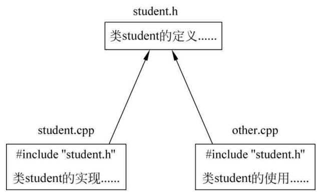

# 结构、权限修饰符与类简介

## 1.结构回顾

​	在C语言部分已经学习了结构，结构是属于一种自定义的数据类型。看看如下范例：

```cpp
struct student //定义一个结构体类型student(学生)
{ 
	int number; 
    char name[100];
};
student studentl; //这里可以省略struct，直接用student
student1.number = 1001; 
strcpy_s(student1.name,sizeof(student1.name),"zhangsan"); //1001
cout << studentl.number << endl; 
cout << studentl.name << endl; //zhangsan  
```

在C语言部分学习过用指向结构体的指针作为函数参数。看看如下范例：

```cpp
// 形参实参地址不同，加断点看，这里肯定做了参数值复制，效率低
void func(student tmpstu)
{ 
    tmpstu.number = 2000;
    strcpy_s(tmpstu.name, sizeof(tmpstu.name),"who"); 
    return;
}
student studentl;
student1.number = 1001;
strcpy_s(student1.name, sizeof(student1.name), "zhangsan"); 
cout << student1.number << endl; //1001 
cout << studentl.name << endl; //zhangsan
func(student1); 
cout << "-------------------" << endl; 
cout << studentl.number << endl; //1001，值没被函数func改变 
cout << studentl.name << endl; //zhangsan，值没被函数func改变  
```

​	上面这个范例，如果把func函数定义这行换一种写法：形参类型变成引用。那么，在func函数中所改变的值，在主调函数中值也会发生相应的改变，因为此时实参和形参代表的是同一段内存地址，调用函数传递参数时，不存在参数值复制（把实参的内容复制给形参）的问题，程序执行效率会提高。看看func函数定义行如何修改：  

```cpp
void func(student& tmpstu){...}  
```

​	上面范例中，再给func函数换一种写法，这次把函数的形参变为指针。此时，函数tunc的函数体也要修改了，这就是C语言部分学习过的用指向结构体的指针作为函数参数。看如何修改func函数：  

```cpp
void func(student* ptmpstu)
{
    ptmpstu->number = 2000;
    strcpy_s(ptmpstu->name, sizeof(ptmpstu->name), "who");
    return;
}
```

在函数调用处，也需要修改函数调用代码：  

```cpp
func(&student1);
```

​	同样不难发现，在func函数中所改变的值在主调函数中也会发生相应的改变。  

​	对于在C中的称呼“结构”，在C++中仍然可以称呼为结构，当然也可以称呼为“类”。但是C++中的结构和C中的结构有什么区别呢？ 

​	C++中的结构除了具备C中结构的所有功能外，还增加许多扩展功能，其中最突出的扩展功能之一就是C++的结构中不仅仅有成员变量，还可以在其中定义成员函数（方法）。看看如下范例：  

```cpp
struct student
{
    int number; //成员变量
    charname[100]; //成员变量
    voidfunc(); //成员函数
    {
        number++;
        return;
    }
};
```

​	成员函数可以用“对象名.成员函数名（实参列表）”的格式来调用。下面演示成员函数的调用：  

```cpp
student student1;
studentl.number = 1001;
strcpy_s(student1.name, sizeof(student1.name), "zhangsan"); 
cout << studentl.number << endl; //1001 
cout << studentl.name << endl; //zhangsan
student1.func(); //调用成员函数
cout << "-------------------" << endl; 
cout << student1.number << endl; //1002 
cout << studentl.name << endl; //zhangsan  
```

## 2.public和private权限修饰符

​	在结构和类中，有三个重要的权限修饰符，分别是public（公有）、private（私有）、protected（保护）。本节只谈public和private，而protected后面讲解。  

​	(1)public：“公有 / 公共”的意思。用这个修饰符修饰的成员（成员变量、成员函数），可以被外界访问。换句话说，一般需要能够被外界访问的成员定义为public，就好像是该结构或类的外部接口一样。

​	(2)private：“私有”的意思。用这个修饰符修饰的成员，只能被该结构或类内部定义的成员函数使用。  

​	对于用struct定义的结构来讲，默认的情况下，所有的成员变量和成员函数都是public权限的，所以，前面定义的student结构等价于如下：

```cpp
struct student
{ 
public:
    int number;// 成员变量
    …… // 其他成员
};
```

​	注意public的书写位置，而且，public后面需要跟一个冒号。  

​	对于public的成员变量和成员函数，可以直接通过对象来引用(使用)。看如下代码：  

```cpp
student studentl;
studentl.number = 1001; // public成员变量可以直接引用
strcpy_s(studentl.name, sizeof(studentl.name), "zhangsan"); // 直接引用
studentl.func(); // public成员函数可以直接引用/调用  
```

​	现在如果把student结构中的成员全部定义成private权限的，如下所示，注意private的书写位置，而且private后面也需要跟一个冒号。  

```cpp
struct student
{ 
private:
    int number;// 成员变量
    …… // 其他成员
};
```

​	那么，就不可以通过对象名引用结构或者类的成员，否则在编译时会出现错误提示。例如如下代码行都不会被允许： 

```cpp
student studentl;
studentl.number = 1001; // 不可以通过对象名student1直接引用private成员
strcpy_s（studentl.name, sizeof(studentl.name), "zhangsan"); // 不可以引|用
student1.func(); // 不可以引用private成员  
```

​	不过，虽然不能通过student1.number的方式引用number成员变量，但是，在成员函数func中仍然可以直接引用/使用number，因为成员函数是可以直接访问成员变量而不管成员变量是否是private的。

 	另外，因为一个结构或类中可能有多个public、private、protected权限修饰符，一个权限修饰符也可以修饰多个成员，所以要看一个成员变量或者成员函数是属于public还是private，只需要沿着该成员往编号更小的代码行方向（上方）看代码，最先看到哪个权限修饰符，则该成员就对应哪个权限。看看如下范例：

```cpp
struct student 
{ 
public: 
    int number; // 该成员变量属于public
private: 
    char name[100]; // 该成员变量属于private
public: 
    void func() // 该成员函数属于public
    {
        number++;
        return; 
    }
private: 
    int ioperct; // 该成员变量属于private
    void funcoper(){} // 该成员函数属于private
};
```

## 3.类简介

​	刚刚谈了结构，现在谈谈类，类也是一种用户自定义的数据类型。现在已经知道的是：  

​	(1).不管C语言还是C++中，结构都用struct定义。  

​	(2).为了方便读者理解，前面曾经说过：把C语言中的结构当成C++中的类。这个说法并不全面，只是方便理解才这样表达。现在，既然讲到了类，那就必须要谈一谈结构和类到底有什么区别。  

关于结构和类，有几点说明：  

​	(1).类，只在C++中才有的概念，C语言中并没有类的概念。  

​	(2).结构用struct定义，类用class定义。  

​	在C语言中，定义一个属于某个结构的变量，会称其为“结构变量”。  

​	在 C++中，定义一个属于某个类的变量，会称其为“对象”，其实读者在理解的时候，直接把对象理解成结构变量即可，不管“结构变量”还是“对象”，无非就是一块“能存储数据并具有某种类型的内存空间”。  

​	把刚才范例中student的定义从struct修改为class，会发现其他代码几乎不用改动，这说明C++中结构和类绝对是极其类似的。

```cpp
class student
{ 
public:
    int number;// 成员变量
    …… // 其他成员
};
```

​	(3).C++中的结构和类确实极其类似，区别有以下两点。  

​	①C++中结构体内部成员变量及成员函数默认的访问级别是public，而C++中类的内部成员变量及成员函数的默认访问级别是private。这就是刚才的代码在定义student这个class时增加public的原因，不然外界就不能直接用“对象名.成员”的方式来访问类中的成员。  

​	②C++中结构体的继承默认是public，而C++中类的继承默认是private。后面讲解类继承时再进一步讨论。  

​	综合结论：C++中，如果定义结构或者类的成员变量或者成员函数时，都明确地写出访问级别public、protected、private等，那么C++中的结构和类就没什么区别，定义的时候写成struct也可以，写成class也行。 

​	(4).注意。

​	①C++标准库里包含了大量丰富的类和函数，供开发者使用。甚至以类的形式定义了一些更加复杂的数据类型，如向量等。

​	②在书写 C++程序的时候，无论代码想实现一个什么样的功能，都应该设法通过写一个或多个类来达到这个目的，因为C++语言中最核心的部件就是类。  

## 4.类的组织

​	无论结构还是类，都是程序员（开发者）自己定义的数据结构，定义了一个类就等于定义了一个新的类型，而且这个类型里还关联了一组操作（成员函数）。  

​	在开发一个大型项目的时候，很可能会写多个类去实现各种功能，显然，如此多的类，在书写的时候肯定要有一个规范。  

​	一般来讲，类的定义代码放到一个.h头文件中，头文件的主文件名可以和类名相同，类的具体实现代码（一般都是成员函数的实现代码）放到一个（或多个） .cpp文件（源程序文件）中，这个 .cpp文件的主文件名一般也和类名相同。  

​	如果有任何其他 .cpp文件想使用这个类的时候，就在其文件的头部使用#include命令把这个类定义相关的.h头文件包含进来。  

​	请看一看这种组织结构的感觉：  

​	(1).定义一个叫作student的类，定义代码放到student.h头文件中，实现代码放到student.cpp文件中。  	

​	(2).现在另外有一个other.cpp文件，想在其代码中使用student类，那么就需要在other.cpp文件的开头包含`#include "student.h"`语句，如下图所示。  

<figure style="text-align: center;">
    
    <figcaption>other.cpp文件中使用student.h中定义的类代码书写示意图</figcaption>
</figure>